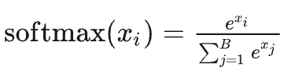
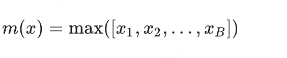
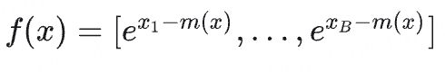
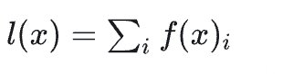
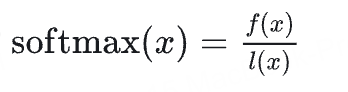
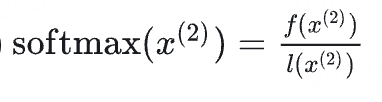
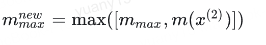
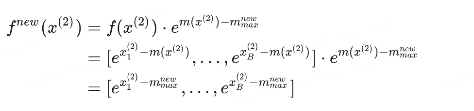
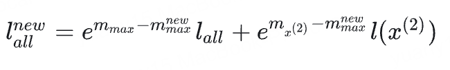
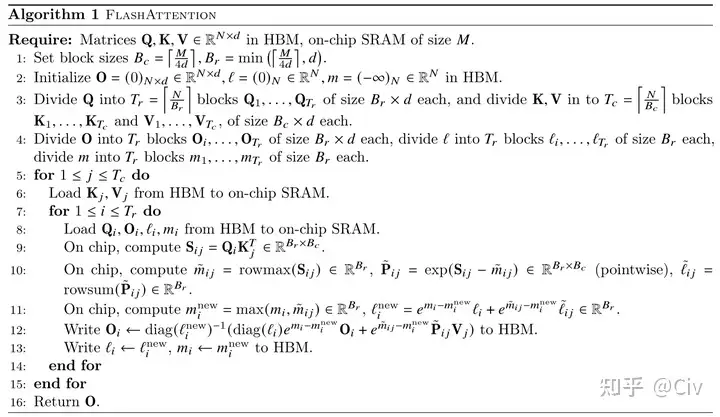

# FlashAttention

主要用于加速训练和推理，大幅度节省显存的注意力计算算法。

其主要思想是，**将注意力计算过程进行分块重组，减少对慢显存的访问次数，从而获得运行时间的巨大提升**。

## 背景

大部分优化transformer的方法集中于降低模型的FLOPS，而Flashattention则是将重点放在了访存开销。他们发现模型计算速度不仅跟时间复杂度有关，还跟访存开销(MAC)有关。

为了弄清楚MAC对计算的影响，可以根据计算的密集程度，将operator分为两类：

**Compute-Bound**：计算密集型。计算耗时主要在于计算本身，例如，大矩阵乘法、卷积  
**Memory-Bound**：访存密集型。计算主要集中在存储的访问，例如，逐元素操作（ReLU、Dropout）、Reduce操作（sum、softmax、Norm等）

GPU的存储结构主要分为两部分：**HBM**和**SRAM**。其中SRAM速度远大于HBM（10倍以上），但空间远小于HBM
    

## 核心思路

传统Attention在计算时，需要生成一个巨大的中间矩阵，并进行softmax，而softmax是一个访存密集型计算,标准Transformer计算可以抽象成如下过程，主要使用的是HBM：
    

图中，一共包含8次读写HBM。

为了减少HBM的读写，同时满足SRAM的大小，Flashattention将计算进行了分块，通过分块实现了整体Attention的计算。

## 分块Attention

Attention中最难分块的是softmax，因为需要用到全局信息。先看一下softmax公式：
    

其中，*Xi* 是向量*X*的第i个分量

通常我们会用稳定版softmax，对x进行max归一后再计算：
    
    
    
    

对于一个向量，将其分块为两份，x = [ *x(1), x(2)* ],则*x(2)* 的softmax为：
    

当前为局部softmax，如果想让*x(2)* 更新到全局，**则需要将l和f进行更新**。

**针对*f(x(2))*** ，需要将*max(x(2))* 变换为*max(x(1), x(2))*,设
      
    

此时，*fnew* 的值已经更新为了全局。这个过程中，**我们只用到了一个m-max变量，也即是全局最大值**,可以看到，只需要存储一个当前最大值，并同步更新即可

**针对*l(x(2))***,同理，更新*l new*：
    

其中，*lall* 是全局的求和，此处*lall=l(x(1))*

> 以上，即完成了softmax的分块计算和更新。整个过程，只需要保存max、f和l即可，**不需要再保存中间矩阵QK转置**。

以下是计算流程图：

## FlashAttention v2

主要是从工程上进行了优化，将向量计算改成了矩阵tensor乘法，效率上进行了加速

## FlashAttention v3

依然是从工程上进行了优化，通过异步的tensor核以及TMA，以及FP8低精度硬件支持实现效率提升，将计算利用率从30%提升到75%。
