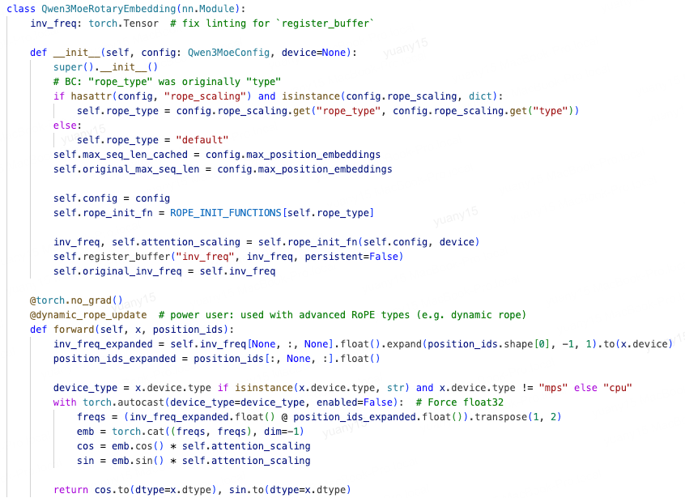
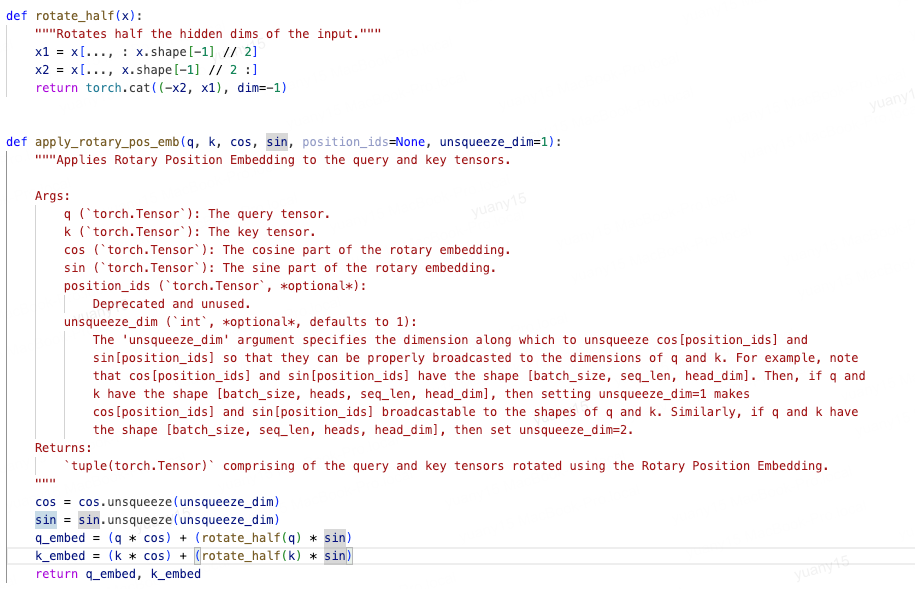

# transformer结构

## MLP

### 模块结构

1. 为什么只有一个激活层
   1. 激活层主要是为了负责特征提取和非线性变换，第二层是输出层，只需要将非线性变换后的高级特征映射到低维空间即可  

## position Embedding

### RoPE

      f(q, m) = q * e^imθ

旋转位置编码，通过对向量进行复数旋转不同的角度，来表示不同位置的相对位置差，在计算注意力分数时，即可表示相对位置关系

**核心思想**：

> 对于一个在 位置 m 的词，它的查询向量 q_m，我们不直接使用它，而是将它 旋转 m \* θ 角度。  
> 对于一个在 位置 n 的词，它的键向量 k_n，我们将它 旋转 n * θ 角度。

这个旋转操作，就是我们的位置编码函数 f:  

      f(q, m) = q * e^(i m θ)  
      f(k, n) = k * e^(i n θ)

现在，我们计算旋转后的 Query 和 Key 的点积（内积），在复数空间里，内积近似于一个复数与另一个共轭复数的乘积的实部。

      <f(q, m), f(k, n)>  
      ≈ Real[ (q \* e^(i m θ)) \* (conjugate(k) \* e^(-i n θ)) ]  
      = Real[ q \* conjugate(k) \* e^(i (m - n) θ) ]

神奇的事情发生了！这个结果只依赖于：

原始向量 q 和 k 的相似度 q * conjugate(k)。

它们的 相对位置 (m - n) 所形成的角度 (m - n)θ。

这意味着，**经过 RoPE 处理后，注意力分数会自动携带相对位置信息！**

实际使用中，θ通常根据模型需要的上下文长度进行设置，θ越大，支持的长度越大，公式如下

      θ = 10000^(-2i/dim)  
实现中，通常将向量按实部虚部组合，因此会分为dim/2个组，每个组设置不同的旋转基数，i代表组的位置。因此，**不同的组，代表不同的旋转速度，也即是对不同距离的敏感度不同**

通常称为基频，实际使用时参数为rope_theta,一般4k需要设置为10000，qwen3支持32k，设置为1000000

#### **实现**

> q的向量[0,dim]为复数, q = [q[实部]，q[虚部]] = x + iy  
> q[实部]=q[0,dim//2]=x  
> q[虚部]=q[dim//2+1, dim]=y  
> 其中，dim为向量维度

1. 计算cos(mθ) 和 sin(mθ)
   1. 注意cos和sin的位置，各一半，所以**虚部和实部不是交叉的，而是前后各一半**
   
2. 计算q \* e^(i mθ)  

   1. 通过欧拉公式，对公式进行转换，可以等价于

         f(q, m)  
         = q \* (cos(mθ) + i sin(mθ))  
         = (x + iy) \* (cos(mθ) + i sin(mθ))  
         = x cos(mθ) + i x sin(mθ) + i y cos(mθ) + i^2 ysin(mθ) (展开)  
         = x cos(mθ) + i x sin(mθ) + i y cos(mθ) − y sin(mθ) (因为 i^2 =−1)  
         = (x cos(mθ) − y sin(mθ)) + i (x sin(mθ) + y cos(mθ))  (合并实部和虚部)  
​
   2. 化简后得到:

         f(q, m) = [x cos(mθ) - y sin(mθ)] + i [x sin(mθ) + y cos(mθ)]  
         = xcos + iycos + (-y)sin + ixsin  
         = [x y] \* cos + [-y x] \* sin (去除复数i，用矩阵表示)  

   3. 所以，转化为向量表示(基于代码实现)：  

         f(q, m) = q \* cos(mθ) + rotate_half(q) \* sin(mθ)

   实现代码如下：
   

   如上代码，rotate_half将向量实部虚部进行颠倒，并置虚部为负数

         [q[实部]，q[虚部]] =>   [-1*q[虚部]， q[实部]]

   apply_rotary_pos_emb中向量计算为：

         q = [q[实部]，q[虚部]] * cos + [-1*q[虚部]， q[实部]] * sin

   拆开看：

         q[实部] => q[实部] * cos + (-1 * q[虚部]) * sin 
                  = x * cos - y * sin
         q[虚部] => q[虚部] * cos + q[实部] * sin 
                  = x * sin + y * cos

   可看出与步骤2中的实部虚部一一对应

#### 为什么是e^imθ

数学上,e^iθ可以用来表示向量逆时针旋转的角度(e^iθ模长为1，因此只旋转)，同时，根据欧拉公式，可以将其进行变换，在注意力计算中将绝对距离表示成相对距离，使得注意力分数仅依赖于相对距离

#### 预训练阶段如何扩展上下文长度

**方法一**  
直接增加rope_theta，从10000扩展到更大，rope_theta变大，旋转的角度更小，因此能支持的上下文长度更长

**方法二**  
rope_theta保持不变，在2i/dim前增加α参数，进行缩放，同样是减少旋转的角度  
