# 大模型分布式训练并行技术-数据并行

## NCCL通讯原语

### **all-reduce**

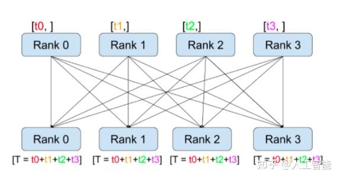  
将所有rank的tensor，进行求和，每个rank都保留求和的结果  

```python
import torch
import torch_npu
import os
import torch.distributed as dist
        
def all_reduce_func():
    # rank = int(os.getenv('LOCAL_RANK'))
    
    dist.init_process_group(backend='hccl', init_method='env://') #,world_size=2 rank=rank, world_size=2, 
    rank = dist.get_rank()
    torch.npu.set_device(rank)
    
    # device="npu:{}".format(rank)
    tensor = torch.tensor([2,3]).npu()+rank*2
    print("initial tensor={}, rank={}".format(tensor, rank))
    torch.distributed.all_reduce(tensor)
    print("after all_reduce tensor={}, rank={}".format(tensor, rank))
    
    
if __name__ == '__main__':
    all_reduce_func()
```

### **all-gather**

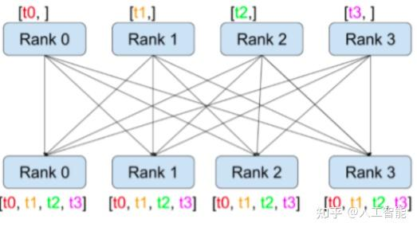
将所有rank的tensor，融合到一起，组成一个list，每个rank都保留list

```python
import torch
import torch_npu
import os
import torch.distributed as dist
        
def all_gather_func():
    rank = int(os.getenv('LOCAL_RANK'))
    # torch.npu.set_device(rank)
    dist.init_process_group(backend='hccl', init_method='env://') #,world_size=2 rank=rank, world_size=2, 
    
    
    # rank = dist.get_rank()
    torch.npu.set_device(rank)
    word_size = dist.get_world_size()
    
    device="npu:{}".format(rank)
    
    weight = torch.randn((4),device=device)
    gather_list = [torch.empty_like(weight) for i in range(word_size)]

    
    print(f"weight={weight}, rank={rank},world_size={word_size}")

    dist.all_gather(gather_list,weight)
    print(f"after gather={gather_list}")
    
if __name__ == '__main__':
    all_gather_func()

```

## 数据并行-DP、DDP

### DP

每张卡参数一样的，只是处理不同的数据分片，最后汇总梯度计算参数后所有模型参数一起更新。

DP主进程下有多个线程，每个线程管理一个device训练。DP对数据进行切分，分发到不同的GPU上进行前向传播计算梯度，再All-Reduce到GPU0上进行梯度汇总平均，更新GPU0的参数，再将更新后的参数分发到其余GPU  

#### DP缺点

1. 负载不均衡，GPU0会成为通信瓶颈，通信成本随GPU数量线性增长，同时其余GPU闲置率高
2. 不支持多机多卡

### DDP

一种多进程的基于Ring-All-Reduce通讯算法的策略,分为reduce-scatter和all-gather两阶段。

针对DP的通信瓶颈问题，将master节点改为相邻节点，每个节点只与相邻两个节点进行通信，接受上一个节点的数据，发送给下一个节点，通过环状通信，scatter和all_reduce操作，将通信量均分到每个节点，且总通信固定2（N-1）K/N

设每个节点数据量为K，默认把每个节点数据切分成N份（**对应到模型训练时，是梯度或参数，相当与将梯度或参数进行切分，进行通信**），则每份大小K/N，编号为Kij，其中i为节点编号，j为数据分块编号  

#### **Reduce-Scatter阶段**

需要进行n次迭代，每次迭代gpu都将自己拥有的一部分数据发往下一个gpu，最终每个节点接受n-1次数据，每份数据为K/N  
迭代完，每个GPU都有1/N完整的数据，例如：GPU0拥有K00+K10+K20+K30,GPU1拥有K01+K11+K21+K31

#### **All-Gather阶段**

每个GPU将自己拥有的完整数据，分发到下游GPU，分发N-1次，每次数据量为K/N，每个GPU接受N-1块数据,每个节点都拥有全量完整的数据

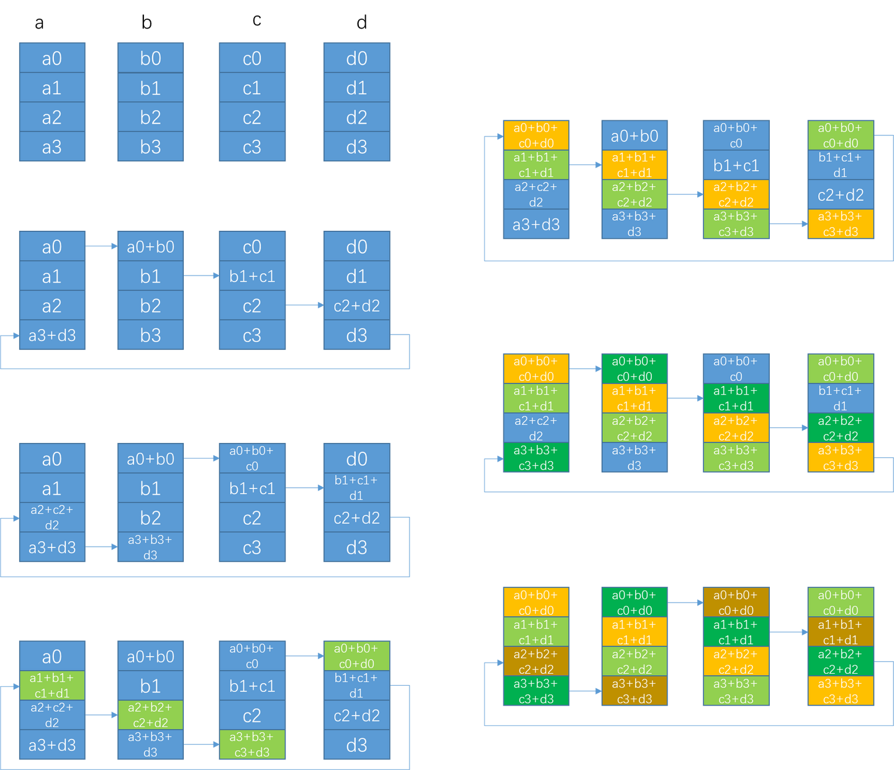

#### **通信耗时**

> 假设带宽是S Gb/s,参数量为P  
> 则梯度块大小为P/N，对单个GPU，通讯量（只算send）为：2 \* (N - 1) \* P/N，可近似为2P，全卡通讯量为2NP。  
> 对比DP，Server为NP，worker为NP，全卡为2NP，与DDP相同，但负载从Server转移到了全卡  
> 假设S=10,P=300M,则梯度为P \* 4 byte = 1.2G,单卡通讯量为2.4G，一次通讯耗时2.4/10 s=240ms

#### **更新时间点**：backward

这里有个小问题，为何在backward的时候进行梯度更新呢？为何不选择在参数更新的时候进行参数平均呢？要回答这个问题，首先要看看训练中各个部分的耗时:

下图是一个基于不同通讯的backend中，训练各个部分耗时的比重图，可以看出，橙色部分的backward(BWD)反向传播部分，通常占比比较大，相比之下，参数更新的部分（OPT）则通常是耗时比重小的部分。所以为了能够overlap通讯的耗时，Pytorch DDP选择在backward的时候进行梯度更新，并且为此引入bucket的概念。一个bucket里通常有不超过一定大小的几个layer的参数组成（默认是25MB），当一个bucket内部的梯度准备好了之后，则这个bucket就可以开始进行ring-all-reduce取平均操作，而不需要等到计算完整个模型的反向传播过后才进行一次统一的ring-all-reduce操作，相当与把多卡通讯的时间隐藏在了backward计算的耗时中，大大提升了资源利用效率。
    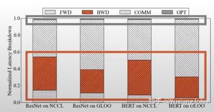

#### DDP缺点

1. 随着节点数增多，单个ring越来越大，延迟将不可接受
2. 每个卡都需要加载一份完整的模型，单卡爆显存问题无法解决

## ZeRO

ZeRO由微软提出，deepspeed发扬光大。**核心思想是用通讯换显存**。ZeRO分为三个级别，对model进行不同程度的分隔(显存占用可参考[大模型显存分析](显存分析.md))：

- ZeRO-1: 对优化状态进行切分(12*T)  
- ZeRO-2: 增加梯度切分(2T)
- ZeRO-3: 增加模型参数切分(2T)
  


### ZeRO-1

1. 每个rank只保存一部分的优化器状态，如下图:
    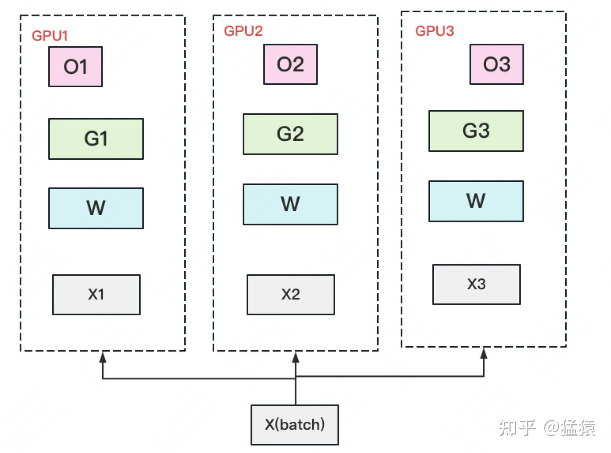

2. 此时W=fp16，G=fp16，O=fp32。此时，整体数据并行的流程如下：
   1. 每块GPU上存一份完整的参数W。将一个batch的数据分成3份，每块GPU各吃一份，做完一轮foward和backward后(**先backward再同步梯度**)，各得一份梯度G。

   2. 对梯度做一次**AllReduce([Ring-AllReduce](#ddp))**，**得到完整的梯度G**，**产生单卡通讯量2T**。  
    **为了表达简明，这里通讯量我们就不再换算成byte了**，而直接根据参数量来计算。(PS： 在zero1代码早期实践中，这里对梯度使用的是AllReduce，但是你可以发现，其实只要做一次ReduceScatter就完全够用了，产生的通讯量为T）

   3. 得到完整梯度G，就可以对权重进行更新。我们知道W的更新由optimizer states和梯度共同决定。**由于每块GPU上只保管部分optimizer states，只能将相应的W（蓝色部分）进行更新**（其实，此时即可推出，**更新W不需要完整的梯度，只需要O所对应的部分梯度即可**，此即为ZeRO-2）。  
   2和3可以用下图表示：(在混合精度训练的前提下，**实际上，zero1并不是直接更新蓝色权重（fp16），而是直接更新优化器中维护的权重(fp32)，蓝色权重是由红色权重cast而来**)
    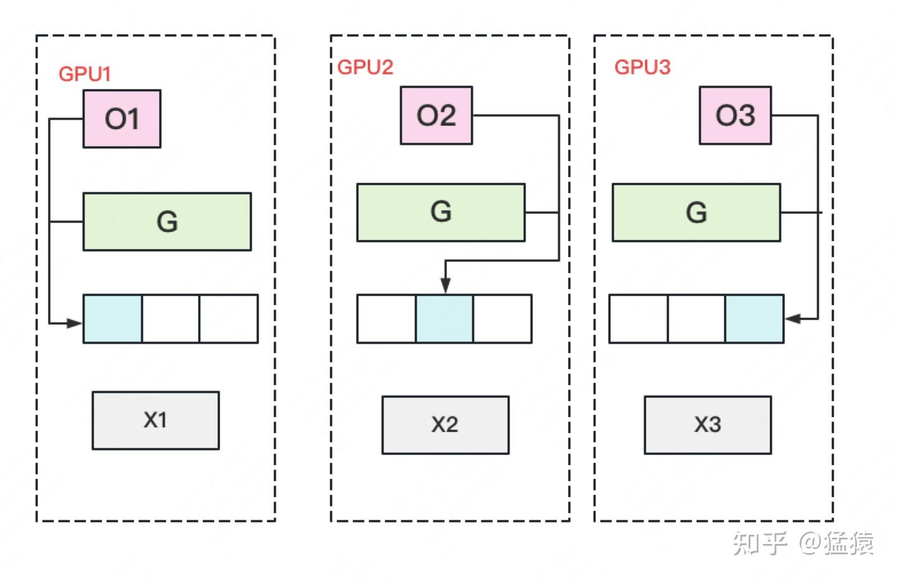

   4. 此时，**每块GPU上相应W（蓝色部分）都完成了更新(fp16._copy(fp32))**，但有部分W没有完成更新（图中白色部分）。所以我们需要**对W（fp16）做一次All-Gather**，从别的GPU上把更新好的部分W取回来(**fp32的W也进行了切分，不需要同步**，因此只需要同步fp16的W用于做forward和backward)。**产生单卡通讯量T**

3. 做完ZeRo-1后，设GPU卡数为Nd，则显存和通讯量的情况如下：
    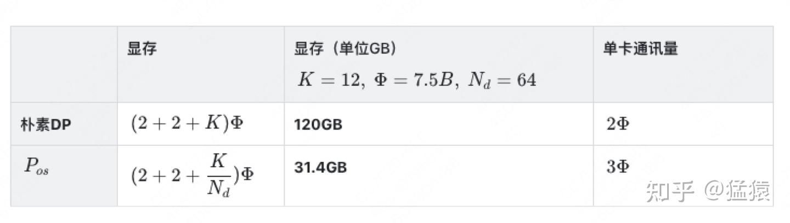  

### ZeRO-2

1. 更进一步将梯度也拆开，每个GPU维护一块梯度, 如下图：
    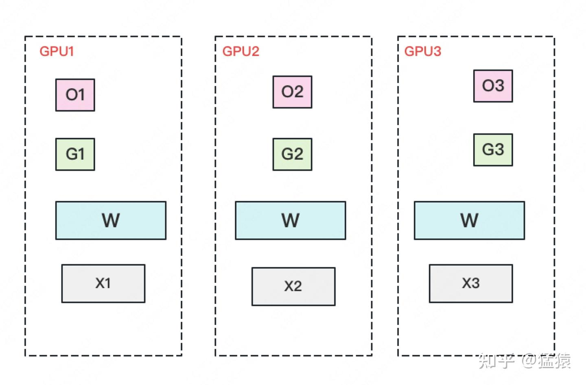

2. 此时，数据并行流程如下：
   1. 每块GPU保存完整的W，batch分成3份，分别做完一轮forward和backward，此时，**每块GPU拥有一份梯度（绿色+白色）**。

   2. **对每个GPU维护的部分梯度，做Reduce-Scatter**，此时，每块GPU即可获得对应部分的完整聚合梯度。例如：GPU1维护G1，因此需要其余GPU将对应G1位置的梯度发送到GPU1汇总即可。汇总后删除白色块梯度，**单卡通讯量T**。1和2见下图：
    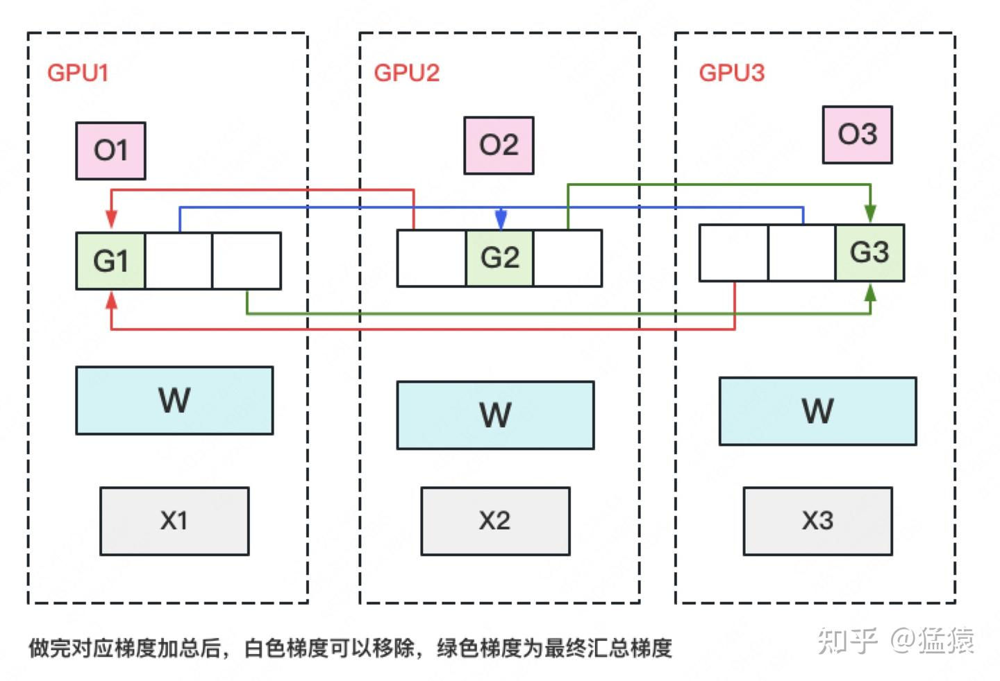

   3. 每块GPU用自己对应的O和G去更新相应的W，更新完毕后，每块GPU维护了一块更新完毕的W，同理，对W做一次All-Gather，将别的GPU算好的W同步过来。**单卡通讯量T**。

3. 再次对比通讯量和显存：
    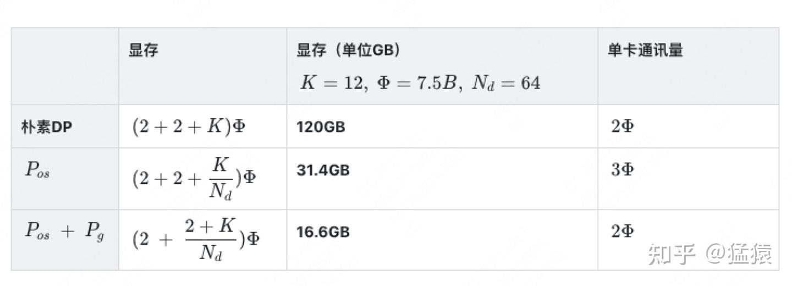  

### ZeRO-3

1. 将最后的参数W（fp16）也进行切分，如下图：
   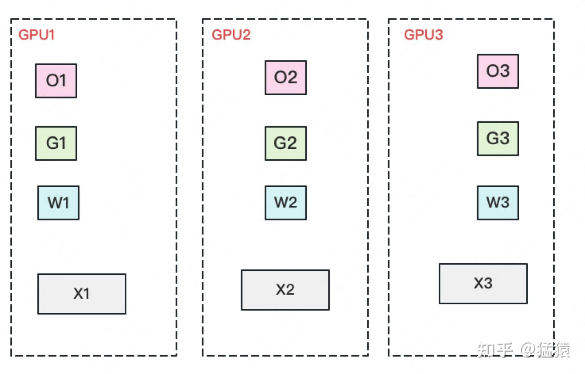

2. 此时，数据并行流程如下：
   1. 每块GPU保存部分参数W，将batch切分成3份数据，每个GPU一份。

   2. **做forward时，对W做一次All-Gather**，获取完整W，做完之后立即释放。**单卡通讯量T**

   3. **做backword时，对W做一次All-Gather**，获取完整W，做完之后立即释放。**单卡通讯量T**

   4. 做完backward后，**做一次Reduce-scatter**，同步各个GPU对应的梯度,结束后释放不是自己维护的梯度，**单卡通讯量为T**

   5. 用自己维护的O和G，更新对应的W，此时**无需对W进行All-Reduce操作**，通讯量为0

3. 对比显存和通讯量：
    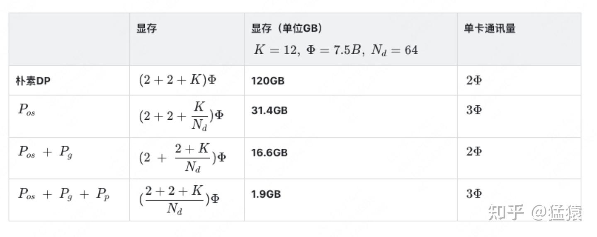

> 至此，我们用1.5倍的通讯开销，64卡资源下，换回近120倍的显存。  
> 纵观ZeRO,其实主要还是在做数据切分，并未涉及模型并行，计算forward和backward时依然是全量参数W

### ZeRO-R

1. 激活值切分:Partitioned Activation Checkpointing

   可以仿照上述方式，对激活值进行切分，每块gpu只保留部分激活值，需要时再从别的gpu取，但是激活值占用显存远高于模型本身，通讯量巨大，需要做好平衡。

2. 固定通讯buffer：Constant Size Buffer

    固定大小的内存buffer，用于提高通讯效率。gpu数量上升，gpu间通讯次数也会上升，同时通讯量会下降（总通讯量不变）。因此数据切片会变小，无法充分利用通讯带宽，设置buffer，可以积攒一定大小后再通讯

    同时也方便对存储进行预估，是存储大小可控。

3. 内存碎片整理

### ZeRO-Offload

ZeRO-Offload核心思想：显存不够，内存来凑。把要存储的大头卸载(offload)到CPU上，而把计算部分放到GPU上，这样比起跨机，既降显存，也能减少一些通讯压力

ZeRO-Offload的做法是：

- **forward和backward计算量高**，因此和它们相关的部分，例如参数W（fp16），activation，就全放入GPU。
- **update的部分计算量低**，因此和它相关的部分，全部放入CPU中。例如W(fp32)，optimizer states（fp32）和gradients(fp16)等。

具体切分如下图：
    

## FSDP

FSDP是pytorch基于ZeRO-3的实现.过程如下：

1. 仅当要计算一个特定的层的forward过程之前，使用AllGather获取模型该层所需的前置的层的参数。

2. 计算前向。结束后释放掉不属于该rank分片的层的参数。

3. 与1类似，仅当要计算一个特定的层的backward过程之前，使用AllGather获取该层所需要的层之前过程的参数。

4. 计算后向。结束后释放掉不属于该rank分片的层的参数。

5. 使用Reduce-scatter对当前分片的参数的梯度进行累加。

6. 让每个rank根据聚合的梯度，独立更新参数。

