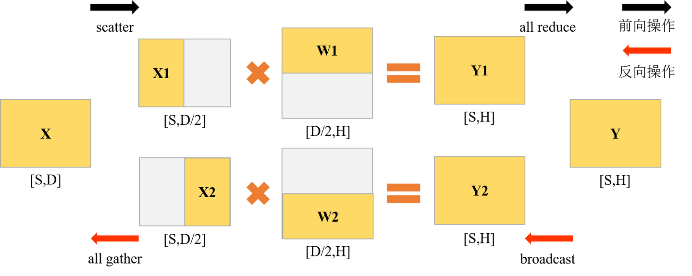
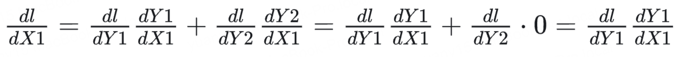
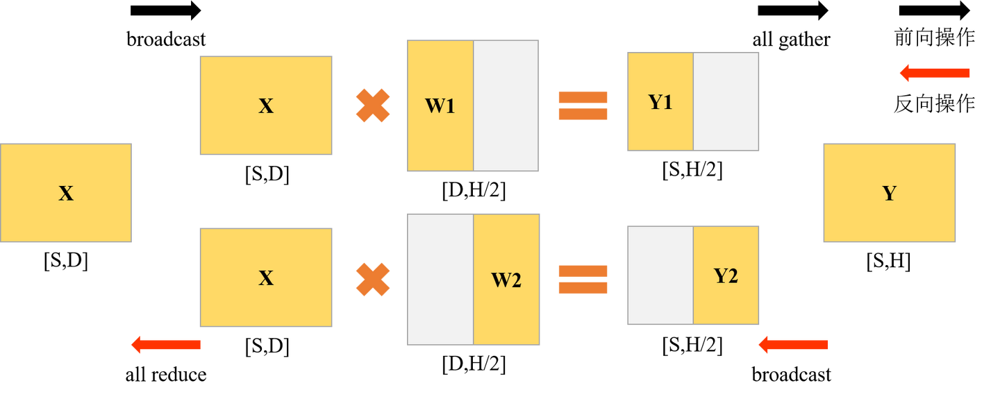
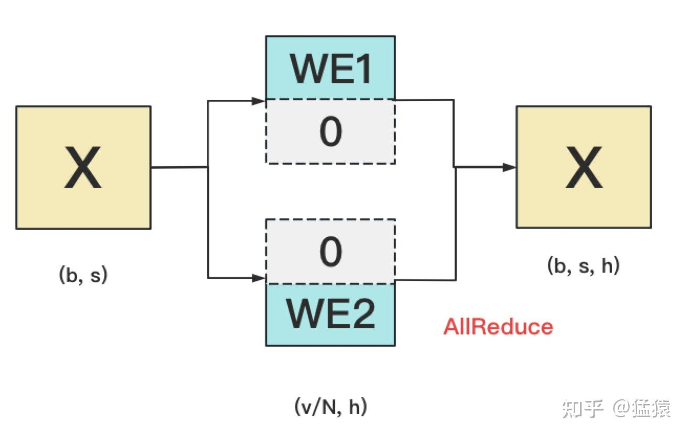
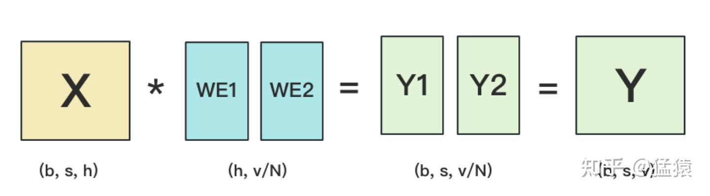
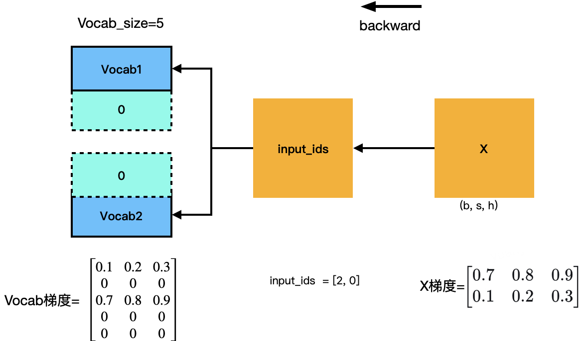
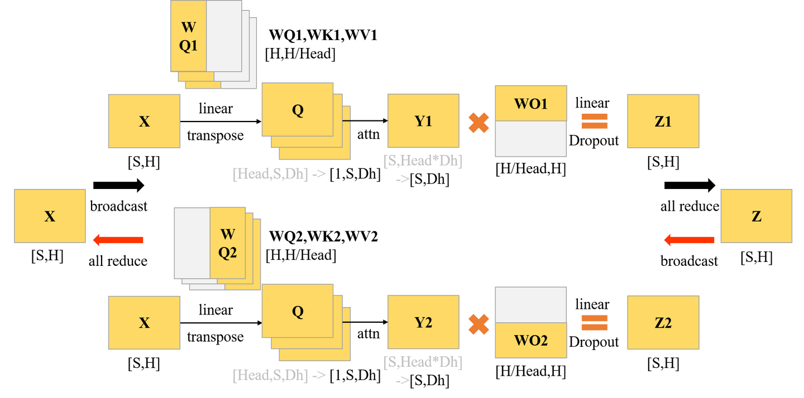
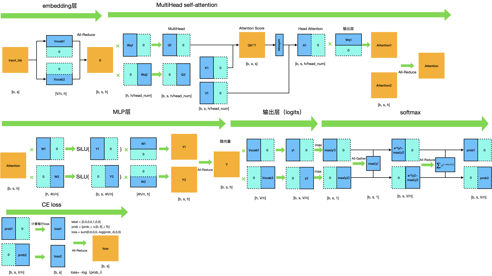
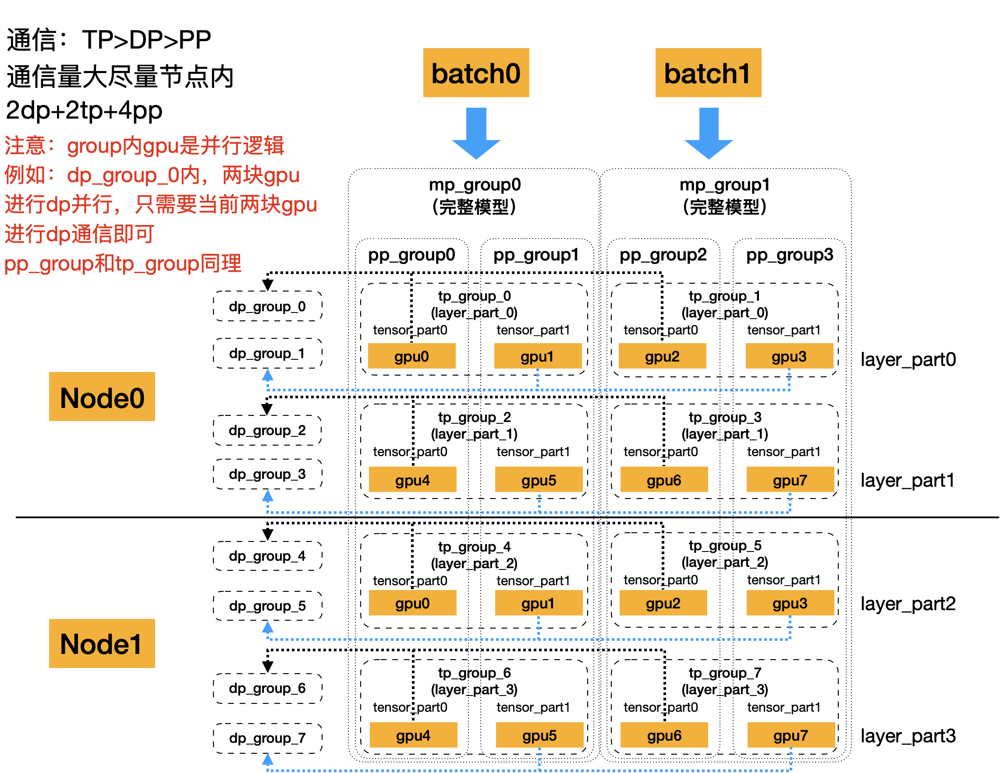

# 大模型分布式训练并行技术-模型并行

1. 单个GPU卡内存有限，从而引发的各种问题，可分为两个维度来看：

    **数据维度**：对于小模型而言，虽然单卡能放下一个模型，但没法放下一个batch所要的全部数据，所以数据得切分到不同卡上计算最终汇总，从而引入数据并行DP

    **模型维度**：对于大模型而言，单卡无法放下一个模型，必须将模型切分到多张卡上，由此引入了除DP之外的各种并行（TP/PP/EP/SP），可统称为模型并行

2. 换句话而言，如果模型又小，单个batch数据不多，一张卡跑就够了，也不需要各种并行。
3. 如果模型一张卡能放下，但单个batch的数据放不下，那只需要DP，这样计算效率最高。在这种情况下再加入其他并行策略反而拖累训练效率。
4. 只有在模型单卡也放不下的时候，这时才必须考虑DP之外的并行。不同的并行策略根据模型结构的不同，采取的策略也不一样。
5. DP/TP/PP/EP/SP都可以同时开启（EP依赖于DP，只有DP开启的情况下，才可能开启EP；SP依赖于TP，只有在TP开启的情况下才能用SP）。

## 张量并行(tp)

**张量并行（TP）来自NVIDIA，是目前最重要，也是基于transformer做大模型预训练最基本的并行范式**。其基本思想就是把模型参数切开，放到不同的GPU中进行独立计算，再做聚合。

### 一、切分原理

> 设输入数据为X，参数为W。X的维度 = (b, s, h)，W的维度 = (h, h')。其中：
>
> b：batch_size，表示批量大小  
s：sequence_length，表示输入序列的长度  
h：hidden_size，表示每个token向量的维度。  
h'：参数W的hidden_size。  

则每次forward的过程如下(为画图方便，图中所绘是b=1的情况)：
    

假设W太大，需要切分，则我们面临三个问题：

- 怎么切分W
- 切完W，如何forward
- 如何做backward、求梯度，更新权重

#### 1.1 按行切分权重

假设N块GPU，则将W按行切成2份,为了满足矩阵乘法的要求，需要将X按列对应切分，示意图如下：
    

**forward**：X划分为X1、X2，与对应的Wi相乘，得到Yi，进行all-reduce，得到完整的Y

**backward**：Xi求导过程如下, Wi求导过程类似：
    
因此，每张卡都可以独立进行反向传播。具体流程：将Y的梯度broadcast到两张卡，分别计算X和W的梯度，最后执行All-Gather,将X梯度汇总起来

#### 1.2 按列切分权重

将W按列进行切分，示意图如下：
    

**前向**：如上图所示，按列切分，需要将输入X全部broadcast到所有GPU，与GPU上对应的部分W进行计算，再执行All-Gather,得到完整的输出Y

**反向**：需要对X和W分别求梯度(X其实就是上一层的Y)  

X梯度如下，注意，GPU1和GPU2中的梯度均为X的梯度，根据公式可以得到：
    

W梯度类似，可以在单卡上进行独立计算。

因此，整个过程为：将Y的梯度broadcast到两张卡上，计算每张卡上X和W的梯度，每张卡的X梯度进行all-reduce，即可得到X的最终梯度，Wi的梯度只有自己维护的部分

### 二、输入层、输出层切分(embedding矩阵切分)

#### 2.1 输入层

输入层主要涉及两个矩阵：

- input_ids：[b, s] - 输入tokens，存储token_id
- Vocab: [V, h] - 词表 embedding 向量

通过索引，得到X [b, s, h]。切分示意图如下：
    

Vocab矩阵切分到不同的GPU上，input_ids在每个GPU上进行**索引**，能找到就存下来，找不到则置为0，最后All-Reduce，即可得到全量的X。

#### 2.2 输出层&loss计算

输出层主要涉及两个矩阵：

- X：[b, s, h] - 对应的是每一个token的表示向量
- Vocab：[V, h] - 词表 embedding 向量,与输入层共享，为同一个矩阵

通过X \* Vocab^T, 得到logits [b, s, V],此即每个token的分布，再计算softmax即可得到对应的prob。切分示意图如下：
    
如上图，Y1和Y2理论上是需要进行All-Gather得到全量的Y，再求softmax，但是考虑到logits维度bsV,通讯量较大，因此针对softmax进行并行优化，如下图：
    

- 每块GPU上，我们可以先按行求和，得到各自GPU上的GPU_sum(e)  
- 将每块GPU上结果做AllReduce，得到每行最终的sum(e)，也就softmax中的分母。此时的通讯量为bs
- 在每块GPU上，即可计算各自维护部分的e/sum(e)，将其与真值做cross-entropy，得到每行的loss，按行加总起来以后得到GPU上scalar Loss。
- 将GPU上的scalar Loss做AllReduce，得到总Loss。此时通讯量为N。
- 这样，我们把原先的通讯量从bsV降至bs + N

#### 2.3 梯度计算&更新

反向传播阶段，输出层Vocab正常计算梯度，输入层是索引操作，在得到X的梯度后，即可反映射回对应token_id的梯度。输入层Vocab词表梯度计算如下图：
    

更新参数时，**因为输入输出层共享，因此在计算时，会将这两者梯度累加后，再进行参数更新**。同时，每个GPU都会拿到X的全部梯度，但只需要更新自己维护的Vocab即可。

### 三、Attention层

**多头自注意力**：这里因为在计算时会多个头并行计算，彼此在计算上不相关，因此可以按头数进行切分，每张卡负责一个头或多个头的计算。
    

通讯量分析：forward过程中会进行一次All-Reduce，backward一次All-Reduce，总通讯量为4bsh

### 四、MLP层

MLP层主要是两个线性层和一个激活层(qwen为SiLU)，一般先列切，再横切，如下图：
    
其中，AB为两个线性矩阵

**张量并行整体流程图如下：**
    

### 通讯量分析

**张量并行**：我们设每次通讯量为T_tp，从上面分析中我们知道每层做4次AllReduce，其通讯总量为8T_tp，其中，T_tp=bsh，则通讯总量为8bsh。

**数据并行**：设每次通讯量为T_dp，我们知道每层做1次AllReduce（先不考虑ZeRO拆分权重的情况），其通讯总量为2T_dp。其中，通讯的主要是梯度，则T_dp=hh，总通讯量为2hh。

因此，**我们要比较的就是bs和h的大小。**

一般情况下，TP>DP>PP
实际中，通讯量大的，尽量放同一台机器，通讯量小可以跨节点，按实际情况决定tp和dp。

## 流水线并行(pp)

流水线并行在张量并行基础上，将模型进一步进行分层，同时将mini-batch也进一步划分为micro-bath，在层内进行并行，详见[流水线并行](分布式训练-流水线并行.md)

## 专家并行（ep）

专家并行是将所有的专家按并行度分配到不同的GPU上。
> 例如：128专家，ep=4，则每32个专家为一组，放一张卡

专家并行，采用**All-to-All**通信，**通信量较大，因此只适合在通信极快的单节点内部实现**，跨节点或跨集群或通信效率低的情况下，很容易抵消掉专家并行的收益。

### **All-to-All**

**forward**：

1. 将不同的专家分布到不同的gpu中
2. 当gpu需要路由专家计算时，先统计每个token需要选择的专家，汇总输入，发送到对应专家所在gpu，同时接收其他gpu发送到当前gpu的数据
3. 根据接收的数据，用对应的专家进行计算，并汇总输出，发送回原始gpu，同时获取已发送数据的计算结果，即完成All-to-All通信过程。

**backward**:

1. 每个专家只根据流经它的数据计算梯度和更新参数

**问题**：

1. 负载均衡：通常每个专家需要处理的数据量是不均匀的

## 序列并行（sp）

类似ZeRO-3：

**数据并行**：将模型参数进行切分，计算时all-gather，计算完释放  
**序列并行**：将数据（Attention和MLP的输入）按序列（seq_length）维度进行切分，计算Attention时all-gather，其余算子独立直接分块计算

## 上下文并行（cp）

采用**环状注意力算法**，借鉴分块注意力算法，将KV块在环之间流转，每次传递一个块，并且至于相邻GPU通信，保证在流转k次后，当前gpu中的Q与所有的KV块完成了注意力计算，即全局注意力。

与sp不同的是，sp每次计算Attention需要all-gather所有的KV。

> 对比sp和cp  
> sp每次需要gather所有的KV才能开始计算，整个过程是阻塞的  
> cp接收一个块之后即可开始计算，计算的同时可以同步接收第二个块  
> 因此，**虽然总体通讯量相同，但是计算效率差距巨大**

## Megatron并行实现

### dp+tp+pp

实际在训练中，会组合多种并行技术，以实现极限效率

以2节点，2dp+2tp+4pp为例，并行示例如下图：
    

考虑通讯量，通常情况下，TP>DP>PP，因此，一般会将tp和dp放在节点内，pp可以跨节点，以节省带宽

如上图，Megatron中会在开始训练之前，对并行进行初始化，会将卡依据并行方式，分为不同的group，同一个group内执行对应的并行计算

**pp_group**: group内每个gpu为模型不同的层，gpu间按层id进行流水线并行  
**tp_group**: group内为模型相同层参数的不同part，gpu间按照tp规则进行前向和后向计算  
**dp_group**: group内为模型相同层相同part的参数，gpu间按照dp规则（ZeRO-2，一般开了tp就不用开ZeRO3）计算各自负责的部分梯度和参数

因此，按照以上逻辑，其实相同类别group间，实现了切分，不用在group间进行通信，只在各个group内进行通信即可

> 通常，dp不用设置，根据GPU数量和tp+pp+... 即可推算出dp，例如：  
> GPU=16，tp=2，pp=4，则一个完整的模型需要2*4=8卡，则dp=16/8=2

### ep+dp+tp+pp

专家并行与以上并行有一些特殊，ep会将专家分配到不同的组，但是非专家层不需要分组，此时就会出现两者并行度不一致的情况：

        设 E=32，ep=2， tp=2，则
        MP：ep*tp，即4卡组成一个MP
        专家层：每2卡成一组，维护16个专家，按张量并行2进行计算
        非专家层：每2卡成一组，维护同一份数据，按张量并行2进行计算
以上，**非专家层相当于重复计算了一次**。

以下是ep示意图：
    
