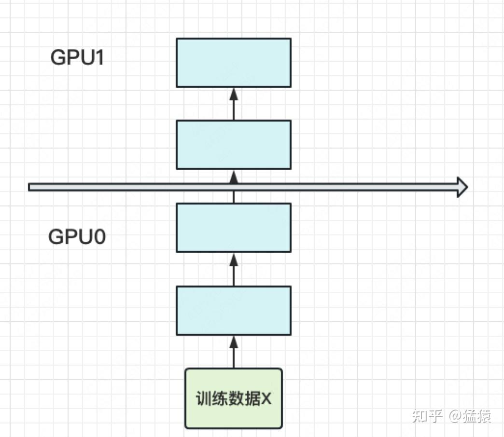

# 大模型分布式训练并行技术-流水线并行

流水线并行范式主要分两种：google的Gpipe和微软的PipeDream。两者都是2019年左右推出，区别在于梯度更新，**Gpipe是同步，PipeDream是异步**。异步GPU空转率进一步降低，利用率更高，但Gpipe更简单易懂，torch的pp接口就基于Gpipe。

## 目标

- 能训练更大的模型：对应模型显存限制
- 能更快的训练模型：对应通讯带宽限制

## 模型并行

当你一个单卡装不下一个模型时，一个直接的办法是，将模型割成不同的层，每层一个卡，如下图：
    

此时，模型做一轮forward和backward的过程如下：
    

其中下标表示batch编号，这里只有一个batch，因此下标都是0。每一行表示一个GPU。每一列表示timestep。

这张图的含义是：我在GPU0上做完一次forward，然后将GPU0上最后一层的输入传给GPU1，继续做forward，直到四块GPU都做完forward后，我再依次做backward。等把四块GPU上的backward全部做完后，最后一个时刻我统一更新每一层的梯度。

这样做确实能训更大的模型了，但也带来了两个问题：

1. **GPU利用率不够**
    

    如图，阴影部分所表示的时间段里，总有GPU在空转。在Gpipe中，将阴影部分定义为bubble。我们来计算一下bubble。假设有K块GPU，而单块GPU上做一次forward和backward的时间为：t

    计算bubble面积 = K\*t - t  
    bubble面积占比 = （K\*t - t)/K\*t = (K-1)/K  
    **当K趋于极限时，空置率接近1，即GPU全被浪费了**

2. **中间结果占据了大量显存**

    在做backward时，**需要用到每一层的中间结果**。

    假设我们的模型有L层，每一层的宽度为h(可以理解为hidden_size)，batch_size为B，则对于每块GPU，不考虑其参数本身的存储，中间结果的空间为：**B * L/K * h**  
    **随着模型增大，B、L、h的变大很容易平滑掉K带来的内存增益**。

## Gpipe流水线并行

朴素的模型并行存在GPU利用度不足，中间结果消耗内存大的问题。而Gpipe提出的流水线并行，就是用来解决这两个主要问题的。

### 1. 切分micro-batch

流水线并行的核心思想是：**在模型并行的基础上，进一步引入数据并行的办法，即把原先的数据再划分成若干个batch，送入GPU进行训练**。未划分前的数据，叫mini-batch。在mini-batch上再划分的数据，叫micro-batch。如下图：
    

其中，第一个下标表示GPU编号，第二个下标表示micro-batch编号。假设micro-batch数量为M

同理，计算bubble占比 = （K - 1）/ (K + M - 1)，当M>=4K时，bubble占比<20%  
至此，GPU空置问题解决。

### 2. 重计算（re-materialization,激活值）

针对激活值显存问题，采用重计算策略，简单来说就是：只存上一块最后一层的结果（即当前块的输入）Z，backward时，根据输入Z重新forward.

**每块GPU峰值显存** = **每块GPU上的输入数据大小 + 每块GPU在forward过程中的中间结果大小**

每块GPU上固定需要保存它的起始输入。  
每个micro-batch是流水线形式进来的，算完一个micro-batch才算下一个。  
在计算一个micro-batch的过程中，我们会产生中间变量，它的大小为**B/M * L/K * h**（其中M为micro-batch个数）。  
**因此，每块GPU峰值时刻的显存为: B*h + B/M * L/K * h**

对比朴素模型并行中的显存：**B * L/K * h**，可以看到，**当L变大时，流水线并行对GPU显存压力显著减小**。
