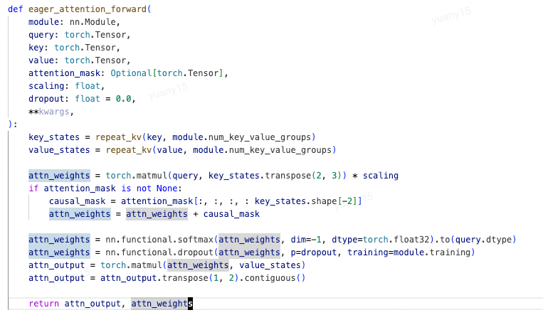
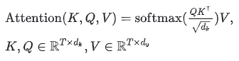
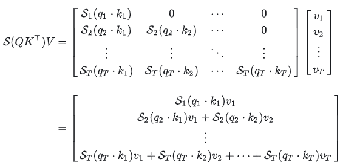
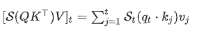
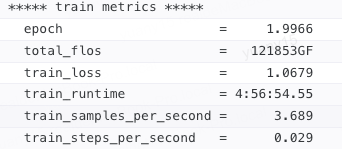

# 显存分析

## 1. 模型参数量分析

参数量 = 模型层数*transformer参数量 + 嵌入层参数量 + 输出层参数量

**transformer参数量**：

1. **attention**：(2+2\*kv_head/attention_head)\*h^2 + 4h ≈ 4h^2 + 4h
    1. 3个w矩阵：3\*h^2(注意：GQA、MQA会有差别)  
       1. 统一：(1+2\*kv_head/attention_head)\*h^2
    2. 输出权重矩阵：h^2
    3. 偏置：4\*h（注意看代码，bias=True/False,qwen2.5只有三个有偏置，所以是3\*h）
    
    
2. **MLP**: 也就是全连接层,一般为2层，h->h_i->h，参数量为：2\*h\*h_i + h_i + h ≈ 8h^2 + 5h (按h_i=4h算)
    1. 如果是SwiGLU，则会多一个参数gate，此时参数量为3\*h\*h_i
        
3. **归一化层**:2层，包含两个参数，gamma、beta，2\*2h=4h
    1. 一个在attention前，一个在attention后
        
        

**嵌入矩阵参数量**：v\*h

**输出层参数量**：复用嵌入层，不计算在内

**总参数量为**：
> **估计：** L \* (12H^2 + 13H) + VH
> **ReLU:** L \* ((2+2\*kv_head/attention_head)H^2 + **2**H\*H_i+ 9H + H_i) + VH  
> **SwiGLU:** L \* ((2+2\*kv_head/attention_head)H^2 + **3**H\*H_i+ 9H + H_i) + VH
>
> 其中，L是模型层数，H是隐藏层维度，V是词表大小，H_i是MLP层隐层维度

**以qwen2.5-7B-Instruct为例：**

采用GQA，MLP采用SwiGLU，因此多了一个gate参数, attention偏置只开了3个, 因此：
> 参数量为  
> 28 \* ((2 + 2*4/28) \* 3548^2 + 3 \* 3548 \* 18944 + 8 \* 3548) + 152064 \* 3548  
> = 6,991,887,488 ≈ 7B

## 2. 显存分析

### 2.1 训练显存分析  

#### 训练显存有哪些

> 静态显存：大小不会发生变化的，例如权重、优化器参数、梯度  
> 动态显存：激活值，中间变量

#### 单卡静态显存占用分析

以[混合精度](混合精度.md)为例,如下图：  

假设参数量为T，则显存占用：(现阶段大部分模型均采用BF16，范围更广，更稳定)  

1. 权重：FP32+FP16 = 4T + 2T
2. 优化器参数：动量FP32 + 方差FP32 = 4T + 4T
3. 梯度： FP16 = 2T
4. 总字节数：4T + 2T + 4T + 4T + 2T = 16T
5. 单卡总显存：16T, 例如T=7B，则显存占用 = 16 \* 7B 字节 = 112G

#### 单卡动态显存分析

参数如下：
> b: batch_size  
   s: seq_len  
   l: transformer层数  
   h: 隐藏层维度  
   v: 词表大小  
   a: 多头数量
>

动态显存主要为输入tokens进行前向传播和反向传播过程产生的中间激活值，包括：**前向传播计算得到的，并且在反向传播中需要用到的所有张量**。不包含静态参数，但包含了mask矩阵  
> 激活值在训练中占据显存大头

以混合精度为例，激活值通常是FP16或者bf16，因此每个激活值占2字节，mask采用int，1字节

**transformer激活值**  

1. **attention**：
   1. QKV共同的输入X，大小：[b, s, h] \* 2 bytes = 2bsh
   2. attention计算Q*K^T，需要保存Q、K，大小：2 \* [b, s, h] \* 2 bytes = 4bsh
   3. attention计算softmax，需要保存Q*K^T, 大小：a \* [b, s, s] \* 2 bytes = 2abs^2
      1. 多头注意力，softmax计算的是多个头的结果
   4. softmax后需要计算dropout，要保留一个mask矩阵，大小：a \* [b, s, s] \* 1 bytes = abs^2
   5. 计算V的attention，即score·V，需要保留score和V，大小：a \* [b, s, s] \* 2 bytes + [b, s, h] \* 2 bytes = 2abs^2 + 2bsh
   6. 计算输出映射和dropout操作，需要保留输入，和mask矩阵，大小：[b, s, h] \* 1 bytes + [b, s, h] \* 2 bytes = 3bsh
   7. 汇总以上显存占用：（2+4+2+3）bsh + (2+1+2)abs^2 = 11bsh + 5abs^2

2. **MLP**:  (隐藏层维度按4h算)
   1. 第一个线性层输入，大小：[b, s, h] \* 2 bytes = 2bsh
   2. 激活函数保存其输入，大小：[b, s, 4h] \* 2 bytes = 8bsh
   3. 第二个线性层输入，大小：[b, s, 4h] \* 2 bytes = 8bsh
   4. 最后有个dropout，大小：[b, s, h] \* 1 bytes = bsh
   5. 汇总以上显存占用： 19bsh
3. **LayerNorm**:
   1. attetion 和 MLP都有，大小： 2 \* 2bsh = 4bsh

综上，transformer每层激活值大小为：34bsh + 5abs^2

**动态显存总量**  
> (34bsh + 5abs^2) \* l = (34h + 5as)bsl

**以qwen2.5-7B-Instruct为例：**

> batch = 1, seq_len=2048  
> 动态显存预估：  
> (34 \* 3584 + 5 \* 28 \* 2048) \* 28 \* 1 \* 2048 = 23,429,382,144 ≈ 23G
>
> batch = 128, seq_len=2048  
> 动态显存预估：  
> (34 \* 3584 + 5 \* 28 \* 2048) \* 28 \* 128 \* 2048 ≈ 23G * 128 = 2.99T

### 2.2 推理显存分析

推理过程少了梯度、优化器状态、中间激活值，显存显著减少。  
推理阶段显存大头是模型参数，如果使用KV cache加速，KV cache也需要占用显存

#### 2.2.1 KV cache

1. 根据attention公式(不考虑GQA)，在decoding阶段需要用到QKV
   
2. 在生成新token Ti时，需要将上一个token Ti-1作为输入，计算attention，在Casual Mask的情况下，只需要计算Ti-1和KV的attention，其余数据可复用。此时，需要全量的KV，因此缓存KV即可。
3. 如下图，生成新token只需要在矩阵中最下面新增一行
   
4. 增加的一行可以表示为以下公式，其中只与全量KV有关，与Q相关的只有当前输入token  
   
5. 另外，随着token增加，KV也需要对新增token做对应的更新

#### KV cache显存占用

> 假设：输入序列长度s，输出序列长度n，以float16保存KV  
> 显存占用：b(s+n)h \* l \* 2 \* 2 = 4blh(s+n)  
> 第一个2是K+V，第二个2是float16，l是模型层数
> 动态显存(按单条，2k预估,128,)：4blh(s+n)=8k \* 28 \* 3584=822,083,584=800M

### 2.3 MOE显存分析

MOE与普通Encoder结构大模型类似，只是MLP结构有区别，MLP对应多个，也即多个专家网络  

**静态显存:** MLP显存*专家数量  

**动态显存:** 临时激活值，计算完即丢弃，不存储，可以忽略不计

> 例如：30B-A3B  
> 静态显存（按bf16存）：30 \* 2=60G  

## 3. 计算量FLOPS分析

### 矩阵计算量  

> [1, n] \* [n, 1] 为n次乘法，n次加法，总计算量为： **2n**  
> [m, n] \* [n, p] 总计算量为：**2mnp**  
> softmax([m,n]) 总计算量为：**m(3n-1)**

### attention

> 1. QKV计算，[b, s, h] \* [h, h]，总计算量为：3*2bshh = **6bsh^2**
> 2. QK^T计算，[b, head_num, s, h_dim] \* [b, head_num, h_dim, s], 总计算量为：2b\*head_num\*s\*h_dim\*s = **2bs^2h**  
> 3. softmax计算，输入[b, head_num, s, s], 总计算量为：b\*head_num\*s(3s-1) = **3bs^2\*head_num - bs\*head_num**（**在h较大情况下，可以忽略**）
> 4. score·V计算，[b, head_num, s, s] \* [b, head_num, s, h_dim] = **2bs^2h**
> 5. 线性映射计算，[b, s, h] \* [h, h]，总计算量： **2bsh^2**

### MLP

> 1. 第一个线性层，[b, s, h] \* [h, 4h] = **8bsh^2**
> 2. 激活函数，忽略不计
> 3. 第二层，[b, s, 4h] \* [4h, h] = **8bsh^2**  

### logits

> 1. 将隐藏向量映射到词表空间，[b, s, h] \* [h, Vocab] = **2bshV**

**前向传播总计算量**：**l \* (24bsh^2 + 4bs^2h) + 2bshV** ≈ 24bsh^2l

### 计算量与参数量的关系

前面提到，参数量可以估计为 l \* (12h^2 + 13h) + hV，当h较大时，忽略一次项就是12lh^2。输入为bs时，总计算量/总参数=2。因此可以近似认为：**在一次前向传递中，对于每个token，每个模型参数，需要进行2次浮点数运算，即一次乘法法运算和一次加法运算。**

反向传播计算量为前向传播的2倍，因此总的系数为 1+2=3。一次训练迭代中，对于每个token，每个模型参数，需要进行 **2 \* 3 = 6 次浮点数运算**。  
实际训练中，为了减少缓存，会使用激活值的重计算技术，此时，系数变为**1+2+1=4，总系数为8**

**训练总计算量**：**6 \* Param_Num \* tokens**
> 以Qwen2.5-7B-Instruct为例  
> 参数量为7B，训练数据量按300B算  
>
> 6 \* 7 \* 10^9 \* 300 \* 10^9 = 1.26 \* 10^22 flops

#### 训练时间估计

利用计算量，可以估算训练时间。考虑因素：GPU实际利用率，通常为30%-50%，激活重计算技术  
计算时间估计公式如下：

> 以Qwen2.5-7B为例  
> 参数量为7B，训练数据量按300B算
> 显卡以64张A100为例，峰值为312 Tflops
>
> 1.68 \* 10^22 / （ 64 \* 312 \* 10^12 \* 0.45) ≈ 0.18 \* 10^7 seconds ≈ 21 days

## 实验数据

> batch = 128, max_seq_len=8192, avg_seq_length=2048  
> 8卡ppu，实际每张卡显存占用70-80G
> 30k样本，约5小时跑完

