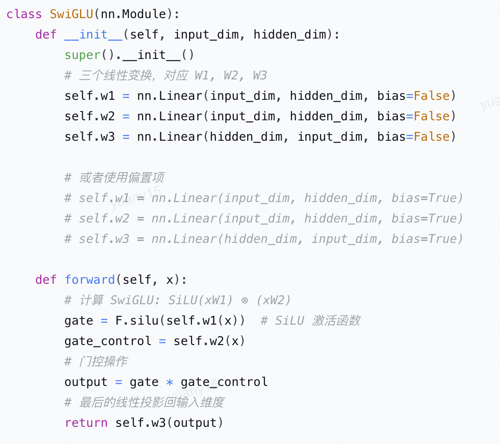
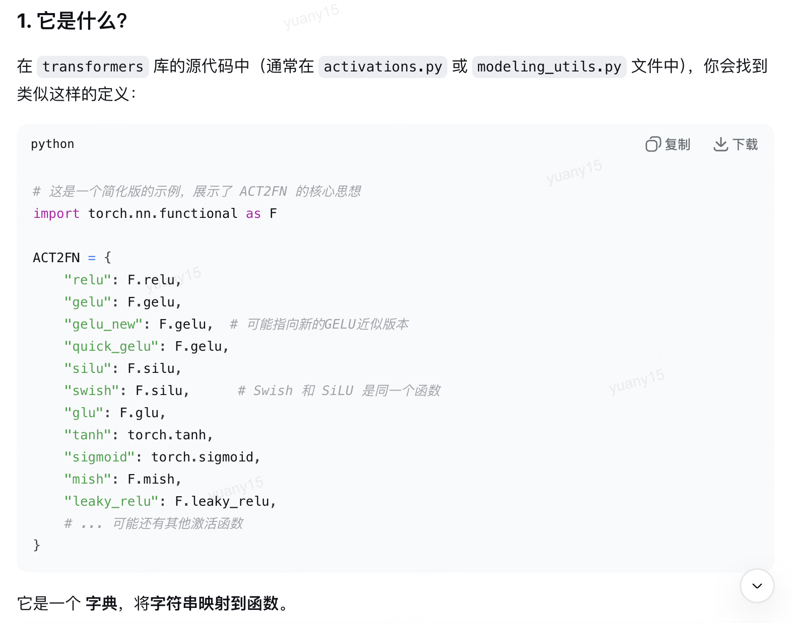
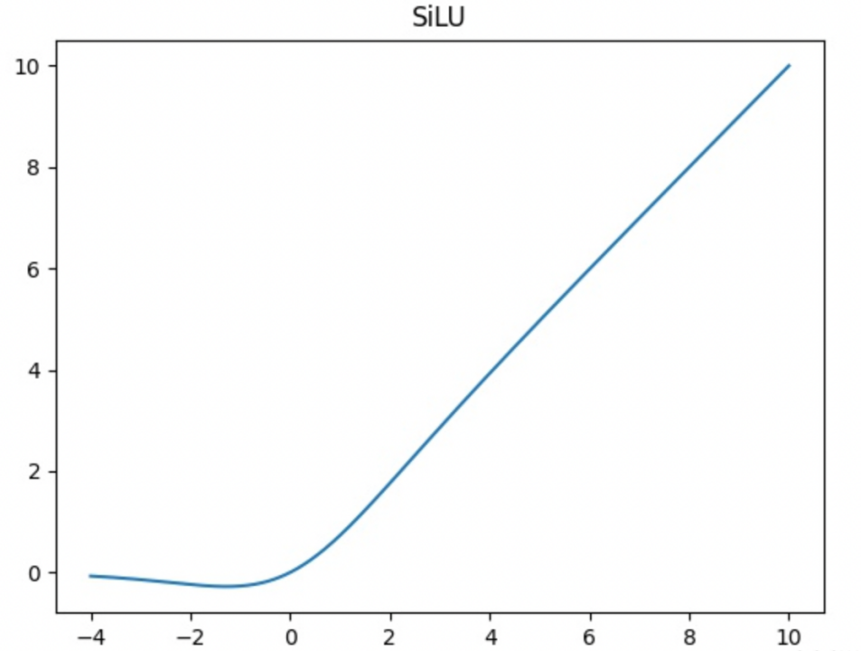

# 激活函数

## SwiGLU

 

 
 

## 为什么 SiLU 如此受欢迎？优点分析

与 ReLU、Leaky ReLU 等传统激活函数相比，SiLU 具有多个显著优势：

1. **平滑且处处可微**
   - 不同于 ReLU 在 x=0 处不可导，SiLU 在整个定义域内都是平滑且可微的。这使得优化过程更稳定，收敛更好。

2. **避免“神经元死亡”**
    - ReLU 有一个致命缺点：当输入为负时，梯度恒为0，导致神经元一旦“死亡”就无法再被激活。
    - SiLU 在负区间的输出不是0，而是一个很小的负值，并且有非零的梯度。这确保了负区间的信息不会完全丢失，梯度仍然可以流动，有效避免了“神经元死亡”问题。

3. **“自门控”特性**
    - 这是 SiLU 最核心、最强大的特性。注意它的公式 x * σ(x)，可以理解为：Sigmoid 函数的输出作为一个介于0和1之间的“门”，来控制输入 x 有多少信息可以通过。
    - 这个门控机制不是由外部参数学习的，而是由输入 x 自身决定的，因此被称为“自门控”。这赋予了模型一种轻量的、数据驱动的特征选择能力。

4. **性能卓越**
    - 大量的实验表明，在许多深度网络架构中（尤其是Transformer），用 SiLU 替换 ReLU 或 GELU 通常能带来更好的模型性能和更快的收敛速度。
 