# DPO（Direct Preference Optimization）

DPO 是一种直接优化策略（policy）以满足偏好对齐的方法，绕过了传统 RLHF 中的奖励模型建模和强化学习循环。

## 建模：基于奖励的偏好模型

假设有一个奖励函数r(x, y)，给定prompt x 和响应 y，偏好数据为（x，ywin, ylose）, 其中，yw比yl受欢迎。

针对偏好问题，通常采用**Bradley-Terry 模型**进行建模，假设**偏好概率**为：
    
其中，σ为sigmoid函数

## RLHF建模

在Bradley-Terry模型基础上，RLHF一般分为2步：

### 1. 训练RM（Reward model）

**优化目标**  

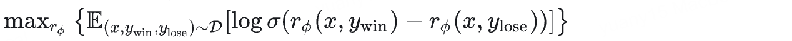
其中，rΦ 是RM对回答的打分

**推导过程**  

- 基于BT模型假设，对所有偏好数据进行**极大似然估计**，则似然函数为：
    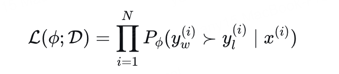
- **取对数**
    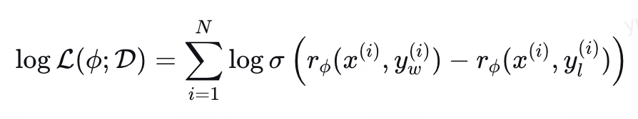
- **极大似然估计**（优化目标）：
    
- **最小化损失**：
    
- **期望形式**：
    

### 2. RL训练

**优化目标**  

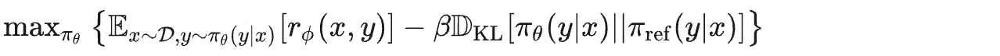
其中，πθ 是我们在训练的LLM，πref 是初始化的模型。这个公式的意思是希望模型尽可能的输出RM评分高的回答,但又不希望偏离原始模型太远，避免为了得分高而过拟合RM导致输出质量差的回答。

## DPO

DPO发现RLHF有显示解。求解前，我们先看看一些前置数学知识

### KL散度与期望

#### 1. 最初的离散形式（求和）

对于两个定义在同一概率空间上的离散分布P和Q，KL 散度（Kullback-Leibler Divergence）最初的定义是一个求和：
    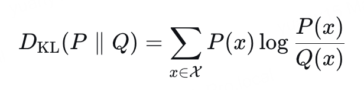

这里：

- P(x) 和 Q(x) 是离散随机变量在取值 x 上的概率质量。
- X是所有可能取值的集合。
- log 通常是自然对数（底为 e）。

**在这个形式中，本质是“加权求和”**，权重是P的概率P(x)，求和是对于x时，两个分布的对数似然比

#### 2.期望形式

- 我们有一个随机变量 X，它服从分布 P。
- 我们根据随机变量 X 的取值，定义了一个新的函数（或称为另一个随机变量）:
    
- 那么，Y在X服从P分布下的**期望值**就是：
    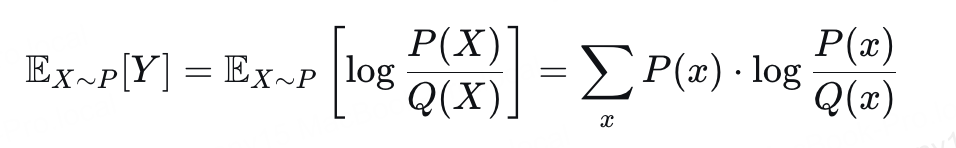

结论：
    

### DPO推导

针对RLHF，我们需要求解以下约束优化问题：
    

根据以上KL与期望结论，对以上问题进行变换：
    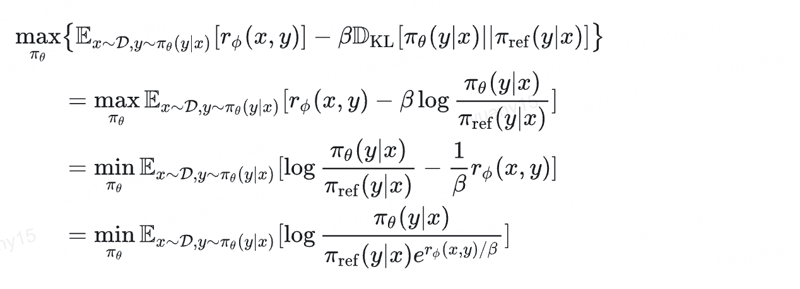

分母为一个分布，我们重新构造一个分布π*(y|x)，代表分母的分布，为保证分布有效性（和为1），引入配分函数:
    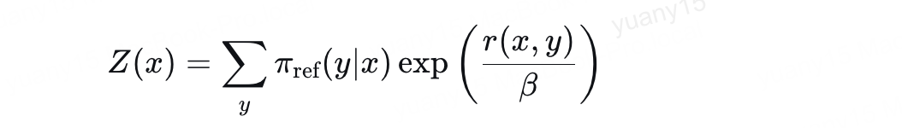

则：
    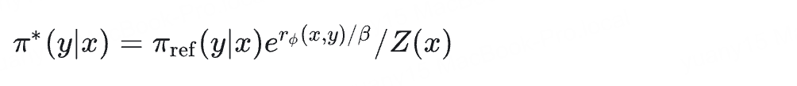

代入上面的式子：
    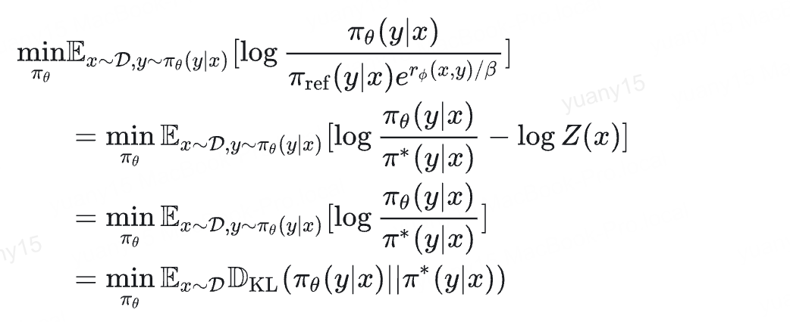

由于KL散度最小值在两个分布相同时取得，也即是π\* = πθ,由此得出结论：**RLHF训练希望得到的最优概率分布为π*.**

而根据π\*的公式，我们能拿到π\*和rΦ的关系，**那么我们能否将RM的目标从训练rΦ变成训练π\*呢**

转换一下公式：
    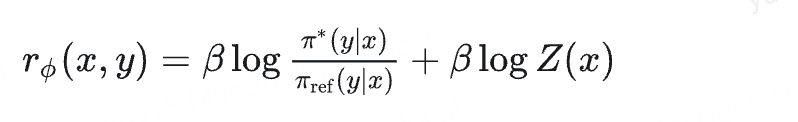

代入到RM的训练目标：
    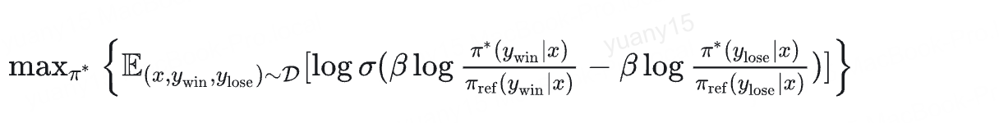

π\* = πθ，也即是：
    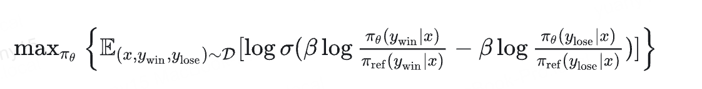

## 引申问题

### 1. 从推导来看，DPO本质是在训一个RM，那么是否可以用DPO训练的模型当做RM，用于RLHF

答案：不行

DPO转换了RM的打分函数rΦ，DPO求解的是π\*,缺少了一个常数项，如果RLHF改成分差，或许可行，但是RLHF算法需要绝对奖励。

从这个角度看，传统RLHF使用的是绝对奖励，是一个**绝对RL系统**，由此问题就转化为，**为什么RLHF不使用相对奖励**？于是答案就又回来了：**DPO就是相对奖励RL**。

### 2. 为什么PPO需要绝对奖励？
