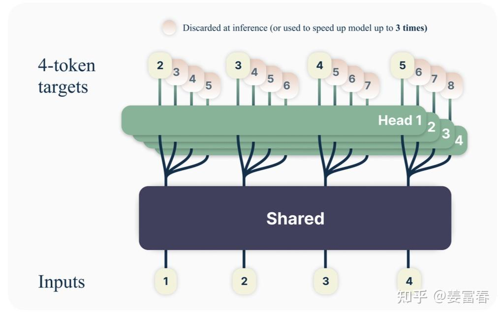
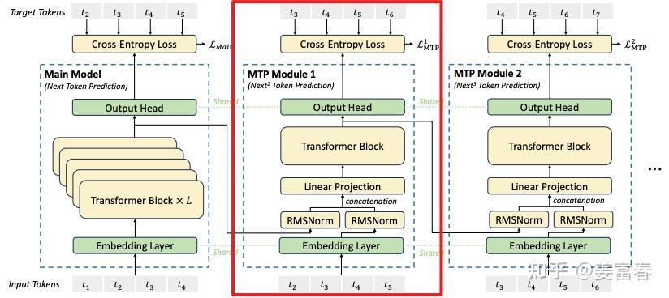

# MTP

通过改造输出层，增加多路MLP，每路输出不同位置的token，再进行校验，选择连续正确的序列，以此缩短训练和推理时间。

## 实现步骤

以下是两个阶段的流程：
    

**predict**：每路生成自己位置的token，总共K个  
**verify**：将predict生成的token进行拼接，组成K组，输入到对应路，预测下一个token，将新预测的token与predict生成的token进行比对，正确则保留，选择连续正确最长的作为本次生成结果。

循环以上步骤，直到生成完毕。

## Meta 实现

如上图，meta实现方式在主网络下接4个并行预测头(MLP)，分别预测*ti* 后4个token

## DeepSeek 实现

如上图，deepseek实现上，将主网络后的并行预测头改成了类Transformer结构，首token保持不变，后续token的预测网络，由MLP改成了类Transformer，同时计算多个loss，**并且包含对应前序token的输入**

对比deepseek和meta，可以发现deepseek推理阶段会有不同，因为后续token需要依赖前序token作为输入，因此推理时，会将上一个预测token作为下一个的输入。
