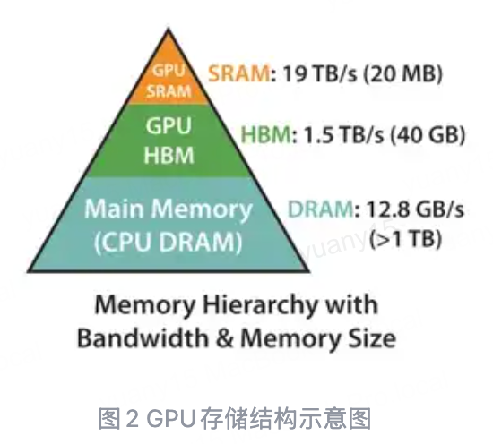
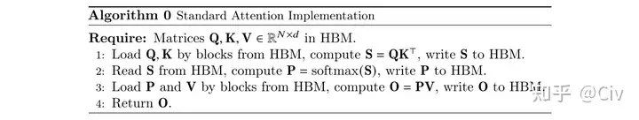

# FlashAttention：分块、在线 softmax 与 IO 优化

先抓住这篇笔记的问题：Attention 的矩阵乘法可以分块，softmax 却要知道一整行的分母。怎样一块一块地计算，又得到与整行一起算相同的结果？下面先解释存储瓶颈，再推导分块之间需要传递哪些量。

FlashAttention 通过分块和融合减少 GPU HBM 与片上存储之间的数据搬运，避免把完整的注意力分数/概率矩阵写入 HBM。它在实数运算意义上计算相同的注意力；浮点运算顺序变化会引入数值差异。密集注意力的二次计算量不会因此消失。

## 1. 注意力与存储瓶颈

考虑一个长度为 $N$ 的序列和其中一个注意力头。令 $Q,K,V$ 分别表示 query、key、value 矩阵，$Q,K\in\mathbb R^{N\times d}$，这里 $d$ 是该头的 query/key 维度。每一行 query 通过与所有 key 做点积，判断应该从各个位置的 value 取多少信息。

我们把点积经过缩放和掩码后的分数矩阵记为 $S$，把 softmax 后的注意力权重记为 $P$，最终加权得到的输出记为 $O$：

$$
S=\frac{QK^\top}{\sqrt d}+M,
\qquad P=\operatorname{Softmax}(S),
\qquad O=PV.
$$

$M$ 为注意力掩码，例如因果注意力会屏蔽未来位置。softmax 沿 key 维执行，即对每个 query 的一整行分数归一化，让这一行的权重之和为 1。$O=PV$ 再用这些权重对 value 求加权和。

朴素实现可能先把完整 $S$ 写入 GPU 主显存 HBM，再读出做 softmax，将 $P$ 写回 HBM，最后又读出 $P$ 去乘 $V$。$S$ 与 $P$ 的大小都是 $N\times N$，因此序列越长，中间结果的存储与搬运越昂贵。

HBM 容量大，适合放模型与大张量；片上 SRAM 容量小，但访问通常更快。FlashAttention 希望让一个能装进片上存储的小块连续完成多步运算，减少把中间结果反复搬进搬出 HBM。图中的具体容量、带宽是硬件示例。

这也解释了为什么只看 FLOPs 不够：**计算受限**时，主要时间花在运算，例如许多大矩阵乘法；**访存受限**时，主要时间花在搬数据，例如不少逐元素、归约操作。实际属于哪一类仍取决于张量形状与实现。

把相邻操作融合到一个内核里，可以让一个块的中间结果留在片上。真正的难点是：一个块只看见部分 key，而 softmax 的分母需要整行所有 key 的分数。接下来的推导就是为了解决这个全局依赖。

## 2. 稳定 softmax

先固定一个 query，只看它对所有 key 的一行分数 $s=(s_1,\ldots,s_N)$。$s_j$ 是它对第 $j$ 个 key 的分数，$j$、$k$ 都是遍历 key 位置的下标。普通 softmax 会给每个 $e^{s_j}$ 除以整行指数和。

为避免较大的分数在取指数后溢出，我们定义三个辅助量：$m(s)$ 是这一行的最大分数；$f_j(s)$ 是减去最大值后的第 $j$ 个指数权重；$\ell(s)$ 是这些权重的总和，充当归一化分母：

$$
m(s)=\max_j s_j,\qquad
f_j(s)=e^{s_j-m(s)},\qquad
\ell(s)=\sum_j f_j(s).
$$

$$
\operatorname{Softmax}(s)_j
=\frac{e^{s_j}}{\sum_k e^{s_k}}
=\frac{f_j(s)}{\ell(s)}.
$$

**这一步为什么等价：** 分子、分母同时除以 $e^m$：

$$
\frac{e^{s_j}}{\sum_ke^{s_k}}
=\frac{e^m e^{s_j-m}}{e^m\sum_ke^{s_k-m}}
=\frac{e^{s_j-m}}{\sum_ke^{s_k-m}}.
$$

这里 $f$ 还不是概率；只有将每个 $f_j$ 除以共同的 $\ell$，才得到总和为 1 的概率。后面分块时，正是分别维护“分子采用的最大值基准”和“分母的总和”。

所有分数共同减去最大值，不改变结果，但能避免指数上溢。这里是减去最大值，不是除以最大值。

公式配图（可选）

## 3. 两个块如何合并

### 3.1 先分别计算两个块的局部量

将同一行分数切成互不重叠的两块，第一块包含的位置组成集合 $B_1$，第二块组成 $B_2$，二者合起来覆盖整行。例如四个 key 可以分成 $B_1=\{1,2\}$、$B_2=\{3,4\}$。

对于任意一块 $b\in\{1,2\}$，我们先只用块内分数，定义局部最大值 $m_b$、局部指数权重 $f_j^{(b)}$、局部分母 $\ell_b$ 和局部概率 $p_j^{(b)}$：

$$
m_b=\max_{j\in B_b}s_j,\quad
f_j^{(b)}=e^{s_j-m_b},\quad
\ell_b=\sum_{j\in B_b}f_j^{(b)},\quad
p_j^{(b)}=\frac{f_j^{(b)}}{\ell_b}.
$$

这里先假设每个块至少有一个有效的有限分数；完全被 mask 的块按零贡献处理，实现时需避免对负无穷作未定义的相减。

局部概率回答的是“如果只在这一块里选择，应怎样分配权重”。它不知道另一块里是否有更大的分数。每个块的概率各自和为 1，直接拼接后总和为 2，因此不能把两组局部概率直接当作整行结果。

### 3.2 把两个块换到同一个最大值基准

两块分别减去了 $m_1$、$m_2$，指数权重使用的基准不同，不能直接相加。先定义共同基准 $m=\max(m_1,m_2)$。再定义 $\alpha$ 和 $\gamma$：它们分别把第一块、第二块的指数权重换算到这个共同基准：

$$
m=\max(m_1,m_2),\qquad
\alpha=e^{m_1-m},\quad\gamma=e^{m_2-m}.
$$

对第二块的每个分量，加减局部最大值 $m_2$：

$$
\begin{aligned}
f_j^{\rm global}
&=e^{s_j-m}\\
&=e^{(s_j-m_2)+(m_2-m)}\\
&=e^{s_j-m_2}e^{m_2-m}\\
&=\gamma f_j^{(2)},\qquad j\in B_2.
\end{aligned}
$$

第一行是希望得到的全局指数权重；第二行在指数里加上再减去 $m_2$，数值不变；第三行把指数拆成乘积，认出其中一项就是已经算过的局部权重。这样只需给第二块整体乘一个 $\gamma$，不用重新逐元素取指数。

第一块同理得到 $f_j^{\rm global}=\alpha f_j^{(1)}$；整个指数向量为 $[\alpha f^{(1)};\gamma f^{(2)}]$，此时还没有除以全局分母。

### 3.3 分母按相同系数缩放后相加

把全局指数和按两个块拆开：

$$
\begin{aligned}
\ell
&=\sum_{j\in B_1\cup B_2}e^{s_j-m}\\
&=\sum_{j\in B_1}\alpha f_j^{(1)}+\sum_{j\in B_2}\gamma f_j^{(2)}\\
&=\alpha\sum_{j\in B_1}f_j^{(1)}+\gamma\sum_{j\in B_2}f_j^{(2)}\\
&=\alpha\ell_1+\gamma\ell_2.
\end{aligned}
$$

### 3.4 统一除以新的全局分母

因此各块对全局 softmax 的贡献为：

$$
p_j=\begin{cases}
\alpha f_j^{(1)}/\ell,&j\in B_1,\\
\gamma f_j^{(2)}/\ell,&j\in B_2.
\end{cases}
$$

两个块现在共用最大值 $m$ 和分母 $\ell$，所以拼接后的概率之和为 1。对某一个 key 的最终权重，既保留了它自己的分数，也考虑了另一块所有 key 对分母的贡献。

处理第 3、4、… 块时，把已经处理过的全部块视为“第一块”，新读入的块视为“第二块”。此时 $m_1,\ell_1$ 表示累计统计量，重复以上四步就能继续合并，不需要把之前的全部分数读回来。

公式配图（可选）

## 4. 为什么不必保存完整注意力矩阵

Attention 最后需要的是 value 的加权和，而不是把整行概率保存下来。因此，对第 $b$ 个块，我们定义向量 $u_b$ 为它的**未归一化输出累加值**。这里 $v_j$ 是第 $j$ 个 key 对应的 value 向量，先乘指数权重，再在块内相加：

$$
u_b=\sum_{j\in B_b}e^{s_j-m_b}v_j.
$$

因为 $u_b$ 使用的仍是块自己的最大值 $m_b$，合并时它也要乘与分子相同的换算系数。合并后的 $u$ 是整行未归一化输出，最后除以全局分母 $\ell$，才得到当前 query 的注意力输出 $O$：

$$
u=\alpha u_1+\gamma u_2,
\qquad O=\frac{u}{\ell}.
$$

**输出也按同样规则合并，不能只合并 softmax 分母。** 将加权和按块展开：

$$
\begin{aligned}
u
&=\sum_{j\in B_1\cup B_2}e^{s_j-m}v_j\\
&=\alpha\sum_{j\in B_1}e^{s_j-m_1}v_j
+\gamma\sum_{j\in B_2}e^{s_j-m_2}v_j\\
&=\alpha u_1+\gamma u_2.
\end{aligned}
$$

也可以选择维护已经归一化的局部输出 $O_1=u_1/\ell_1$、$O_2=u_2/\ell_2$，则用 $u_b=\ell_bO_b$ 代入：

$$
O=\frac{\alpha u_1+\gamma u_2}{\alpha\ell_1+\gamma\ell_2}
=\frac{\alpha\ell_1O_1+\gamma\ell_2O_2}{\alpha\ell_1+\gamma\ell_2}.
$$

这说明合并两个局部输出不能简单取平均：需要先用各自的 $\ell_b$ 恢复未归一化加权和，按 $\alpha,\gamma$ 换到同一个基准，再除以合并后的分母。对于多个 query 行，每行都有自己的最大值、分母和输出累加器；批量计算时分别沿行应用这套规则。

因此每个 query 行可维护最大值 $m$、指数和 $\ell$、输出累加器 $u$，依次处理 key/value 块。块内仍然需要临时计算分数和指数；避免的是在 HBM 保存完整 $N\times N$ 矩阵，而不是完全不产生任何分数矩阵。

反向传播可依据保存的统计量重计算块内分数/概率。用额外局部计算换取更少的 HBM 读写，并减少中间张量显存。

可以按操作顺序理解整个前向：读入一个 query 块和一块 K/V → 在片上计算局部分数 → 更新每行的 $m,\ell,u$ → 丢弃该块临时分数 → 继续下一块 K/V → 全部处理后输出 $u/\ell$。保留下来的是少量逐行统计量与输出，不是完整分数矩阵。

## 5. FlashAttention-2

FA2 的重点包括：减少非矩阵乘 FLOPs、沿序列维增加线程块并行度、调整 warp 分工以减少共享内存通信。FA1 已经使用矩阵乘法，因此“把向量计算改成矩阵乘法”不能准确概括升级。

原论文报告的约 50%–73% 峰值 FLOPs/s 利用率针对 A100 上特定 attention 配置，不能直接等同于任意完整模型的训练利用率。

## 6. FlashAttention-3

FA3 针对 Hopper 架构利用异步 Tensor Core、TMA、流水重叠以及 FP8 等能力。论文中最高约 75% 的利用率等结果来自具体 H100 配置，不是跨硬件、跨形状的固定保证，也不是所有设置都会从 30% 升到 75%。

## 7. 来源

- [FlashAttention](https://arxiv.org/abs/2205.14135)：IO-aware exact attention、分块与重计算。
- [FlashAttention-2](https://arxiv.org/html/2307.08691)：算法与工作划分。
- [FlashAttention-3](https://arxiv.org/abs/2407.08608)：Hopper、异步和低精度。
