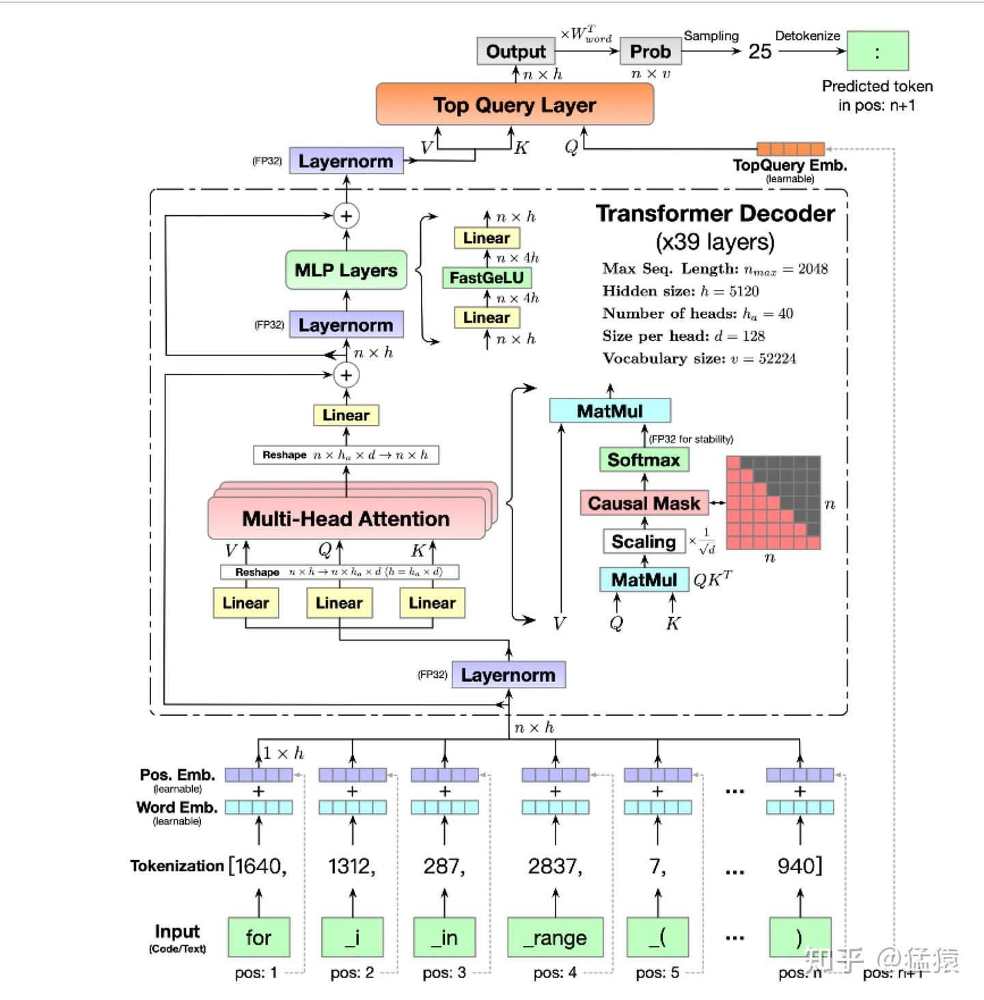
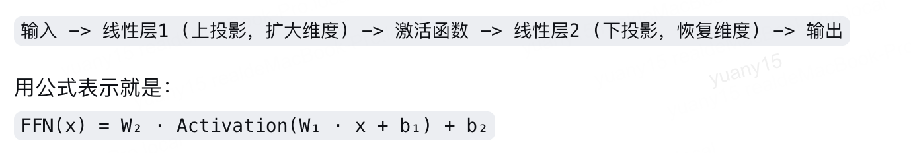

# Transformer 结构与 RoPE

这篇笔记先说明 Transformer 中 Attention 与 MLP 各自做什么，再重点解释 RoPE：怎样给 query 和 key 加入位置，以及为什么旋转后会出现相对位置差。



配图是一个带 learned position embedding 和 Top Query Layer 的具体 decoder 示例。下面分别介绍通用残差子层、RoPE 和 SwiGLU；具体模型会选择不同组合。

## 1. Transformer block

对于进入一个 Transformer block 的 token 表示，我们记作 $X$。以 pre-norm 结构为例：先对 $X$ 做归一化，交给 Attention 聚合其他位置的信息，再加回输入得到中间表示 $U$；然后对 $U$ 归一化，交给 MLP 变换特征，再加回 $U$ 得到输出 $Y$：

$$
\begin{aligned}
U &=X+\operatorname{Attention}(\operatorname{Norm}_1(X)),\\[4pt]
Y &=U+\operatorname{MLP}(\operatorname{Norm}_2(U)).
\end{aligned}
$$

这里 $\operatorname{Norm}_1,\operatorname{Norm}_2$ 是两个子层各自的归一化操作。Attention 负责跨 token 交互，MLP 通常逐 token 运算；两次加法都是残差连接，保留已有表示并叠加新的变换结果。

## 2. MLP 与门控变体

设每个 token 的输入宽度为 $H$，中间特征宽度为 $I$。普通两层 MLP 先用 $W_1\in\mathbb R^{H\times I}$ 将输入映射到中间空间，再逐元素应用非线性函数 $\phi$，最后用 $W_2\in\mathbb R^{I\times H}$ 映射回残差分支要求的宽度；$b_1,b_2$ 是对应偏置：

$$
\operatorname{MLP}(X)=\phi(XW_1+b_1)W_2+b_2.
$$



写成 $XW$ 时，每个 token 用一行表示；也可以用列向量写成 $Wx$，两种记法需要相应转置权重，表示的是同一个线性变换。

两个线性投影之间的激活函数引入非线性。末端线性层将特征映射回残差维度；“为什么不再加一次激活”是架构选择，不是数学上只能有一个激活函数。

SwiGLU 常用三个无偏置投影：

$$
\operatorname{SwiGLU}(X)
=\bigl[\operatorname{SiLU}(XW_g)\odot(XW_u)\bigr]W_d.
$$

详见[激活函数](激活函数.md)与[参数量、显存分析](显存分析.md)。

## 3. RoPE：每对维度上的旋转

Attention 的点积需要同时反映内容和位置。RoPE 的做法是：对于位置 $m$ 的 query 向量 $q$，按与 $m$ 有关的角度旋转它；对于位置 $n$ 的 key 向量 $k$，按与 $n$ 有关的角度旋转它。之后再计算二者的点积。

为实现这个旋转，先把一个 attention head 中参与旋转的 $d$ 个实数坐标两两配对，因此 $d$ 必须为偶数，共有 $d/2$ 对。我们用 $i$ 表示第几对，并为它定义角频率 $\omega_i$，也就是位置每增加 1 时旋转多少弧度：

$$
\omega_i=b^{-2i/d},\qquad i=0,\ldots,d/2-1,
$$

其中 $b$ 是配置里的 `rope_theta`，不是角频率 $\omega_i$。位置 $m$ 上的二维向量按角度 $m\omega_i$ 旋转：

$$
R(m\omega_i)=
\begin{bmatrix}
\cos(m\omega_i)&-\sin(m\omega_i)\\
\sin(m\omega_i)&\cos(m\omega_i)
\end{bmatrix}.
$$

把一对实数写成复数 $q_i=q_i^{(R)}+\mathrm i q_i^{(I)}$，等价于：

$$
f(q_i,m)=q_i e^{\mathrm i m\omega_i}.
$$

这里 $\mathrm i$ 是满足 $\mathrm i^2=-1$ 的虚数单位，下标 $i$ 则是维度对编号。一个二维实向量可把第一坐标记为实部、第二坐标记为虚部；乘 $e^{\mathrm i m\omega_i}$ 的模长是 1，所以只改变方向、不改变该对坐标的长度。这就是选择复指数表示旋转的原因。

不同维度对使用不同频率：有些随位置变化转得快，有些转得慢，从而让不同维度携带不同尺度的位置变化信息。原始 RoPE 对 Q、K 做旋转，V 通常不做这一位置旋转。

## 4. 为什么点积包含相对位置

先看一对 query/key 坐标。把 query 的两个数记为 $(a,b)$，key 的两个数记为 $(c,d)$，并定义它们的复数表示 $z_{q,i}=a+\mathrm i b$、$z_{k,i}=c+\mathrm i d$；这一段的 $a,b,c,d$ 仅表示四个坐标值。复共轭把虚部符号翻转，因此 $\overline{z_{k,i}}=c-\mathrm i d$。取乘积的实部得到：

$$
\operatorname{Re}\!\left[(a+\mathrm i b)(c-\mathrm i d)\right]=ac+bd,
$$

实二维点积恰好等于一个复数乘另一个共轭复数后的实部。旋转后的点积逐步变为：

$$
\begin{aligned}
\langle R(m\omega_i)q_i,R(n\omega_i)k_i\rangle
&=\operatorname{Re}\!\left[(z_{q,i}e^{\mathrm i m\omega_i})\overline{(z_{k,i}e^{\mathrm i n\omega_i})}\right]\\
&=\operatorname{Re}\!\left[z_{q,i}e^{\mathrm i m\omega_i}\overline{z_{k,i}}e^{-\mathrm i n\omega_i}\right]\\
&=\operatorname{Re}\!\left[z_{q,i}\overline{z_{k,i}}e^{\mathrm i(m-n)\omega_i}\right].
\end{aligned}
$$

第二步使用乘积的共轭，以及单位复指数取共轭后角度变负；第三步合并同底指数。

全向量内积是所有维度对的上述结果之和。在位置 $m$ 与 $n$ 分别旋转后，一正一负的两个角度合成了 $(m-n)\omega_i$，因此点积自然携带二者的相对位置信息。这是实向量与复数表示之间的精确等价。

显式旋转因子只含位置差 $m-n$，但分数还依赖 Q、K 的内容表示；不能把整项注意力说成“只依赖相对距离”。

## 5. 与 rotate_half 代码对照

实际代码通常直接操作实数张量。这里采用 split-half 布局：把向量前半记为 $x$、后半记为 $y$；前半第 $i$ 个数与后半第 $i$ 个数配成一对。为了实现旋转，我们再定义辅助操作 `rotate_half`：交换这两半，并给原后半加负号：

$$
q=[x;y],\qquad x=q[0:d/2],\qquad y=q[d/2:d],
\qquad \operatorname{rotate\_half}(q)=[-y;x].
$$

例如 $q=[a,b,c,d]$ 时，配对是 $(a,c)$、$(b,d)$，而 `rotate_half(q)` 得到 $[-c,-d,a,b]$。Python 切片右端不包含在内，因此后半从 `d//2` 开始，正好覆盖剩余元素。

### 5.1 展开一对坐标的复数乘法

先只看其中一对坐标，把实部、虚部分别暂记为标量 $x,y$，旋转角度记为 $a=m\omega_i$。欧拉公式将复指数写成 cos 与 sin 的组合；再按普通乘法分配律展开四项：

$$
\begin{aligned}
(x+\mathrm i y)e^{\mathrm i a}
&=(x+\mathrm i y)(\cos a+\mathrm i\sin a)\\
&=x\cos a+\mathrm i x\sin a+\mathrm i y\cos a+\mathrm i^2y\sin a\\
&=x\cos a-y\sin a+\mathrm i(x\sin a+y\cos a).
\end{aligned}
$$

这里用到了 $\mathrm i^2=-1$，因此旋转后的实部是 $x\cos a-y\sin a$，虚部是 $x\sin a+y\cos a$。

### 5.2 将实部与虚部重新堆成向量

令 $x,y$ 表示所有维度对的前半、后半向量，$c=\cos(m\omega)$、$s=\sin(m\omega)$ 表示逐对角度的三角函数。先分别写两个半区，再拆成两项：

$$
\begin{aligned}
q_{\rm rot}
&=[x\odot c-y\odot s\ ;\ x\odot s+y\odot c]\\
&=[x;y]\odot[c;c]+[-y;x]\odot[s;s]\\
&=q\odot[c;c]+\operatorname{rotate\_half}(q)\odot[s;s].
\end{aligned}
$$

这就是代码中 cos/sin 复制成两半，以及 `rotate_half(q)=[-y;x]` 的由来，不是直接省略复数符号后随意拼接。

### 5.3 将旋转写成实数张量运算

第一步，根据每个 token 的位置 $m$ 和每对坐标的频率 $\omega_i$，计算角度以及 cos/sin。由于一对坐标的实部、虚部共用同一个角度，要将得到的 $d/2$ 个 cos/sin 值分别复制成前后两半，匹配长度为 $d$ 的向量。

第二步，构造 `rotate_half(q)`，再做逐元素乘加。符号 $\odot$ 表示相同位置的元素相乘，$[x;y]$ 表示拼接，二者都不是矩阵乘法：

```python
# split-half 版本；cos、sin 已复制为 [freqs, freqs] 并广播到 head 维。
x1, x2 = q[..., :q.shape[-1] // 2], q[..., q.shape[-1] // 2:]
rotated_half = torch.cat((-x2, x1), dim=-1)
q_rot = q * cos + rotated_half * sin
```

还有相邻维度交错配对的实现。两种布局可通过相应置换表达相同旋转思想，但加载权重和应用算子时必须保持一致，不能把“前后各一半”当成 RoPE 的唯一规则。


<details>
<summary>配图与实现示例</summary>

基础旋转不额外缩放幅值；实现中的 `rope_type`、`attention_scaling` 等配置需要按具体模型选择。


</details>

## 6. 扩展上下文长度的边界

增大基数 $b$ 会降低 $i>0$ 维度对的角频率；$i=0$ 的频率仍为 1。改变频率结构不等于自动获得可靠的长上下文能力，还需匹配训练长度、继续训练/适配和评测。

最简单的位置插值可写成：

$$
m'=m/s,\qquad s>1,
\qquad m'\omega_i=m(\omega_i/s).
$$

它是在位置或频率上做缩放，不等于任意修改 $-2i/d$ 的指数。NTK-aware scaling、YaRN 等使用不同规则，应标注具体方法，不能合并成一个通用“加 α”公式。

## 7. 来源

- [RoFormer 原论文](https://arxiv.org/html/2104.09864)：旋转位置编码与相对位置结构。
- [Transformers RoPE utilities](https://huggingface.co/docs/transformers/main/en/internal/rope_utils)：不同缩放方案与配置。

