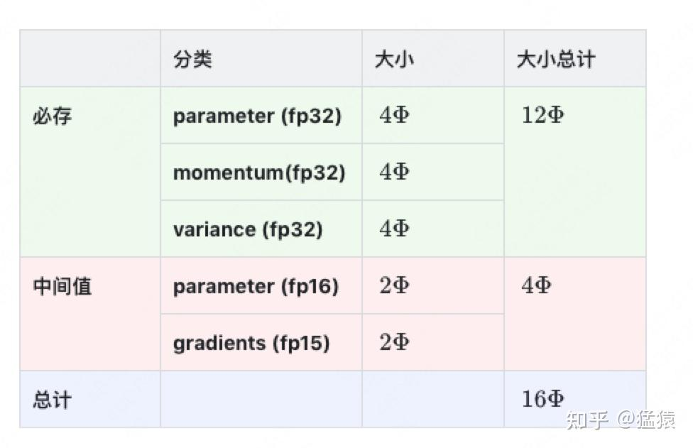
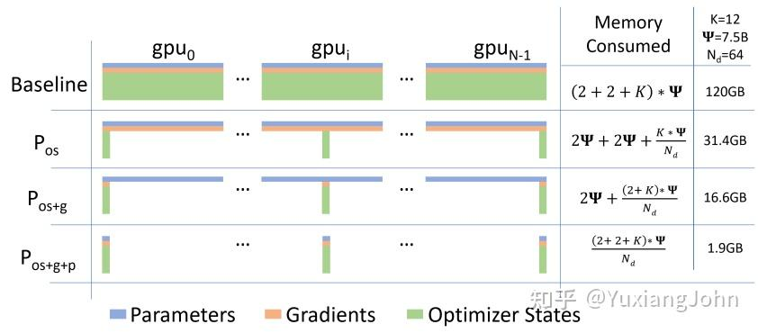
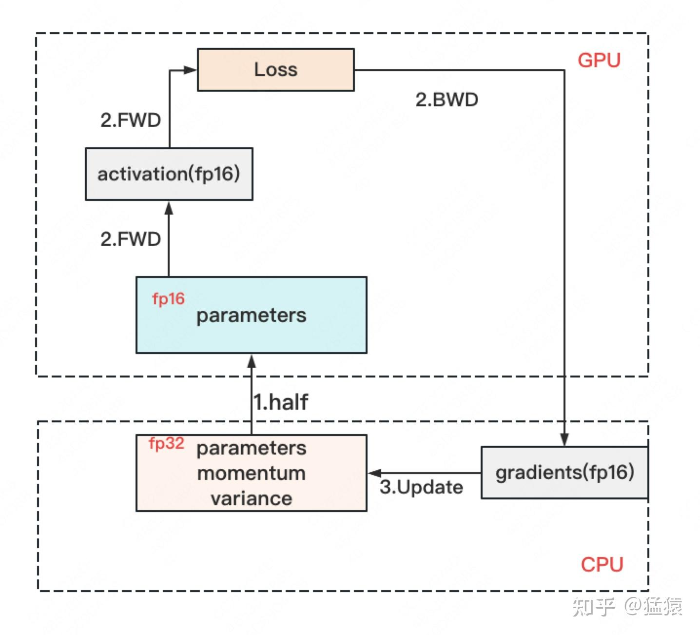

# 分布式训练：数据并行、ZeRO 与 FSDP

数据并行先把不同训练样本交给多个模型副本，再把它们算出的梯度合起来。理解 DDP 和 ZeRO，需要分清三个问题：数据由谁计算、梯度怎样同步、参数和优化器状态由谁保存。

## 1. 集合通信原语

先约定术语：一个 **rank** 是通信组中的一个进程编号；常见训练方式是一张 GPU/NPU 对应一个进程。通信组指定哪些进程一起执行同一次集合通信。“归约”表示把不同进程上相同位置的数据按同一个操作合并，例如求和或取最大值。

NCCL 常用于 NVIDIA GPU，HCCL 用于昇腾 NPU。All-Reduce、All-Gather、Reduce-Scatter 是集合通信操作，不属于某一家硬件独有。

- **All-Reduce**：对各 rank 同一位置的张量做归约，每个 rank 得到完整结果。求平均通常由求和再除以组大小实现。
- **All-Gather**：收集各 rank 的分片，每个 rank 得到所有分片。
- **Reduce-Scatter**：先归约，再把归约结果分片，每个 rank 保留一个分片。

例如两个 rank 分别持有 `[2, 3]` 与 `[4, 5]`：All-Reduce(SUM) 后两边都拿到 `[6, 8]`；All-Gather 后两边都能拿到原来的两份向量；若对这两个元素做 Reduce-Scatter，则先求得 `[6, 8]`，再让两边各保留其中一部分。


以下是 HCCL 示例，需在安装了匹配版本 `torch_npu` 的多 NPU 环境中以 `torchrun` 启动。`LOCAL_RANK` 选本机设备；全局 `RANK` 标识整个通信组中的进程，多机时不能混用。这段示例未在本次文档修订中运行硬件测试。

```python
import os
import torch
import torch_npu
import torch.distributed as dist

local_rank = int(os.environ["LOCAL_RANK"])
torch.npu.set_device(local_rank)
dist.init_process_group(backend="hccl", init_method="env://")
rank, world_size = dist.get_rank(), dist.get_world_size()
device = torch.device(f"npu:{local_rank}")
x = torch.tensor([2., 3.], device=device) + 2 * rank
summed = x.clone()
dist.all_reduce(summed, op=dist.ReduceOp.SUM)
gathered = [torch.empty_like(x) for _ in range(world_size)]
dist.all_gather(gathered, x)
print(rank, summed, gathered)
dist.destroy_process_group()
```

## 2. DP 与 DDP

PyTorch `DataParallel`（DP）通常在单进程中复制模型，将输入分给多个设备，汇集输出，并把副本梯度累加到原始模块的参数上。不能描述成“把梯度 All-Reduce 到 GPU0”：All-Reduce 的语义是每个参与 rank 都得到结果。DP 的主设备往往有额外输出、梯度和优化器负担，且不是常规多机训练方案。

`DistributedDataParallel`（DDP）通常每设备一个进程，各模型副本处理不同数据，反向传播时同步梯度，各进程再用相同优化器状态更新本地参数。数据划分一般由 `DistributedSampler` 等负责。DDP 不等于 Ring All-Reduce；后端会按拓扑、消息大小和实现选择 ring、tree 等算法。

### Ring All-Reduce 的开销

设组内有 $N$ 个 rank，每个 rank 都有一份大小为 $M$ **字节**的待归约张量。训练中这通常是某个梯度 bucket：各 rank 上的同一位置对应同一个参数，但数值来自不同训练数据。把每份张量切成 $N$ 块，每块 $M/N$ 字节，再把 rank 连成逻辑环，每次只向下一位发送、从上一位接收。

**第一阶段 Reduce-Scatter：** 每收到一块，就把相同位置的本地贡献累加进去，并继续沿环传递。经过 $N-1$ 步，每个 rank 留下一块已经汇总全部 rank 贡献的结果；不同 rank 持有不同块。例如四卡时，一张卡最终负责第 0 块的四卡梯度之和，另一张负责第 1 块，依此类推。

**第二阶段 All-Gather：** 归约已经完成，只需把这些结果块继续传给其他 rank，不再重复求和。再经过 $N-1$ 步，每个 rank 就集齐全部 $N$ 个结果块，恢复完整的聚合梯度。

两阶段各 $N-1$ 步，每一步每 rank 发送 $M/N$ 字节，因此单 rank 总发送量为：

$$
V_{\mathrm{send,rank}}=2\frac{N-1}{N}M.
$$

这是单 rank 的发送量；接收量相同，不能在带宽口径不变时又随意加倍。理想带宽模型为：

$$
t_{\mathrm{ring}}\approx2(N-1)\alpha+\frac{2(N-1)M}{NB},
$$

其中 $\alpha$ 为每步延迟，$B$ 是有效单向带宽，单位 byte/s。


例：3 亿参数的 FP32 梯度有 $M=1.2\times10^9$ byte。10 Gb/s 等于 $1.25\times10^9$ byte/s；忽略延迟且 $N$ 足够大：

$$
t\approx\frac{2.4\times10^9}{1.25\times10^9}=1.92\ \mathrm{s}.
$$

有限 $N$ 时再乘 $(N-1)/N$。这里分子、分母都用 byte；带宽中的 Gb/s 是 bit/s，必须先除以 8 才能相除。实际耗时还受有效带宽和计算通信重叠影响。

### backward 同步梯度，optimizer.step 更新参数

反向传播会逐层产出梯度，前面一部分梯度就绪时，其他层往往还在计算。如果等所有梯度都算完才通信，计算和通信只能串行等待。DDP 把梯度组织成 bucket。某个 bucket 的梯度就绪后，可以与后续反向计算重叠地发起通信；不必等所有梯度计算完才开始。**backward 中主要是计算和同步梯度，参数更新发生在优化器 step。** bucket 大小可配置，效果取决于模型、后端与网络。


上图用于说明重叠的动机，不代表所有模型、硬件或 backend 的耗时比例。DDP 仍为每个 rank 保存完整模型状态，不能单独解决模型状态超出单卡显存的问题。

## 3. ZeRO：切分冗余模型状态

采用传统混合精度 Adam 口径：低精度权重 2 byte、梯度 2 byte、FP32 主权重与两个优化器矩各 4 byte，总计每参数 16 byte。设参数量 $P$、数据并行组大小 $N$：

| 策略 | 切分的状态 | 每 rank 常驻模型状态字节数 |
| --- | --- | --- |
| 普通 DP/DDP | 无 | $16P$ |
| ZeRO-1 | 主权重、优化器矩 | $4P+12P/N$ |
| ZeRO-2 | 再切分梯度 | $2P+14P/N$ |
| ZeRO-3 | 再切分低精度参数 | $16P/N$ |

**上表从哪里来：** 先把状态拆成低精度参数 $W=2P$、梯度 $G=2P$、主权重和优化器状态 $O=12P$，再仅对已分片的部分除以 $N$：

$$
\begin{aligned}
M_{\rm DP}&=W+G+O=16P,\\
M_{\rm ZeRO1}&=W+G+O/N=4P+12P/N,\\
M_{\rm ZeRO2}&=W+(G+O)/N=2P+14P/N,\\
M_{\rm ZeRO3}&=(W+G+O)/N=16P/N.
\end{aligned}
$$

这里 $W,G,O$ 都表示**存储字节数**。被分片的状态由 $N$ 个 rank 分担，单 rank 才除以 $N$；仍完整复制的状态维持原大小。三个阶段依次把优化器、梯度、参数纳入分片集合。

不同 dtype、优化器和框架会改变系数；上表不包含激活、临时聚合参数、通信 buffer、碎片和运行时显存。




<details>
<summary>状态图的精度标注</summary>

图中的 `gradients(fp15)` 应为 FP16。12P 部分包含 FP32 主权重以及两个 Adam 状态。

</details>

以 $P=7.5\times10^9,N=64$ 为例，使用十进制 GB：

| 策略 | 每 rank 模型状态 |
| --- | ---: |
| DDP | 120 GB |
| ZeRO-1 | 31.40625 GB |
| ZeRO-2 | 16.640625 GB |
| ZeRO-3 | 1.875 GB |

因此理想模型状态降低 **64 倍**，不是 120 倍，也不是实际整卡峰值降低 64 倍。

### ZeRO-1

ZeRO-1 保留完整的低精度参数副本，但把参数的“更新责任”分给不同 rank。每个 rank 只保存自己负责部分的 FP32 主权重和 Adam 状态。一次训练迭代可以这样理解：

1. 各 rank 用相同参数处理不同数据，前向后反向，算出各自的梯度。
2. 同步梯度，使负责更新某一参数的 rank 拿到该参数在所有数据分片上的聚合梯度。
3. 该 rank 使用本地 Adam 状态更新对应的 FP32 主权重，再转换成用于计算的低精度权重。其余参数由其他 rank 负责更新。
4. 对更新后的低精度权重分片做 All-Gather，让每个 rank 恢复一份完整且一致的计算参数；FP32 主权重与优化器状态继续分片。


一种 $3T$ 通信量的估计来自“梯度 All-Reduce 约 $2T$ + 参数 All-Gather 约 $T$”的简化流程。若实现只把聚合梯度送到负责更新的 rank，可使用 Reduce-Scatter，梯度通信不必包含完整 All-Reduce。**阶段名称描述状态如何存储，不唯一决定通信调度。** 此处 $T$ 是一次完整低精度张量的通信大小，并省略 $(N-1)/N$ 系数；若按元素计数，仍需乘对应 dtype 字节数才能算耗时。

### ZeRO-2

ZeRO-2 进一步利用一个事实：某个 rank 只负责一部分参数的更新，那么更新时也只需要这些参数的聚合梯度，没有必要常驻一整份梯度。

1. 前向仍使用完整的低精度参数，各 rank 处理自己的数据分片。
2. 反向产出的梯度通过 Reduce-Scatter 汇总并分配给对应的更新负责人，每个 rank 只保留自己的梯度分片。
3. 用这一分片的梯度、FP32 主权重和优化器状态完成本地更新。
4. 将更新后的低精度参数 All-Gather，供下一轮计算。

因此常见流程是“梯度 Reduce-Scatter → 本地更新 → 参数 All-Gather”，累计发送量约 $2T$。


实现可以按 bucket 边反向边归约和释放梯度，不要求完整模型的所有梯度先同时驻留再切分。

### ZeRO-3

ZeRO-3 连低精度参数也不再常驻完整副本。对于即将执行的一个模块，先临时凑齐它需要的参数，用完再按配置释放非本地部分：

1. 平时每个 rank 只持有自己的参数、梯度和优化器状态分片。
2. 前向到某个模块之前，通过 All-Gather 取得这个模块的完整参数，算完后可重新分片。
3. 反向再次需要这些参数时，再进行 All-Gather，算出参数梯度和输入梯度。
4. 对参数梯度做 Reduce-Scatter，更新负责人拿到自己的聚合梯度。
5. 各 rank 用本地状态更新本地参数分片；下一次需要完整模块参数时再聚合。

因此，每次具体模块计算仍然有它需要的完整权重，但不要求整份模型权重始终驻留在单卡。


若前向、反向各聚合一次参数，再归约一次梯度，整轮累计发送量约 $3T$，相对约 $2T$ 的基线是 1.5 倍。它不是每算一层都加载整个模型；预取、参数持久化、重计算和重分片策略都可能改变实际通信量与峰值显存。

### ZeRO-R 与 Offload

ZeRO-R 进一步处理模型状态之外的显存：激活检查点也可分给多个 rank 保存，反向需要时再取回，以增加通信换取空间；临时通信 buffer 控制每次集中处理的数据量，兼顾带宽效率与显存上限；内存管理则减少碎片带来的浪费。固定 buffer 控制的是临时空间与通信粒度，不意味着所有配置的全局通信量恒定。

ZeRO-Offload 把优化器状态、FP32 主权重和更新计算等转移到 CPU，GPU 保留主要前向/反向计算，梯度和更新权重跨 CPU/GPU 传输。



收益是节省 GPU 显存，代价是 CPU 计算和主机链路传输；不能无条件声称它减少通信。不同 Offload 方案也可能继续卸载参数或使用 NVMe，应按具体配置区分。

## 4. FSDP

PyTorch FSDP 的全分片模式与 ZeRO-3 具有相近的状态分片思路，但不同 API、策略和分组不完全等价。典型过程是：

1. 计算某个 FSDP 单元之前，All-Gather **当前单元自己的参数**。
2. 执行前向，按重分片策略释放非本地参数分片。
3. 反向需要参数时重新聚合，计算梯度。
4. Reduce-Scatter 梯度，各 rank 用自己的状态更新对应参数分片。

前一层已经传来输入激活，这里要聚合的是当前计算单元的权重。FSDP 单元可以是一个 block 或一组层；如果把整个模型包装为一个单元，临时聚合峰值也会不同。完整显存分析见[显存分析](显存分析.md)。

## 资料

- [PyTorch DDP 设计](https://docs.pytorch.org/docs/stable/notes/ddp.html)
- [PyTorch fully_shard](https://docs.pytorch.org/docs/stable/distributed.fsdp.fully_shard.html)
- [ZeRO 论文](https://arxiv.org/abs/1910.02054)
- [ZeRO-Offload 论文](https://arxiv.org/abs/2101.06840)
