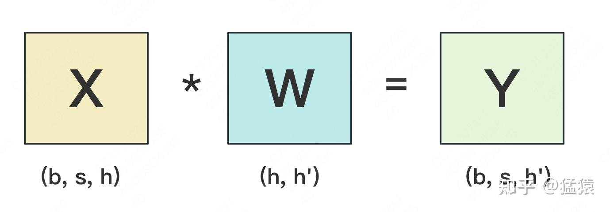
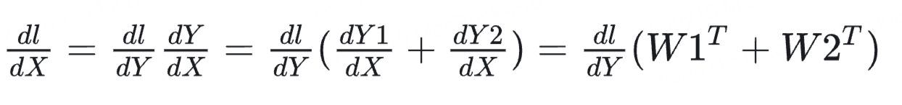
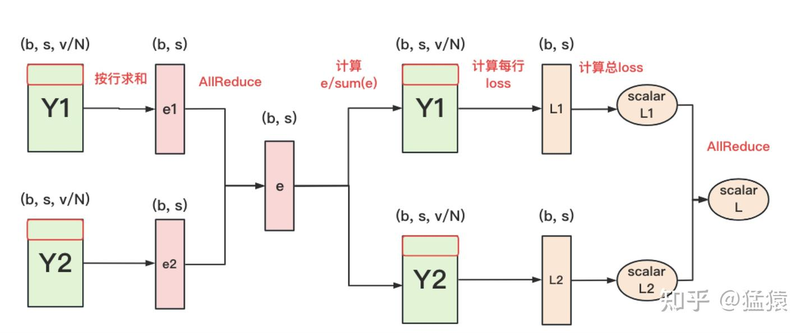
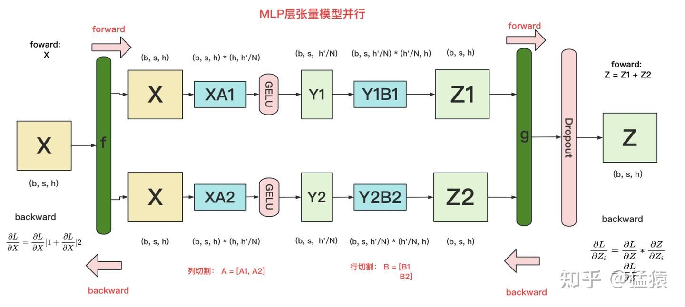
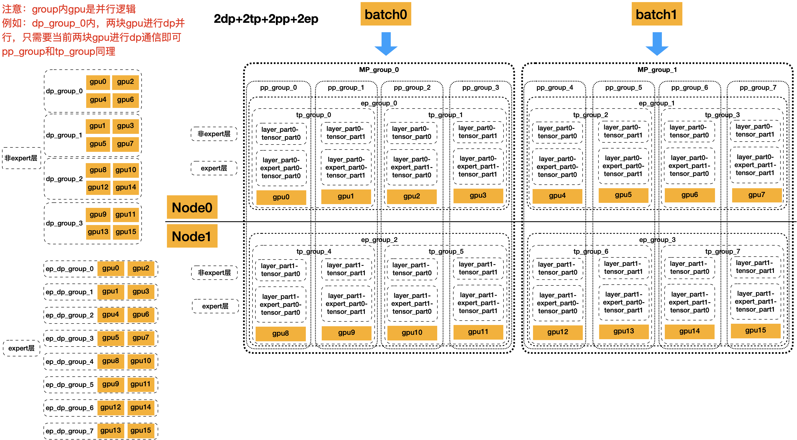

# 分布式训练：张量、专家、序列与上下文并行

模型并行将同一个模型的计算分给多个设备。下面从最简单的线性层开始，分别说明：参数怎样切、前向结果怎样合并、反向梯度怎样回到输入与参数。

## 1. 为什么组合并行

并行既用于让模型、激活和优化器状态放得下，也用于提升吞吐、降低延迟。即使单卡能放下模型，也可能采用 TP 或 PP；DP 是否更快要由批量、序列长度、算子形状和网络拓扑决定。

| 方式 | 主要切分对象 | 主要代价 |
| --- | --- | --- |
| DP / ZeRO | 不同数据；可进一步分片模型状态 | 梯度归约、参数聚合 |
| TP | 单个张量算子的权重与计算 | 层内频繁集合通信 |
| PP | 不同层或模型阶段 | 阶段边界通信、流水线气泡 |
| EP | MoE 专家 | token dispatch / combine |
| SP | 部分激活的序列维度 | 与 TP 配合的 gather / scatter |
| CP | 更完整地切分长序列上下文 | Attention 所需的跨分片信息交换 |

这里的 SP 特指 Megatron 常用的 Sequence Parallelism；其他系统可能用同名术语表示更广义的序列切分。EP 不在数学上要求先启用 DP；Megatron 中它通常复用或重组数据并行维度的进程组。

## 2. TP 的矩阵公式

先定义一个线性层：$X$ 是输入 token 表示，$W$ 是要训练的权重，$Y=XW$ 是输出。输入原本的形状为 $[b,s,h]$：$b$ 是一次处理的序列数，$s$ 是每条序列的长度，$h$ 是每个 token 的输入特征宽度；输出宽度记为 $h'$。

为了只关注矩阵乘法，把 batch 与序列两个维度合并成 $bs$ 个 token：此时 $X\in\mathbb R^{bs\times h}$、$W\in\mathbb R^{h\times h'}$、$Y\in\mathbb R^{bs\times h'}$。这里的“按行/按列切分”都是相对于权重 $W$ 而言，不能直接等同于按 batch 或序列切分。

### 按行切分权重

以两张卡均分输入维度为例，假设 $h$ 可被 2 整除。将 $W$ 的上、下两部分分别记为 $W_1,W_2$，每份形状为 $[h/2,h']$。为了能相乘，也必须把 $X$ 的特征列切成对应的 $X_1,X_2$，每份形状为 $[bs,h/2]$。

同一个输出元素原本要沿完整的输入维度求和；现在两张卡各算一半加数，所以局部结果需要**相加**：

$$
W=\begin{bmatrix}W_1\\W_2\end{bmatrix},\quad
X=[X_1\;X_2],\quad Y=X_1W_1+X_2W_2.
$$

每卡的局部结果都是 $[bs,h']$，但只包含一部分输入特征的贡献。使用 All-Reduce(SUM) 可以让每张卡得到完整输出 $Y$。

接着看反向。$L$ 表示最终的标量训练损失，后续层会传回 $G=\partial L/\partial Y$，称为上游梯度，形状与 $Y$ 相同。我们要分别求输入梯度以继续传给前一层，以及权重梯度以更新本层参数：

$$
\frac{\partial L}{\partial X_i}=GW_i^\top,\qquad
\frac{\partial L}{\partial W_i}=X_i^\top G.
$$

**为什么可以各自在本地求梯度。** 令 $Y_i=X_iW_i$，则 $Y=Y_1+Y_2$，所以 $G_{Y_1}=G_{Y_2}=G$；同时 $Y_2$ 不依赖 $X_1$，交叉导数为零。可用微分把矩阵链式法则明确写出来：

$$
\mathrm dY=\mathrm dX_1W_1+X_1\mathrm dW_1
+\mathrm dX_2W_2+X_2\mathrm dW_2.
$$

上面的 $\mathrm dX_i,\mathrm dW_i$ 表示输入、权重发生微小变化时的增量，$\mathrm dY$ 是它们带来的输出变化。用逐元素乘积求和的方式计算损失变化，就是矩阵的 Frobenius 内积；它记作 $\langle A,B\rangle_F=\operatorname{tr}(A^\top B)$。将输出变化代入链式法则：

$$
\begin{aligned}
\mathrm dL&=\langle G,\mathrm dY\rangle_F\\
&=\sum_{i=1}^2\left[
\langle GW_i^\top,\mathrm dX_i\rangle_F
+\langle X_i^\top G,\mathrm dW_i\rangle_F\right].
\end{aligned}
$$

读出各微分项的系数，就得到上面的 $G_{X_i}$ 与 $G_{W_i}$；这同时说明了为何另一个输入分片不会额外贡献一项。

各卡持有 $G$ 时可独立算局部梯度。$\partial L/\partial X$ 是各 $\partial L/\partial X_i$ 的拼接；只有下游反向算子需要完整梯度时才 All-Gather，配对的列并行层常可直接消费分片。

### 按列切分权重

现在均分的是输出维度，假设 $h'$ 可被 2 整除。每张卡持有 $W$ 的一组输出列，$W_i$ 形状为 $[h,h'/2]$；为了算自己的输出列，两张卡都需要完整输入 $X$。各自产生 $Y_i\in\mathbb R^{bs\times h'/2}$，它们表示不同输出特征，所以用**拼接**组成 $Y$：

$$
W=[W_1\;W_2],\quad Y=[Y_1\;Y_2]=[XW_1\;XW_2].
$$

输入复制到各卡，输出可以继续保持分片，并非每层后都必须 All-Gather。将上游梯度按输出列分成 $G=[G_1\;G_2]$：

$$
\frac{\partial L}{\partial X}=G_1W_1^\top+G_2W_2^\top,\qquad
\frac{\partial L}{\partial W_i}=X^\top G_i.
$$

**按列切分时，两个输出都依赖同一个 X。** 先把损失微分按输出分片拆开，再把对共同输入的贡献相加：

$$
\begin{aligned}
\mathrm dL
&=\langle G_1,\mathrm dY_1\rangle_F+\langle G_2,\mathrm dY_2\rangle_F\\
&=\sum_{i=1}^2\langle G_i,\mathrm dXW_i+X\mathrm dW_i\rangle_F\\
&=\left\langle\sum_{i=1}^2G_iW_i^\top,\mathrm dX\right\rangle_F
+\sum_{i=1}^2\langle X^\top G_i,\mathrm dW_i\rangle_F.
\end{aligned}
$$

同一个输入 $X$ 沿两条路径影响损失：一条经过 $Y_1$，一条经过 $Y_2$。链式法则要求把这两条路径的输入梯度贡献相加，因此对 $\mathrm dX$ 收集系数得到求和梯度。相比之下，$W_i$ 只影响自己的输出分片，权重梯度留在本地。

各卡先算输入梯度的局部贡献，再归约求和；权重梯度保持本地分片。

列并行梯度配图（含符号说明）

图中的两个输出分片应分别使用 $G_1,G_2$；输入梯度是各自 $G_iW_i^\top$ 的和，不能合并为 $G(W_1^\top+W_2^\top)$。

## 3. Embedding 与词表并行损失

输入 `input_ids` 的形状是 $[b,s]$，其中每个整数表示一个 token 在词表中的编号。我们定义词表 embedding 矩阵 $E\in\mathbb R^{V\times h}$，$V$ 是词表大小；第 $v$ 行 $E_v$ 就是编号为 $v$ 的 token 向量。查表后得到 $X\in\mathbb R^{b\times s\times h}$。

将 $E$ 按词表行分给不同卡后，每张卡只负责一个 token 编号范围。对同一个输入编号，拥有该行的卡取出向量，其他卡在相同位置填零；这些局部结果 All-Reduce(SUM) 后，便恢复完整的输入 embedding。

输出头 $W_{\mathrm{out}}\in\mathbb R^{h\times V}$ 可以按词表列切分。它**可能**与输入 embedding 共享，也可能不共享；只有共享时两处梯度才累加到同一参数。

### 不聚合完整 logits 也能算交叉熵

输出头要给每个候选 token 一个分数。对于一个待预测位置，将词表第 $j$ 项的未归一化分数记为 logit $z_j$，各卡只持有自己的词表子集 $\mathcal V_i$。完整 logits 的形状是 $[bs,V]$；如果先把它聚到一起再做 softmax，通信量会随大词表增长。

但交叉熵只关心真值 token 的概率。因此先定义全词表最大值 $m$ 和稳定指数总和 $S$，它们都是“每个待预测位置一个数”：

$$
m=\max_i\max_{j\in\mathcal V_i}z_j,\qquad
S=\sum_i\sum_{j\in\mathcal V_i}e^{z_j-m}.
$$

这里 $k$ 是该位置应预测的真值 token 编号，$p_k$ 是模型给它的概率。交叉熵定义为 $-\log p_k$：真值概率越大，损失越小。只要从负责该 token 的卡取得 $z_k$，便能用共同的 $m,S$ 写出损失：

$$
\ell=-z_k+m+\log S.
$$

**从交叉熵定义展开，才能看清为什么无需完整 logits。**

$$
\begin{aligned}
\ell
&=-\log p_k\\
&=-\log\frac{e^{z_k-m}}{\sum_j e^{z_j-m}}\\
&=-(z_k-m)+\log\sum_i\sum_{j\in\mathcal V_i}e^{z_j-m}\\
&=-z_k+m+\log S.
\end{aligned}
$$

每卡先求本地 max，再 All-Reduce(MAX) 得到 $m$；计算本地指数和后 All-Reduce(SUM) 得到 $S$；仅持有真值 token 的卡贡献 $z_k$，其余贡献 0，通过归约取回。反向对本地 logits 的梯度为：

$$
\frac{\partial\ell}{\partial z_j}=p_j-\mathbf1[j=k],\qquad
p_j=\frac{e^{z_j-m}}{S}.
$$

其中 $\mathbf1[j=k]$ 表示词表项 $j$ 是否就是真值：是真值则减 1，否则只保留 $p_j$。全局标量 $m,S$ 已知后，每卡都能形成自己的梯度分片。

需要分别归约最大值、指数和，以及真值 logit 或等价的局部损失；通信张量大小为 $O(bs)$，避免聚合 $O(bsV)$ 的完整 logits。不能把实际通信字节数笼统写成 $bs+N$。

稳定计算时，最大值归约和指数和归约都需要覆盖整个词表。减去共同最大值不会改变 softmax 概率。

**查表操作怎样更新 embedding。** 将 batch 和序列位置展平成位置索引 $t$，token id 为 $k_t$，查表结果 $X_t=E_{k_t}$。同一个 token 可能出现多次，对应 embedding 行的梯度要累加：

$$
\frac{\partial L}{\partial E_v}
=\sum_t\mathbf1[k_t=v]\frac{\partial L}{\partial X_t}.
$$

式中的 $v$ 是某个词表编号，指示函数 $\mathbf1[k_t=v]$ 在位置 $t$ 恰好使用该 token 时为 1，否则为 0。因此，只把真正查过第 $v$ 行的位置梯度累加到 $E_v$ 上；同一个词在多个位置出现时，这些贡献都要保留。如果输入 embedding 与输出头共享参数，还要加上输出头路径的梯度。

## 4. Transformer 中的 TP 配对

Attention 常将 Q/K/V 投影按输出列或头切分，输出投影按输入行切分；各头先独立计算，再通过输出投影归约。GQA/MQA 还需考虑 KV 头数与 TP 组大小的兼容性。

普通两层 MLP 使用“列切第一层 → 局部非线性 → 行切第二层”。SwiGLU 有 gate、up、down 三个投影，前两者配对切分；不能简单描述为“两层线性之间放 SiLU”。

结构图的符号说明

Attention 末尾输出投影应记为 $W_O$，图中的 $W_Q$ 标注容易与 query 投影混淆。MLP 图展示普通两层结构；SwiGLU 需要 gate、up、down 三个投影。

### 通信量的比较口径

基础 TP、不启用 SP 的典型 Transformer block，一次完整前向和反向约有 4 次 All-Reduce。设 TP 组大小 $N_{\rm tp}$，激活每元素 $q_a$ byte，则每 rank 的总发送量近似：

$$
V_{\rm TP}\approx8\frac{N_{\rm tp}-1}{N_{\rm tp}}bshq_a.
$$

DDP 对该 rank 所持有的参数梯度归约，若参数数目为 $P_{\rm local}$、每梯度元素 $q_g$ byte：

$$
V_{\rm DP}\approx2\frac{N_{\rm dp}-1}{N_{\rm dp}}P_{\rm local}q_g.
$$

真实 block 有多个投影矩阵，不能把参数量一律当成 $h^2$。TP 通常每 micro-batch、每层都通信，DP 可在梯度累积后同步；比较时还要统一统计周期。**不存在无条件的 TP > DP > PP 通信排序。** TP 常放高带宽低延迟的节点内，PP 可跨节点，但应结合实测拓扑决定。

## 5. PP 与 EP

PP 将模型分为多个阶段，逐阶段传递激活与反向梯度，可以独立使用，也可以与 TP 组合，见[流水线并行](分布式训练-流水线并行.md)。

EP 将不同专家放到不同 rank，例如 128 个专家、EP=4 时，每个 rank 可以负责 32 个专家。路由器为每个 token 选择要执行的专家，随后：

1. **分发 dispatch**：按专家所在 rank 整理 token 表示，发送给对应设备，同时接收其他设备发来的 token。
2. **本地专家计算**：每个 rank 用自己的专家处理收到的 token。负载是否均衡，取决于路由选中了哪些专家。
3. **回收 combine**：将专家输出发送回 token 原先所在位置，再按路由权重合并。
4. **反向传播**：沿相反路径发送梯度；专家计算参数梯度，同时把输入梯度传回上游。同一专家若还有 DP 副本，则还需同步参数梯度。

这些分发、回收常用 All-to-All 或等价通信实现。EP 可以跨节点，效率取决于路由分布、负载均衡和网络，例如 DeepSeek-V3 使用跨节点专家并行。

## 6. SP 与 CP

Megatron 的常用 SP 将 LayerNorm、dropout 等原本在 TP rank 上重复保存的激活沿序列分片，并与 TP 层的 All-Gather / Reduce-Scatter 配合。它不是“在 Attention 前 All-Gather 所有 KV”的一般定义。

CP 更系统地把长序列激活按上下文分片，各 rank 处理自己的 query，但全局 Attention 仍需访问必要的其他 KV。可通过 ring 点对点传递、All-Gather、All-to-All 或分层组合实现；ring 只是其中一种通信方式。

分块接收 KV 后即可计算，可重叠通信与计算；是否更快取决于块大小、因果负载、拓扑和内核。不能直接断言 SP/CP 通信量恒相同，或一个必然完全阻塞、另一个必然大幅加速。

## 7. 组合进程组

不含其他并行维度时：

$$
N_{\rm world}=N_{\rm TP}N_{\rm PP}N_{\rm DP}.
$$

例如 16 卡、TP=2、PP=4，则 DP=2。TP 组处理同一阶段的张量分片，PP 组连接各阶段，DP 组持有相同参数分片但处理不同数据。优化器分片策略与各并行维度是相关但不同的配置，不应写成“开 TP 就不能用 ZeRO-3”。

EP 的分组通常与 DP 维度发生重组，专家参数与非专家参数的复制组不同，不能把所有并行度无条件相乘。下图非专家层即使复制同一参数，也在处理 **batch0、batch1 等不同数据**，不是重复计算同一份数据。

## 资料

- [Megatron 并行选择指南](https://docs.nvidia.com/megatron-core/developer-guide/latest/user-guide/parallelism-guide.html)
- [Megatron Context Parallelism](https://docs.nvidia.com/megatron-core/developer-guide/latest/user-guide/features/context_parallel.html)
- [Megatron-LM 张量并行论文](https://arxiv.org/abs/1909.08053)
- [DeepSeek-V3 技术报告](https://arxiv.org/html/2412.19437v2)
