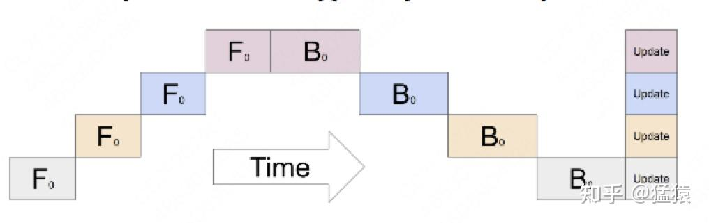
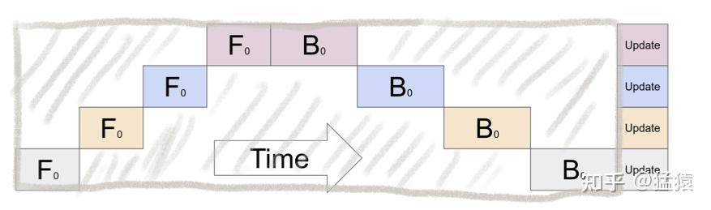
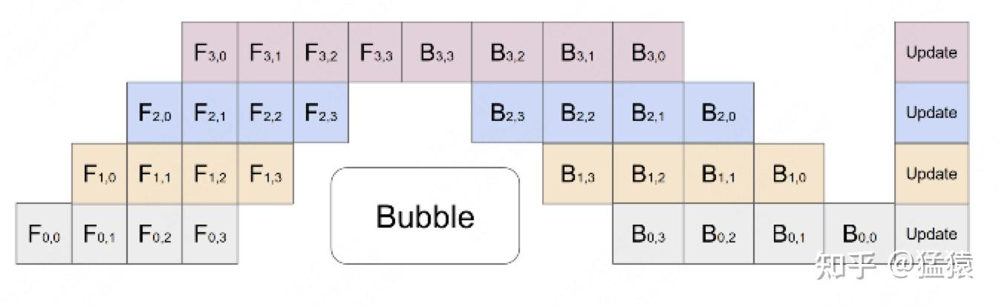

# 分布式训练：流水线并行

流水线并行解决两件事：把模型的不同层放到不同设备上，让单卡不必容纳完整模型；再让不同数据分批进入这些阶段，减少设备互相等待的时间。

## 1. 将模型分阶段

把 $L$ 层模型分为 $K$ 个 stage。每个阶段可由一张 GPU 或一个 TP 组承担；所以 $K$ 不总等于 GPU 总数。

读时间表时，可以把每一行看作一个计算阶段、每一列看作一个时间步；方块的 F/B 分别表示前向和反向，下标区分正在处理哪个 micro-batch。只有一份数据时，先由阶段 0 算前向，再轮到阶段 1，直到最后阶段得到 loss；反向梯度随后沿相反方向返回。

前一阶段向后一阶段发送的是自身最后一层的**输出激活**；反向则反方向传递对边界激活的梯度。一轮梯度累积完成后，优化器更新参数，不能说成“最后统一更新各层梯度”。

只有一个 micro-batch 时，各阶段大多轮流工作，空闲形成流水线气泡。

## 2. micro-batch 减少气泡

把一个 mini-batch 的 $B$ 条序列切为 $M$ 个 micro-batch，每个大小 $b=B/M$。每个 micro-batch 都需要经过所有阶段，各阶段能同时处理不同 micro-batch。

例如阶段 0 把 micro-batch 0 的输出传给阶段 1 后，就可以开始计算 micro-batch 1；此时阶段 1 仍在处理 micro-batch 0。并行发生在“不同阶段处理不同数据块”上，每个数据块最终仍要经过完整模型。这与复制整条模型的 DP 不同，也可以在流水线之外再启用 DP。

假设各阶段均衡、每个 micro-batch 的前向耗时 $t_f$ 与反向耗时 $t_b$ 在阶段间一致，并忽略通信和调度开销，GPipe 的整轮耗时近似为：

$$
T\approx(M+K-1)(t_f+t_b).
$$

每阶段有效计算时间为 $M(t_f+t_b)$，因此气泡比例：

$$
f_{\rm bubble}\approx\frac{K-1}{M+K-1}.
$$

**为什么是 $M+K-1$。** 第一份 micro-batch 要依次经过 $K$ 个阶段，需要 $K$ 格；流水线填满后，其余 $M-1$ 份理想情况下每格完成一份，所以总共 $K+(M-1)$ 格。反向同理，只是每格从 $t_f$ 换成 $t_b$，因此整轮时间为 $(M+K-1)(t_f+t_b)$。所有 $K$ 个阶段提供的总计算容量与实际忙碌量分别为：

$$
C_{\rm total}=K(M+K-1)(t_f+t_b),\qquad
C_{\rm busy}=KM(t_f+t_b).
$$

空闲比例等于总容量减忙碌量，再除以总容量：

$$
\begin{aligned}
f_{\rm bubble} &=\frac{C_{\rm total}-C_{\rm busy}}{C_{\rm total}}\\
&=1-\frac{M}{M+K-1}\\
&=\frac{K-1}{M+K-1}.
\end{aligned}
$$

这不是把一个阶段的空闲时间与整个集群的计算量混除；分子、分母都采用 stage-time 的相同口径。

$M=1$ 时为 $(K-1)/K$；$M\ge4K$ 时小于 20%。它减少了气泡，**没有消除气泡**。micro-batch 太小可能降低矩阵运算效率，实际还要平衡通信与计算。

## 3. GPipe、1F1B 与同步更新

GPipe 常采用先完成各 micro-batch 前向、再统一反向的 fill-drain 调度，并在整轮累积后同步更新参数。原始 PipeDream 使用异步流水线与权重版本管理，但不能把“交错执行前向/反向”直接等同于异步参数更新。

现代同步 **1F1B（一次前向、一次反向）** 同样可以在整轮末尾统一 optimizer step，并减少同时驻留的激活。PyTorch 的流水线接口支持 GPipe、1F1B、交错等多种调度，并非只基于 GPipe。

各 micro-batch 的 loss/梯度应按全局目标正确归一化。长度不等时，按序列平均和按有效 token 平均是不同目标，不能机械地都除以同一个 $M$。

## 4. 激活重计算的显存估算

设序列长度 $s$、隐藏维度 $h$、边界激活每元素 $q$ byte。用 $C_{\rm layer}$ 表示**每条序列、每层**需要保存的中间激活字节数；它可能包含 $sh$、$s^2$ 等项，取决于 Attention 实现、dropout 和保存策略。

反向不仅需要权重，还需要前向时产生的中间结果。如果所有 $M$ 个 micro-batch 都完成前向之后才开始反向，每个阶段就要暂存全部 $B$ 条序列在本阶段各层的激活。均匀分层时，一个阶段约有 $L/K$ 层；因此把“序列数 × 本阶段层数 × 每条序列每层的激活字节数”相乘：

$$
A_{\rm naive}\approx B\frac{L}{K}C_{\rm layer}.
$$

重计算改为只长期保存每个 micro-batch 进入本阶段时的输入，把阶段内部的临时激活丢弃。反向轮到某个 micro-batch 时，从保存的输入重新前向，恢复该 micro-batch 的内部激活，完成反向后再释放。

这样峰值主要由两部分组成：所有 micro-batch 的边界输入，加上当前一个 micro-batch 的内部激活。GPipe 风格的简化估计为：

$$
A_{\rm checkpoint}\approx Bshq+
\frac{B}{M}\frac{L}{K}C_{\rm layer}.
$$

把两项进一步展开：每个 micro-batch 的边界输入为 $(B/M)shq$ byte，一共保留 $M$ 份，所以：

$$
\begin{aligned}
A_{\rm boundary} &=M\times\frac{B}{M}shq\\
&=Bshq.
\end{aligned}
$$

当前正在重算的一个 micro-batch 有 $B/M$ 条序列，经过本阶段约 $L/K$ 层，所以：

$$
A_{\rm internal}\approx\frac{B}{M}\frac{L}{K}C_{\rm layer},\qquad
A_{\rm checkpoint}\approx A_{\rm boundary}+A_{\rm internal}.
$$

第一项随总序列数 $B$ 增长，但只存阶段边界的一份表示；第二项仍要保存本阶段多层的内部激活，不过同时只承担 $B/M$ 条序列。因此，多层模型中的内部激活存储可以明显减少，代价是反向前多执行一次局部前向。

此式仅解释激活重计算如何省空间，**不包括**权重、梯度、优化器、通信 buffer 等整卡峰值组成；1F1B、细粒度 checkpoint 和双向重叠会改变活跃 micro-batch 数量。重计算同时增加 FLOPs，需结合[显存分析](显存分析.md)评估。

## 资料

- [GPipe](https://arxiv.org/abs/1811.06965)
- [PipeDream](https://arxiv.org/abs/1806.03377)
- [PyTorch 流水线调度](https://docs.pytorch.org/docs/stable/distributed.pipelining.html)
