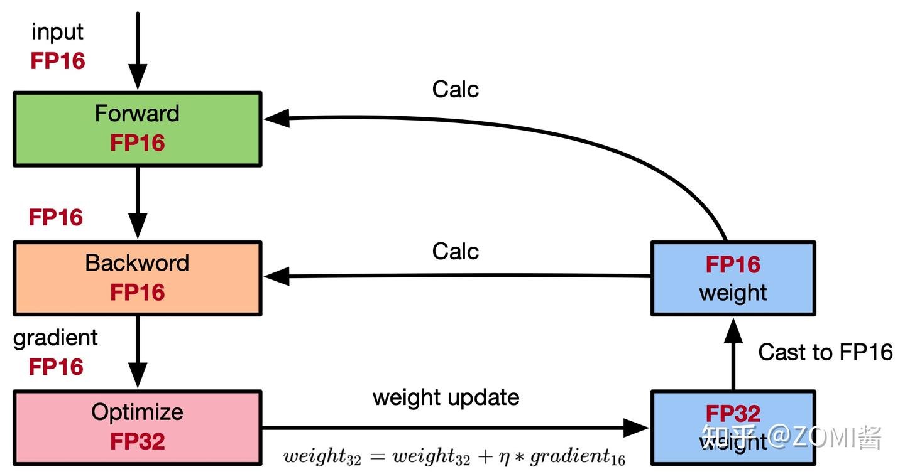

# 参数量、显存与计算量分析

先分清三个问题：**参数量**是在数模型里有多少个可学习的数；**显存**是在数某个时刻要保存多少字节；**计算量**是在数处理数据时执行多少运算。它们有关联，但不能互相替代。本文按“矩阵形状 → 元素个数 → 字节或运算次数”逐项计算；GB 使用 $10^9$ 字节，GiB 使用 $2^{30}$ 字节。

## 1. 统一符号

| 符号 | 含义 |
| --- | --- |
| $L,H,I,V$ | 层数、hidden size、MLP intermediate size、词表大小 |
| $n_q,n_{kv},d$ | Q head 数、KV head 数、head dimension；本页假设 $H=n_qd$ |
| $H_{kv}=n_{kv}d$ | KV 投影宽度 |
| $b,s$ | 单 rank 的 micro-batch size、实际计算序列长度 |
| $P,T$ | 参数量、训练 token 数 |

## 2. 模型参数量

一个 decoder 模型通常包括：输入 embedding、重复 $L$ 次的 Transformer block、末端归一化、输出词表头。先算清一个 block 中 Attention、MLP 和归一化各有多少参数，再乘层数，最后加只出现一次的词表层等部分。是否共享参数、是否带偏置，要按具体配置决定。

### 2.1 Attention

对于输入宽度 $H_{\rm in}$、输出宽度 $H_{\rm out}$ 的线性投影 $Y=XW+b$，每个输出特征都需要对全部输入特征加权，因此 $W$ 有 $H_{\rm in}H_{\rm out}$ 个参数；如果启用偏置 $b$，还要加 $H_{\rm out}$ 个。这里用数学上的 $XW$ 记号，PyTorch 存储权重时可能转置，但元素数不变。

在本页的 Attention 设定中，query 总宽度为 $H=n_qd$；K/V 总宽度为 $H_{kv}=n_{kv}d$。GQA 让多个 query head 共享一组 K/V head，所以 K/V 投影可能比 Q 投影窄。分别列出四个投影：

| 投影 | 权重形状 | 权重参数数目 | Qwen 示例的偏置 |
| --- | --- | --- | --- |
| Q | $H\times H$ | $H^2$ | $H$ |
| K | $H\times H_{kv}$ | $HH_{kv}$ | $H_{kv}$ |
| V | $H\times H_{kv}$ | $HH_{kv}$ | $H_{kv}$ |
| O | $H\times H$ | $H^2$ | 无 |

四个矩阵元素数相加才得到下面的总式，不能因为有三个 QKV 投影就一律写成 $3H^2$。

Q、K、V、输出投影的权重参数量为：

$$
\begin{aligned}
P_{\rm attn,weight} &=H^2+HH_{kv}+HH_{kv}+H^2\\
&=2H^2+2HH_{kv}.
\end{aligned}
$$

MHA 中 $H_{kv}=H$，退化为 $4H^2$。GQA/MQA 不应直接近似成 MHA；head dimension 不满足上述假设时，应直接按四个矩阵形状求和。

若只有 QKV 使用偏置：

$$
P_{\rm attn,bias}=H+2H_{kv}.
$$

因此 Qwen GQA 的“三个偏置”不等于 $3H$：K、V 的输出维度更小。

配图与实现示例

### 2.2 MLP、归一化、词表层

对于普通两层 MLP，第一层把每个 token 从宽度 $H$ 映射到 $I$，因此有 $HI$ 个权重和 $I$ 个偏置；第二层从 $I$ 映射回 $H$，因此有 $IH$ 个权重和 $H$ 个偏置。把两层相加：

$$
\begin{aligned}
P_{\rm MLP} &=\underbrace{HI+I}_{H\to I}+\underbrace{IH+H}_{I\to H}\\
&=2HI+I+H.
\end{aligned}
$$

SwiGLU 则有 gate 与 up 两条从 $H$ 到 $I$ 的投影，再由 down 从 $I$ 回到 $H$。三组矩阵都要训练；忽略偏置时：

$$
\begin{aligned}
P_{\rm SwiGLU} &=\underbrace{HI}_{\rm gate}+\underbrace{HI}_{\rm up}+\underbrace{IH}_{\rm down}\\
&=3HI.
\end{aligned}
$$

标准 affine LayerNorm 通常有 gamma、beta 两组参数，每层 $2H$；Qwen 使用只有 scale 的 RMSNorm，每层 $H$。一个 Qwen block 内两次 RMSNorm 共 $2H$，此外整个 decoder 还有 final RMSNorm。

embedding 为 $VH$；只有配置确实共享 input embedding 与 lm_head 时才只计一份。未共享时，两个矩阵合计 $2VH$。

配图与实现示例

### 2.3 Qwen2.5-7B-Instruct 精确示例

官方配置：$L=28,H=3584,I=18944,V=152064,n_q=28,n_{kv}=4,d=128$，因此 $H_{kv}=512$，且 `tie_word_embeddings=false`。

$$
\begin{aligned}
P_{\rm block} &=2H^2+2HH_{kv}+(H+2H_{kv})+3HI+2H\\
&=233057792.
\end{aligned}
$$

$$
\begin{aligned}
P_{\rm total}&=LP_{\rm block}+2VH+H\\
&=28\times233057792+2\times152064\times3584+3584\\
&=7615616512\approx7.616\times10^9.
\end{aligned}
$$

在 $P_{\rm block}$ 中，前两项计 Attention 权重，括号项计 QKV 偏置，$3HI$ 计 SwiGLU，$2H$ 计 block 内两次 RMSNorm。总式中的 $LP_{\rm block}$ 是所有 block，$2VH$ 是未共享的输入/输出词表矩阵，最后的 $H$ 是整个 decoder 的 final RMSNorm。官方模型卡将结果标为约 7.61B。

## 3. 训练显存

### 3.1 模型状态与峰值

模型状态包括参数本身、反向得到的参数梯度，以及优化器为了下一次更新而保存的信息。它们主要随参数量 $P$ 增长；前向激活和临时工作区则还受 batch、序列长度和内核实现影响。

以低精度权重/梯度、FP32 主权重与 Adam 状态的传统配置为例：每个参数有一份 2 byte 计算权重、一份 2 byte 梯度，以及三份 4 byte 状态。所以先算每参数的字节数，再乘参数量：

$$
\begin{aligned}
M_{\rm states} &=P(2+2+4+4+4)\\
&=16P\ \text{bytes}.
\end{aligned}
$$

上式五项依次是：低精度计算权重 $2P$、低精度梯度 $2P$、FP32 主权重 $4P$、Adam 一阶矩 $4P$、二阶矩 $4P$。这里暂时只统计模型状态，不含激活。

例如按教学用 $P=7\times10^9$ 计算，状态为 112GB，约 104.31GiB。实际 Qwen 参数量更大；训练峰值还需加上激活、通信和临时缓冲。梯度 dtype、AMP、优化器、分片会改变系数，详见[混合精度](混合精度.md)。

混合精度图的更新符号

最小化损失时，若 gradient 表示损失梯度，图中的 `weight32 + η * gradient16` 应使用减号。FP16/FP32 分工是一种示例配置。

### 3.2 教学版激活估算

下面公式针对保存反向所需激活、普通 MHA、两层 $I=4H$ MLP、LayerNorm、启用相应 dropout、未用 FlashAttention 和重计算的教学模型。假设保存的主要激活为 2 bytes，dropout mask 为 1 byte；不能把任意 `int` 或 attention mask 都当成 1 byte。

激活显存为什么会大：前向算过的张量，反向求导时还可能要用，因此不能全部立即释放。例如线性层的权重梯度需要它的输入，softmax 的梯度可以由其输出计算。下面列的是**为反向保留下来的对象**，不是把前向出现过的所有变量都重复相加。

**先展开 Attention 的每一项。** 一个 token 表示张量有 $b\times s\times H$ 个元素，按 2 byte 保存就是 $2bsH$。而每个 head 的注意力权重有 $s\times s$ 个位置对，共 $bn_q$ 个 head，因此有 $bn_qs^2$ 个元素。这两类形状分别产生下面的一次项与序列长度二次项：

| 保存对象 | 形状 / 元素数 | 每元素字节 | 字节数 |
| --- | --- | ---: | --- |
| QKV 三个投影共享的输入 X | $bsH$ | 2 | $2bsH$ |
| Q、K，供 QKᵀ 反向使用 | $2bsH$ | 2 | $4bsH$ |
| softmax 输出，供其反向使用 | $n_qbs^2$ | 2 | $2n_qbs^2$ |
| softmax 后 dropout 的 mask | $n_qbs^2$ | 1 | $n_qbs^2$ |
| dropout 后的注意力权重，供乘 V 的反向使用 | $n_qbs^2$ | 2 | $2n_qbs^2$ |
| V | $bsH$ | 2 | $2bsH$ |
| O 投影的输入 | $bsH$ | 2 | $2bsH$ |
| O 投影后 dropout 的 mask | $bsH$ | 1 | $bsH$ |

把 $bsH$ 和 $n_qbs^2$ 分别收集：

$$
\begin{aligned}
M_{\rm attn}
&=(2+4+2+2+1)bsH+(2+1+2)n_qbs^2\\
&=11bsH+5n_qbs^2.
\end{aligned}
$$

**再展开普通 MLP。** 中间宽度为 $I=4H$：

| 保存对象 | 形状 / 元素数 | 字节数 |
| --- | --- | --- |
| 第一个线性层输入 | $bsH$ | $2bsH$ |
| 激活函数输入 | $bs(4H)$ | $8bsH$ |
| 第二个线性层输入，即激活函数输出 | $bs(4H)$ | $8bsH$ |
| MLP 输出 dropout 的 mask | $bsH$ | $bsH$ |

$$
\begin{aligned}
M_{\rm MLP} &=(2+8+8+1)bsH\\
&=19bsH.
\end{aligned}
$$

**最后加入两次 LayerNorm。** 每次保留一份输入，近似为 $2bsH$ byte；均值、方差等 $O(bs)$ 小项在此教学估计中忽略：

$$
\begin{aligned}
M_{\rm LN} &=2\times(2bsH)\\
&=4bsH.
\end{aligned}
$$

三个部分相加，再乘层数：

$$
\begin{aligned}
M_{\rm act,layer}
&=M_{\rm attn}+M_{\rm MLP}+M_{\rm LN}\\
&=(11+19+4)bsH+5n_qbs^2\\
&=34bsH+5n_qbs^2,\\
M_{\rm act,total}&\approx L(34bsH+5n_qbs^2).
\end{aligned}
$$

可以看到，34 是线性大小激活项的字节系数之和，而 5 来自注意力概率及 mask 等 $s^2$ 大小对象。它们已经包含 dtype 字节数，不能再整体乘一次 2。计数口径参考 [Reducing Activation Recomputation 的 §4.1](https://arxiv.org/html/2205.05198#S4.SS1)，输出 logits/loss 等张量需另计。实现若复用同一存储、融合算子或改变保存策略，应按实际存储去重，不能把本表当作所有框架必然分配的清单。

仅把 $H=3584,L=28,n_q=28,b=1,s=2048$ 代入这个教学模型：

$$
M_{\rm act}=23429382144\ \text{bytes}\approx23.429\ \text{GB}\approx21.82\ \text{GiB}.
$$

它不是实际 Qwen2.5 训练显存预测。Qwen 使用 GQA、SwiGLU、RMSNorm，且该配置 attention dropout 为 0；FlashAttention、checkpointing、融合 kernel、padding/packing 还会继续改变保存的张量。

$b$ 是本卡 micro-batch，不能将梯度累积后的 global batch 直接代入。在其余假设不变时，$b=128$ 的上述结果为约 2998.96GB；它不是所有 128 global-batch 训练的需求。

这个 eager 实现显式生成 attention weights，并在 softmax 中使用 FP32，还可能重复 KV 头。实际估算要跟踪各张量的 dtype、存储共享和存活时间，不能只按同一套 2 byte 假设计数。

## 4. 推理与 KV cache

推理不需要保存用于反向的全套激活和优化器状态，但仍有前向激活与临时 workspace，尤其 prefill 阶段不能忽略峰值。

### 4.1 为什么只缓存 K/V

考虑正在生成回答的因果 self-attention。位置 $t$ 的 query 向量记为 $q_t$，历史位置 $j$ 的 key、value 分别记为 $k_j,v_j$，每个头的维度为 $d$。由于位置 $t$ 只能看到自己和前面的 token，可见范围是 $j\le t$。

我们定义 $a_{t,j}$ 为位置 $t$ 分配给位置 $j$ 的注意力权重：先计算并缩放 query/key 点积，再对所有可见 key 做 softmax。该位置的输出 $o_t$ 就是用这些权重对 value 求和：

$$
\begin{aligned}
a_{t,j} &=\frac{\exp(q_t^\top k_j/\sqrt d)}{\sum_{u\le t}\exp(q_t^\top k_u/\sqrt d)},\\[4pt]
o_t &=\sum_{j\le t}a_{t,j}v_j.
\end{aligned}
$$

**把整段序列写成矩阵，再看新增位置。** 以三个位置为例，令 $A$ 为经过缩放、因果 mask、逐行 softmax 后的矩阵：

$$
\begin{aligned}
A &=\begin{bmatrix}
a_{11}&0&0\\
a_{21}&a_{22}&0\\
a_{31}&a_{32}&a_{33}
\end{bmatrix},\\[4pt]
O &=AV\\
&=\begin{bmatrix}
a_{11}v_1\\
a_{21}v_1+a_{22}v_2\\
a_{31}v_1+a_{32}v_2+a_{33}v_3
\end{bmatrix}.
\end{aligned}
$$

矩阵的第 1 行只能使用 $v_1$，第 2 行使用 $v_1,v_2$，第 3 行使用 $v_1,v_2,v_3$。因果 mask 把右上角的未来位置权重置为 0；每一行的输出都是该行非零权重对应的 value 加权和。

在标准因果 self-attention 中追加位置 $t+1$ 时，过去各行不会看到未来 token，因此既有位置的表示和 K/V 可复用。缓存更新为：

$$
K_{1:t+1}=[K_{1:t};k_{t+1}],\qquad
V_{1:t+1}=[V_{1:t};v_{t+1}],
$$

$$
o_{t+1}=\sum_{j=1}^{t+1}
\frac{e^{q_{t+1}^\top k_j/\sqrt d}}{\sum_{u=1}^{t+1}e^{q_{t+1}^\top k_u/\sqrt d}}\,v_j.
$$

计算新增一行只出现新的 $q_{t+1}$，但要用所有可见位置的 K/V；这就是保留历史 K/V 而无需保留历史 Q 的原因。

例如，prompt 的三个 token 首次前向后，可以缓存这三处在每一层的 K/V，并用最后位置的 logits 生成第 4 个 token。下一步将第 4 个 token 送入模型时，只计算这个新位置的 query 和 K/V，把新 K/V 追加到缓存，再用新 query 关注全部四个位置，产生预测第 5 个 token 的 logits。历史 query 不参与这次新输出，因此无需作为 KV cache 的一部分保留。

配图与实现示例

### 4.2 GQA/MQA 通用 KV 公式

假设 $b$ 条序列都缓存 $n$ 个 token，K/V 使用相同 head 数、head dimension 与每元素字节数 $q$：

$$
M_{\rm KV}=2bLn\,n_{kv}d\,q.
$$

按维度逐项相乘：每条序列、每层、每个 token 的 K 有 $n_{kv}d$ 个元素，V 同样多；乘上序列数 $b$、缓存长度 $n$、层数 $L$、每元素字节数 $q$，就是上式。若把长度拆为 prompt 长度 $s$ 和已经缓存的生成长度 $g$，则 $n=s+g$。注意这里计的是已经写入缓存的 token 数。

第一个 2 表示 K 和 V。若使用 MHA，则 $n_{kv}d=H$；再取每元素 $q=2$ byte，就得到 $4bLnH$。使用 GQA 时要保留实际的 $n_{kv}$，因为缓存宽度由 KV 头数决定。

Qwen2.5-7B、单序列、总缓存长度 $n=2048$、BF16：

$$
\begin{aligned}
M_{\rm KV} &=2\times1\times28\times2048\times4\times128\times2\\
&=117440512\ \text{bytes}\\
&=112\ \text{MiB}.
\end{aligned}
$$

同形状按 MHA 28 个 KV heads 算则为 784MiB，即 822083584 bytes。分页碎片、预分配、量化尺度、并行复制与不同长度的请求需另算；若各请求长度不同，将 $bn$ 替换为各缓存长度之和。

## 5. MoE 的显存

MoE 为某些层准备了多个专家，但每个 token 只选择其中一部分参与计算。即使某个专家本次没被选中，它的权重也仍需存放在某处；因此存储量主要看总参数量，每 token 的计算量才主要看激活参数量。

定义 $P_{\rm shared}$ 为共享层参数量，$E$ 为专家数，$P_{\rm expert}$ 为每个专家参数量，$P_{\rm router}$ 为路由器参数量，$q$ 为每个权重的存储字节数。假设各专家大小相同，仅权重存储就是：

$$
M_{\rm weights}\approx q(P_{\rm shared}+E P_{\rm expert}+P_{\rm router}).
$$

“MLP 参数量乘专家数”只覆盖专家部分。以名称近似表示的 30B-A3B 为例，30B 总参数的 BF16 权重约 60GB；这不是训练总显存，也不是单卡必然占用。EP/TP 可以分片存储。

训练仍需保存或重计算激活；推理也有 expert dispatch/combine、路由和临时激活的峰值。计算完释放只缩短存活时间，不代表显存可忽略。

## 6. FLOPs 与训练时间

### 6.1 矩阵乘法

设左矩阵形状为 $[m,n]$，右矩阵为 $[n,p]$，输出共有 $mp$ 个元素。每个输出元素都是长度为 $n$ 的点积；把“每个点积的运算量”乘以“输出元素个数”，得到：

$$
\operatorname{FLOPs}([m,n]\times[n,p])\approx2mnp.
$$

严格标量计数中每个输出有 $n$ 次乘法、$n-1$ 次加法；工程估算通常记作 $2n$。FLOPs 表示运算量，FLOP/s 表示吞吐。

### 6.2 普通 MHA + 两层 MLP

忽略归一化、激活、softmax 等相对较小的算子开销：

$$
F_{\rm attn}\approx8bsH^2+4bs^2H,
\qquad F_{\rm MLP}\approx4bsHI.
$$

这里 $F_{\rm attn}$ 与 $F_{\rm MLP}$ 分别表示一个 block 的 Attention、MLP 前向运算量。为了看清各项怎么组成它们，逐算子套用矩阵乘的 $2mnp$ 计数：

| 算子 | 计算过程 | FLOPs 近似 |
| --- | --- | --- |
| Q/K/V 三个投影 | 三次 $[bs,H]\times[H,H]$ | $3\times2bsH^2=6bsH^2$ |
| QKᵀ | $bn_q$ 次 $[s,d]\times[d,s]$ | $2bn_qs^2d=2bs^2H$ |
| 注意力权重乘 V | $bn_q$ 次 $[s,s]\times[s,d]$ | $2bn_qs^2d=2bs^2H$ |
| O 投影 | $[bs,H]\times[H,H]$ | $2bsH^2$ |
| MLP 上投影 | $[bs,H]\times[H,I]$ | $2bsHI$ |
| MLP 下投影 | $[bs,I]\times[I,H]$ | $2bsIH$ |
| 输出词表头 | $[bs,H]\times[H,V]$ | $2bsHV$ |

因此 Attention 的线性项为 $(6+2)bsH^2$，二次项为 $(2+2)bs^2H$；MLP 两项相加是 $4bsHI$。若 $I=4H$，MLP 就是 $16bsH^2$。

当 $I=4H$，每层约 $24bsH^2+4bs^2H$，全模型还需计入输出投影：

$$
F_{\rm forward}\approx L(24bsH^2+4bs^2H)+2bsHV.
$$

如果单独估算未做稳定化的一行 softmax：$s$ 次取指数、$s-1$ 次求和、$s$ 次除法，在“每种操作都记一次”的简化口径下是 $3s-1$；共有 $bn_qs$ 行，再乘上行数。稳定版还需要找最大值、做减法，而且 exp/div 的硬件代价并不等同于普通乘加，所以它只能说明运算的组成，不能直接预测运行时间。

GQA 改变投影部分；SwiGLU 的 MLP 投影约 $6bsHI$。长上下文的二次 attention 项和大词表输出项不能无条件省略。softmax 的具体 FLOPs 也取决于是否做稳定化及如何计数 exp/div，需要说明采用什么计数口径。

### 6.3 6PT 与重计算

这里 $P$ 表示参与密集计算的参数量，$T$ 是整个训练过程累计处理的 token 数，不是单条序列长度。在大矩阵线性层占主导时，每个 token 使用每个权重完成一次乘法和一次累加，前向大约需要 $2P$ 次运算。把全部训练 token 的前向与反向加起来，常用近似是：

$$
F_{\rm train}\approx6PT.
$$

**系数 6 的来历：** 对线性层 $Y=XW$，前向一次矩阵乘；反向需要分别计算输入梯度 $G_X=G_YW^\top$ 和参数梯度 $G_W=X^\top G_Y$，各一次形状对应的矩阵乘。三者 FLOPs 同阶：

$$
F_{\rm forward}\approx2PT,\qquad
F_{\rm backward}\approx2F_{\rm forward}\approx4PT,
$$

$$
F_{\rm train}\approx(1+2)\times2PT=6PT.
$$

这是线性投影占主导时的近似；并非所有算子的反向都严格是前向两倍。全量再做一次相同前向时，才增加 $2PT$：

$$
F_{\rm train,recompute}\approx(1+2+1)\times2PT=8PT.
$$

若所有相关前向计算都额外重做一次，可粗略改成 $8PT$；选择性重计算的增量更小，不能一律写成 8。MoE 也不能直接把总参数数目代进密集模型公式。

按教学用 $P=7\times10^9,T=300\times10^9$：无重计算约 $1.26\times10^{22}$ FLOPs，全量前向重计算近似约 $1.68\times10^{22}$ FLOPs。

### 6.4 时间估计的效率口径

训练时间可以粗略写成“总运算量 ÷ 集群每秒真正完成的运算量”。定义 $F_{\rm executed}$ 为包含重计算在内的实际运算总量，$N_{\rm GPU}$ 为 GPU 数，$F_{\rm peak}$ 为单卡在选定精度下的峰值 FLOP/s，再用效率 $\eta_{\rm executed}$ 折算有效吞吐：

$$
t\approx\frac{F_{\rm executed}}{N_{\rm GPU}F_{\rm peak}\eta_{\rm executed}}.
$$

$\eta_{\rm executed}$ 是实际执行 FLOPs 相对峰值的有效比例，包含重计算时接近 HFU 口径；不是监控面板的 GPU busy 百分比。若采用按模型有效 FLOPs 定义的 MFU，就应匹配其分子，避免同时加重计算又用已扣除重计算的效率重复惩罚。

使用前面全量前向重计算的 $8PT$ 近似。假设 64 张 A100、每卡 FP16/BF16 dense 峰值 312TFLOP/s、执行效率 0.45：

$$
t\approx\frac{1.68\times10^{22}}{64\times312\times10^{12}\times0.45}
\approx1.87\times10^6\ \text{s}\approx21.64\ \text{days}.
$$

这是显式假设下的估算，不是实测承诺。还需考虑数据、检查点、评测和故障开销。

## 7. 原始实验记录（待补元数据）

保留原记录：batch=128，max_seq_len=8192，avg_seq_length=2048；“8卡ppu”，每卡 70–80G；30k 样本，约 5 小时。

这条记录尚缺模型/checkpoint、卡型号、“ppu”的含义、batch 是 global 还是 micro、dtype、并行/重计算配置、代码版本与日志路径。因此不能用它验证前面的估算，也不将其改写成新的实测结论。

## 8. 来源

- [Qwen2.5-7B-Instruct 配置](https://huggingface.co/Qwen/Qwen2.5-7B-Instruct/blob/main/config.json)与[模型卡](https://huggingface.co/Qwen/Qwen2.5-7B-Instruct)。
- [Reducing Activation Recomputation in Large Transformer Models](https://arxiv.org/html/2205.05198)：教学激活公式与适用结构。
- [ZeRO](https://arxiv.org/abs/1910.02054)：模型状态分片。
- 具体参数计数、字节换算与时间算例均按本页公式重新计算，不代表 GPU 实测。
