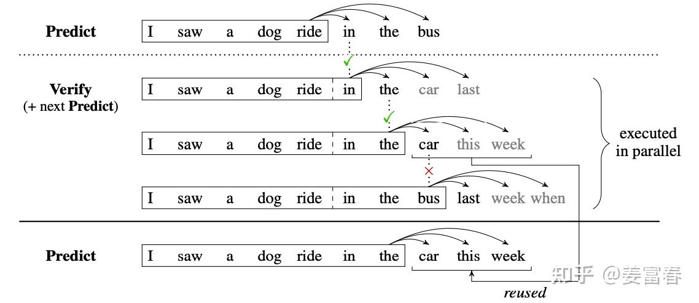

# MTP：多 token 预测与推测解码

MTP 包含两个需要分开的环节：训练时，多预测几个未来位置以提供额外监督；推理时，可选择把这些预测作为草稿，再让主模型验证。下面分别说明目标、模块输入和验证流程。

MTP（Multi-Token Prediction）是在训练时增加未来多个 token 的预测目标。它可以改善训练信号，也可以为推测解码提供草稿。是否加速训练、是否加速推理，必须分别测量；增加预测头通常还会带来每步训练开销。

## 1. 训练目标

设训练序列为 $x_1,\ldots,x_T$，其中 $T$ 是序列长度。主干在位置 $t$ 只看到前缀 $x_{\le t}$；定义第 $k$ 个预测头输出未来第 $k$ 个 token 的分布，记为 $p_{\theta,k}(\cdot\mid x_{\le t})$。总共使用 $K$ 个预测头，$\lambda_k$ 是第 $k$ 个任务的损失权重。

例如前缀到位置 5，三个头分别学习预测位置 6、7、8 的真实 token。每个预测都可以计算负对数概率损失，将所有有效位置和所有头的损失相加：

$$
\mathcal L_{\rm MTP}
=-\sum_{k=1}^{K}\lambda_k
\sum_{t:\,t+k\le T}
\log p_{\theta,k}(x_{t+k}\mid x_{\le t}),
\qquad \lambda_k\ge0.
$$

内层对位置 $t$ 求和，只保留目标 $t+k$ 没有超出序列末尾的位置；外层对预测距离 $k$ 求和。$k=1$ 就是普通 next-token prediction，更远的 $k$ 增加了额外监督。

这是独立预测头情形的写法；不同论文对 head 数、损失归一化和权重定义不同。多个目标共享主干，但后续预测头的条件输入不一定相同。

## 2. Meta 的多 token 预测

各个 head 从同一共享主干表示出发，预测不同距离的 token，训练梯度共同回到主干。Meta 原论文主要实验使用单层 Transformer 作为 head，再接共享 unembedding，将表示映射为词表 logits；附录也讨论线性头等变体。

MTP 本身不意味着训练更快。原论文附录 C 报告了具体实现的训练开销；应分别比较每步成本、达到目标质量所需数据量、总训练时间。

## 3. DeepSeek-V3 的顺序 MTP 模块

DeepSeek 的额外 MTP 模块按深度顺序连接。这里将主模型在位置 $i$ 的表示记为 $h_i^{(0)}$，额外模块从 $k=1$ 开始编号。第 $k$ 个模块既接收上一深度的表示 $h_i^{(k-1)}$，也接收向后移动 $k$ 位的真实 token $x_{i+k}$。

定义 $E$ 为共享的 token embedding 查表，$M_k$ 为第 $k$ 个模块的融合投影。先分别归一化两路输入，沿特征维拼接，再投影回模块需要的隐藏宽度，得到融合输入 $\tilde h_i^{(k)}$：

$$
\tilde h_i^{(k)}
=M_k\left[\operatorname{RMSNorm}(h_i^{(k-1)});\operatorname{RMSNorm}(E(x_{i+k}))\right],
$$

$$
\begin{aligned}
h_{1:T-k}^{(k)} &=\operatorname{Transformer}_k(\tilde h_{1:T-k}^{(k)}),\\[4pt]
p_i^{(k)} &=\operatorname{Softmax}(W_{\rm out}h_i^{(k)}).
\end{aligned}
$$

第二个式子把融合后的整个有效序列交给第 $k$ 个 Transformer 模块，得到表示 $h^{(k)}$；共享输出矩阵 $W_{\rm out}$ 将它变成词表分数，softmax 后的 $p_i^{(k)}$ 是该位置的 token 预测分布。这里采用列向量记号。该模块的预测目标为 $x_{i+k+1}$，损失仅在 $i+k+1\le T$ 的有效位置计算，末端越界目标需屏蔽。训练时使用移位后的真实 token（teacher forcing）；通过因果掩码维持因果依赖。多个模块共享主模型的 embedding 和 output head。

例如 $k=1$ 的模块拿到主干表示和真实的 $x_{i+1}$，学习预测 $x_{i+2}$；$k=2$ 再接入前级表示与真实的 $x_{i+2}$，学习预测 $x_{i+3}$。因此区别在于顺序传递表示、显式接入前序 token。推理生成草稿时，未来真实 token 还不存在，需要使用已经得到的候选 token 作为后续模块输入。

## 4. 推理：草稿与验证

以**贪心解码**为例，一轮可以分为三步：

1. **提出草稿**：利用 MTP 提出连续多个候选 token。
2. **并行验证**：把前缀和候选序列送入目标主模型，用因果 mask 同时计算每个候选位置在其正确前缀下的 next-token 分布。验证依据是主模型的预测，不是让不同 MTP 头互相投票。
3. **接受连续前缀**：从第一个候选开始检查。与主模型贪心选择一致就接受；遇到第一个不一致的位置，采用主模型在该位置的选择，并丢弃后面依赖错误前缀的草稿，再进入下一轮。

例如草稿依次是 A、B、C，主模型接受 A，但在前缀 A 后更愿意生成 D，那么本轮保留 A 并使用 D，不再继续接受原来基于 A、B 推测的 C。

若进行随机采样，并要求保持目标分布，需使用严格的接受/拒绝及修正采样规则。令 $c$ 为当前已接受的上下文，$q(y\mid c)$ 为草稿模型提出候选 token $y$ 的概率，$p(y\mid c)$ 为主模型对同一个候选的概率。经典单步接受概率定义为：

$$
a(y)=\min\left(1,\frac{p(y\mid c)}{q(y\mid c)}\right).
$$

这里 $a(y)$ 表示“是否接受这个已提出候选”的概率，不是 token 本身的生成概率。拒绝后不能随意另取一个 token，而需从修正分布采样；该分布与 $[p-q]_+=\max(p-q,0)$ 成正比，并在词表上重新归一化。简单的 token 相等校验不是随机采样场景下的通用接受规则；候选树方案也需要相应的验证协议。

DeepSeek-V3 的 MTP 模块在正常推理时可以直接丢弃，主模型仍然可以独立生成；保留它们用于推测解码是可选路径。

## 5. 来源

- [Meta：Better & Faster Large Language Models via Multi-token Prediction](https://arxiv.org/html/2404.19737v1)，§2、附录 B/C。
- [DeepSeek-V3 技术报告](https://arxiv.org/html/2412.19437v2)，§2.2。
- [Fast Inference from Transformers via Speculative Decoding](https://arxiv.org/abs/2211.17192)，接受与修正采样机制。
