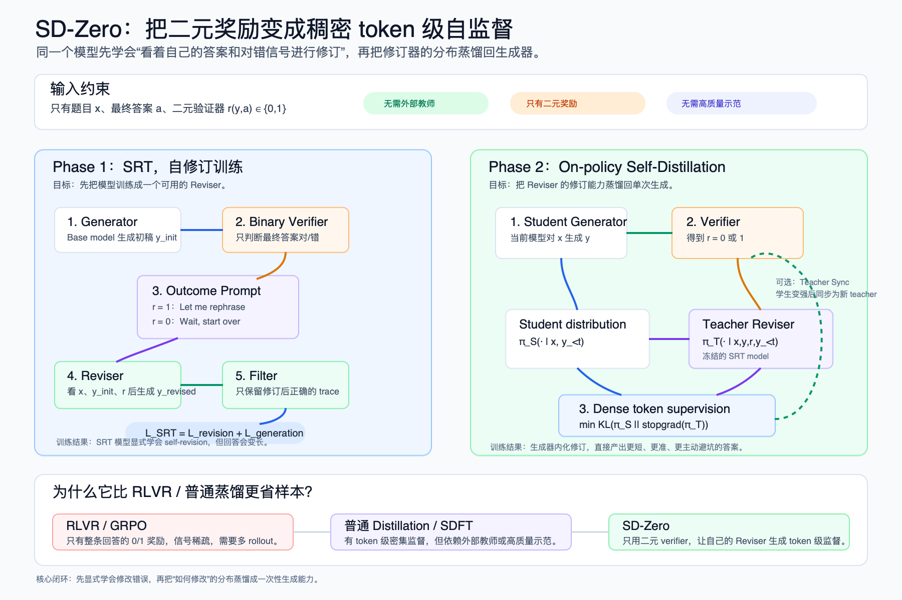

# Self-Distillation Zero 精读

阅读日期：2026-04-29  
论文标题：Self-Distillation Zero: Self-Revision Turns Binary Rewards into Dense Supervision  
作者：Yinghui He, Simran Kaur, Adithya Bhaskar, Yongjin Yang, Jiarui Liu, Narutatsu Ri, Liam Fowl, Abhishek Panigrahi, Danqi Chen, Sanjeev Arora  
arXiv：2604.12002v1, 2026-04-13  
链接：[arXiv Abs](http://arxiv.org/abs/2604.12002)，[PDF](https://arxiv.org/pdf/2604.12002)  
资料版本：arXiv PDF，SHA256 `7042d4d43e7b9e4858fc127a353d39fae91b29d302a054d3e2c7de4e30ac8d36`

资料中的 PDF 哈希为阅读时留存。下文按论文 v1 的设定，分别说明模型角色、条件输入、训练目标与实验范围。

## 一图看懂 SD-Zero



<details>
<summary>架构图的适用范围</summary>

图中的 $r$ 在 teacher 上下文里简写了对错提示 $P_r$；“RLVR 只有 0/1 奖励”等比较限于本文基线设置。Teacher 还需要额外前向计算，图中没有展示这部分成本。

</details>

## 一句话结论

SD-Zero 的核心想法是：不要只拿最终答案对错做 RL，也不要依赖外部 teacher 或高质量解题过程，而是先训练模型学会“看着自己的初稿和二元对错信号进行修订”，再把这个修订器在 token 级给出的分布蒸馏回生成器。这样，原本稀疏的 binary reward 被模型自己转化成稠密 token-level supervision。

我对这篇论文的判断是：

1. **最有价值的点是把“错误尝试”保留下来。** RFT/STaR 类方法通常过滤掉错误样本，只学正确 trace；SD-Zero 反过来把错误初稿作为条件，让模型学会从错误到正确的转化。
2. **它不是纯 self-correction prompt，而是把 self-revision 写进参数。** Phase 1 训练模型显式修订，Phase 2 再把显式修订蒸馏成更短、更主动的单次生成。
3. **它把 RLVR 的 sparse reward 和 distillation 的 dense supervision 接上了。** 本文基线主要使用整条回答的二元 outcome reward；SD-Zero 的 Reviser 提供 token 级分布差异。RLVR 本身并不限于二元奖励，分布差异也不等同于可靠的逐步正确性标注。
4. **实验结果比较干净。** 在 Qwen3-4B-Instruct 和 Olmo-3-7B-Instruct 上，SD-Zero 在同样问题集和近似 sample budget 下超过 SFT、RFT、GRPO、SDFT。
5. **边界也明确。** 当前只在 math/code 这种可验证任务上成立；对 thinking model 和不可验证任务如何扩展，论文只给了初步观察。

## 1. 背景：为什么需要 SD-Zero

可验证任务的后训练大致有两类路线：

1. **本文采用的 RLVR / GRPO 设置**：使用 binary outcome reward，例如最终答案对不对。优点是信号便宜、适用广；缺点是信号稀疏，不知道哪个中间步骤错了，需要大量 rollout 比较。
2. **Distillation / SFT / SDFT**：能提供 token 级稠密监督。优点是样本效率高；缺点是通常依赖外部 teacher、高质量 demonstrations 或 gold reasoning traces。

SD-Zero 问的是：

> 能不能只用模型自己的初稿和最终对错信号，让模型自己产生 token 级监督？

答案是用一个模型扮演两个角色：

1. **Generator**：先对题目生成一个初始回答。
2. **Reviser**：看到题目、初始回答、以及这个回答是否正确后，生成修订后的回答。

然后把 Reviser 的 token 分布作为 teacher signal，蒸馏回 Generator。

## 2. 算法主线

SD-Zero 分两个阶段：

1. **Phase 1：Self-Revision Training, SRT**
2. **Phase 2：On-policy Self-Distillation via Revision Feedback**

### 2.1 基本设定

训练数据是：

$$
\mathcal D=\{(x_i,a_i)\}_{i=1}^{n}
$$

其中：

1. `x_i` 是题目。
2. `a_i` 是最终答案。
3. 没有 gold solution。
4. 有一个 binary verifier：

$$
r(y,a)\in\{0,1\}
$$

如果模型回答 `y` 的最终答案匹配 `a`，奖励为 1，否则为 0。

### 2.2 Phase 1：SRT，让模型学会修订

对每个题目 `x`，先从当前模型采样初始回答：

$$
y_{\rm init}\sim\pi_\theta(\cdot\mid x)
$$

然后用 verifier 得到：

$$
r=r(y_{\rm init},a)
$$

将数值结果 $r$ 转成给模型看的文本提示，我们把这段提示定义为 $P_r$。它告诉 Reviser 刚才的回答是否正确，作为额外上下文，而不是一段标准解题过程。根据结果构造：

```text
if r = 1:
    "Let me rephrase the above solution."
if r = 0:
    "Wait, this response is not correct, let me start over."
```

让同一个模型生成修订回答：

$$
y_{\rm revised}\sim\pi_\theta(\cdot\mid x,y_{\rm init},P_r)
$$

只保留修订后正确的 trace：

$$
(x,y_{\rm init},P_r,y_{\rm revised}),\quad r(y_{\rm revised},a)=1
$$

这里最关键的是：错误初稿没有被丢掉，而是作为 Reviser 的上下文。模型学到的不是“模仿正确答案”，而是“基于我刚才错在哪里，重新生成一个正确答案”。

### 2.3 SRT 训练目标

SRT 同时训练两个能力。

**Revision loss**

给定 `x, y_init, P_r`，生成 `y_revised`：

$$
\mathcal L_{\rm revision}=-\log\pi_\theta(y_{\rm revised}\mid x,y_{\rm init},P_r)
$$

这里上下文已经给出题目、初稿与对错提示，损失只要求模型提高正确修订回答的条件概率。序列 log-prob 是回答 token 的条件 log-prob 之和，所以它提供逐 token 的训练信号，让模型学会当 Reviser。

**Generation loss**

给定 `x`，生成整个自修订 trace：

$$
\mathcal L_{\rm generation}=-\log\pi_\theta([y_{\rm init},P_r,y_{\rm revised}]\mid x)
$$

它把修订行为也写入 standalone generation，让模型在只看到题目时也能主动检查和修正。

总目标：

$$
\mathcal L_{\rm SRT}=\mathcal L_{\rm revision}+\mathcal L_{\rm generation}
$$

论文的 ablation 显示这两个 loss 互补：

1. 只用 `L_generation`，生成能力还行，但修订能力弱。
2. 只用 `L_revision`，first-attempt 准确率为 62.1%，低于完整 SRT 的 66.7%，但仍高于 base 的 59.6%；不能说它相对 base 下降。
3. 两者联合在该消融中表现更好；单独目标也能高于 base，不能把联合目标说成获得任何提升的必要条件。

### 2.4 Phase 2：把 Reviser 蒸馏回 Generator

Phase 1 后得到一个 SRT model。它已经会显式自修订，但有一个问题：回答变长，常出现 “Wait, this is wrong. Let me start over.” 这样的显式回退。

Phase 2 的目标是把这种显式修订内化成一次性生成能力。

设：

1. Student / Generator 是当前训练中的模型 `πθ`。
2. Teacher / Reviser 是冻结的 SRT model `πθSRT`。

对每个题目：

1. Student 先生成 on-policy 回答：

$$
y\sim\pi_\theta(\cdot\mid x)
$$

2. Verifier 给出 binary reward：

$$
r=r(y,a)
$$

3. Teacher Reviser 看到 `x, y, P_r`，输出 token 分布：

$$
\pi_T(\cdot\mid x,y,P_r,y_{<t})
$$

4. Student 只看到正常生成上下文，输出：

$$
\pi_S(\cdot\mid x,y_{<t})
$$

5. 用 KL 让 Student 匹配 Teacher：

$$
\mathcal L_{\rm SD}=\mathbb E_{(x,a)\sim\mathcal D,\,y\sim\pi_S(\cdot\mid x)}\left[\sum_{t=1}^{|y|}D_{\rm KL}\!\left(\pi_S(\cdot\mid x,y_{<t})\,\Vert\,\pi_T(\cdot\mid x,y,P_{r(y,a)},y_{<t})\right)\right]
$$

这就是论文说的：

> binary reward -> dense token-level self-supervision

这里 $y_{<t}$ 是同一条 student 已采样回答的前缀；teacher 在这些前缀上做 teacher-forced 分布评估，主流程不需要额外自回归生成一整条 revision。该 KL 的方向为 student 到 teacher，优化时 teacher 与已采样 token 序列停止梯度。

Teacher 的额外上下文是“学生刚才答了什么、对还是错”。Student 最终没有这些额外上下文，但通过 KL 蒸馏学会把修订能力内化到普通生成里。

### 2.5 Teacher Synchronization：迭代自进化

论文还做了一个进一步实验：Phase 2 训练后，学生模型不仅生成变强，revision capability 也变强。于是可以把新的学生同步成新的 teacher，继续下一轮 self-distillation。

流程是：

```text
SRT model as teacher
-> train student with self-distillation
-> student improves as generator and reviser
-> sync teacher = improved student
-> continue self-distillation
```

OpenR1-Math 上，第一轮 Self-Distillation 到约 400 step 后趋于平台；同步 teacher 后第二阶段又带来至少 3 个百分点提升，说明这个闭环有继续自举的可能。

## 3. 和已有方法的关系

| 方法 | On-policy | Dense supervision | Teacher | Teacher 能否看错误尝试 |
| --- | --- | --- | --- | --- |
| SFT / 普通蒸馏 | 否 | 是 | 外部 teacher / gold demo | 不适用 |
| On-policy Distillation | 是 | 是 | 外部 teacher | 通常不看 |
| 本文 RLVR / GRPO | 是 | 二元 outcome reward | 无 | 不适用 |
| 本文 SDFT 基线 | 是 | 是 | self | 使用 demonstration 作为 privileged context |
| SDPO | 是 | 是 | self | 可使用运行错误等 rich feedback，不能概括为只看高质量 demo |
| SD-Zero | 是 | 是 | self | 是 |

SD-Zero 的突出设计是用 SRT 训练修订能力，再让 teacher condition on wrong attempt 与二元反馈。但“利用错误尝试”并非它独占：[SDPO 原论文](https://arxiv.org/abs/2601.20802)也让 self-teacher 利用反馈理解失败，不应把它与 demonstration-only 方法混为一谈。它不是让模型直接模仿某个更强 teacher 的正确答案，而是让模型看见自己错过的轨迹，然后学习“怎样改”。

这也是它和 RFT 的关键区别：

1. RFT 只保留正确 self-generation。
2. SD-Zero 保留错误初稿，并要求模型把错误初稿修成正确答案。

## 4. 实验设置

### 4.1 模型

论文主要使用两个 instruct model：

1. Qwen3-4B-Instruct
2. Olmo-3-7B-Instruct

训练采样：

1. temperature = 0.7
2. 训练阶段 16K token limit
3. 评测阶段 32K token limit
4. 结果报告 avg@8

### 4.2 数据

分别在 math 和 code 两个领域训练：

1. **OpenR1-Math**：选 15K competition / olympiad level math problems。
2. **Codeforces**：cpp subset 7.5K + Python subset 7.5K。

Phase 分配：

1. SRT：6K self-revision traces。
2. Self-Distillation：9K additional question-answer pairs。

### 4.3 评测

评测包含 8 个 benchmark：

1. AIME24
2. AIME25
3. HMMT25
4. AMOBench
5. OpenR1-Math
6. MATH
7. Codeforces
8. LiveCodeBench

### 4.4 Baselines

所有 baseline 使用相同 15K question set：

1. SFT：用 DeepSeek-R1 高质量 demonstrations。
2. RFT：rejection fine-tuning，只训练正确 self-generated traces。
3. GRPO / DAPO：二元 correctness reward。
4. SDFT：on-policy self-distillation，用高质量 demonstrations 作为 privileged context。

## 5. 主结果

### 5.1 Avg@8

Qwen3-4B-Instruct：

| 方法 | Avg |
| --- | ---: |
| Base | 49.8 |
| SFT | 50.0 |
| RFT | 54.3 |
| GRPO | 53.1 |
| SDFT | 51.2 |
| SRT | 57.6 |
| SD-Zero | 60.3 |

Olmo-3-7B-Instruct：

| 方法 | Avg |
| --- | ---: |
| Base | 41.1 |
| SFT | 42.4 |
| RFT | 46.7 |
| GRPO | 44.8 |
| SDFT | 43.4 |
| SRT | 50.3 |
| SD-Zero | 51.5 |

解读：

1. Phase 1 SRT 已经超过所有 baseline。
2. Phase 2 Self-Distillation 在 SRT 基础上继续提升。
3. 相比 base，Qwen 提升 `+10.5`，Olmo 提升 `+10.4`。
4. 相比最强 baseline RFT，Qwen 提升 `+6.0`，Olmo 提升 `+4.8`。

### 5.2 哪些 benchmark 提升最大

Qwen3-4B-Instruct 上：

1. HMMT25：Base 26.7 -> SD-Zero 45.4
2. AIME25：45.8 -> 60.0
3. LiveCodeBench：61.8 -> 82.6
4. AMOBench：9.8 -> 16.0

Olmo-3-7B-Instruct 上：

1. HMMT25：25.0 -> 40.4
2. LiveCodeBench：32.4 -> 57.8
3. AIME25：42.1 -> 53.8
4. AMOBench：1.3 -> 5.5

这说明 SD-Zero 特别适合“模型会尝试，但中间容易走错”的任务。它不是单纯记答案，而是在训练过程中学会更有效地定位和修复推理错误。

### 5.3 Pass@8

论文附录还给出 math Pass@8：

Qwen3-4B-Instruct：

| 方法 | Avg |
| --- | ---: |
| Base | 66.7 |
| RFT | 69.8 |
| GRPO | 65.4 |
| SRT | 70.4 |
| SD-Zero | 72.5 |

Olmo-3-7B-Instruct：

| 方法 | Avg |
| --- | ---: |
| Base | 62.3 |
| RFT | 65.7 |
| GRPO | 63.1 |
| SRT | 68.4 |
| SD-Zero | 70.8 |

Pass@8 提升说明在该采样设置下，8 次采样至少答对一次的概率更高；它支持正确答案覆盖改善，但仅凭这一指标不能证明“获得新推理能力”、排除偶然性，或完全分离分布变尖与探索变化。

## 6. 为什么 SRT 有效

SRT 的数据结构是：

```text
错误或正确初稿 -> 对错信号 -> 修订后正确答案
```

它比 RFT 多了一个关键监督：

1. RFT 学的是“正确答案长什么样”。
2. SRT 学的是“我这类错误应该怎么改成正确答案”。

论文的 Generate-then-Revise 实验很直观：

| 方法 | First Attempt Acc | Revised Attempt Acc | Correction Rate | First Tokens | Revised Tokens |
| --- | ---: | ---: | ---: | ---: | ---: |
| Base | 59.6 | 60.7 | 2.7 | 3708 | 5098 |
| GRPO | 65.2 | 66.9 | 4.9 | 4432 | 5499 |
| SDFT | 63.3 | 64.7 | 3.8 | 3630 | 5099 |
| SRT | 66.7 | 71.7 | 15.0 | 8458 | 8137 |
| SD-Zero | 68.3 | 73.6 | 16.7 | 3518 | 3314 |

SRT 让模型的修订能力明显增强：Correction Rate 从 base 的 2.7% 到 15.0%。但 SRT 的 first attempt 很长，说明模型学会了显式 backtracking。

SD-Zero 的 Phase 2 把这个显式 backtracking 压回生成器：Correction Rate 继续升到 16.7%，同时 first attempt token 从 SRT 的 8458 降到 3518。

## 7. Self-Distillation 如何产生 token 级监督

论文把 Self-Distillation 的 KL 拆成 token-wise terms：

$$
D_{\rm KL}^{(t)}=D_{\rm KL}\!\left(\pi_\theta(\cdot\mid x,y_{<t})\,\Vert\,\pi_{\theta_{\rm SRT}}(\cdot\mid x,y,P_r,y_{<t})\right)
$$

当 `r = 0`，也就是初始回答错了，Reviser 的分布会在少数关键 token 上和 Generator 拉开很大距离。论文案例中这些位置可能对应：

1. 错误的几何/代数假设。
2. 错误的分支选择。
3. 应该改用另一种解法的转折处。

当 `r = 1`，也就是初始回答正确，Reviser 的信号更平滑，更多是在保持答案、压缩冗余、重述正确逻辑。

据此可把 Reviser 信号解释为以下两种作用，但它不是错误定位的形式化保证：

1. **localize error**：定位哪些 token 附近是错误关键点。
2. **redirect probability**：把概率质量转向更合理的后续推理。

这有点像不用训练单独 PRM，就从同一个模型的 Reviser 中获得隐式 process-level / token-level reward。

## 8. 为什么 Phase 2 重要

只看准确率，SRT 已经很强。但 Phase 2 仍然是 SD-Zero 的关键，因为它解决两个问题。

### 8.1 推理效率

SRT 模型会显式自我修正，回答非常长。Phase 2 后：

1. 平均 response length 大约减半。
2. 显式 self-revision keywords 比例下降。
3. 准确率继续提升。

论文的解释是：模型从“显式说出 Wait, this is wrong”变成“提前避开这个坑”。

### 8.2 训练样本效率

SRT 构造数据很贵，因为需要多次采样和过滤：

1. 10K 初始回答。
2. 约 5K correct + 5K incorrect。
3. 每个初稿生成 3 个 revision。
4. 过滤后得到 6K 正确 revision traces。

Phase 2 则每题只需要一个 on-policy response，再由 frozen Reviser 给 token 分布监督。论文给的 generation budget：

| 方法 | questions | generations |
| --- | ---: | ---: |
| RFT | 15K | 60K |
| GRPO | 15K | 60K |
| SDFT | 15K | 60K |
| SRT phase | 6K retained | 40K generated |
| Self-Distillation phase | 9K | 9K |
| SD-Zero total | 15K | 49K |

token budget 也与 RFT/GRPO 近似同量级：

1. RFT/GRPO 约 222M sampling tokens。
2. SD-Zero 总 sampling tokens 上界约 224.5M。
3. SD-Zero training forward tokens 上界约 219M。

在论文报告的近似采样预算下，SD-Zero 得到更强表现。但 sampling tokens、training forward tokens 不等于 FLOPs 或墙钟时间；teacher 的额外前向、较长条件前缀和反向开销都需计入，不能据此宣称严格等算力比较。

## 9. 关键消融

### 9.1 两个 SRT loss 在该实验中互补

Qwen3-4B-Instruct：

| 方法 | Average Generation Acc | First Attempt | Revised Attempt | Correction Rate |
| --- | ---: | ---: | ---: | ---: |
| Base | 49.8 | 59.6 | 60.7 | 2.7 |
| SRT full | 57.6 | 66.7 | 71.7 | 15.0 |
| SRT, only L_generation | 56.4 | 65.4 | 67.9 | 7.2 |
| SRT, only L_revision | 52.2 | 62.1 | 66.7 | 12.1 |

结论：

1. `L_revision` 负责让模型真的会改。
2. `L_generation` 负责保留和提升直接生成能力。
3. 只学修订相对完整 SRT 的 first attempt 较低，但仍高于 base；这支持联合目标更好，不足以推出“不能作为生成器”。

### 9.2 该实验中跳过 SRT 后收益较小

| 方法 | Avg Generation Acc | First Attempt | Revised Attempt | Correction Rate |
| --- | ---: | ---: | ---: | ---: |
| Base | 49.8 | 59.6 | 60.7 | 2.7 |
| SD-Zero, Phase 2 Only | 51.4 | 61.2 | 62.2 | 2.6 |
| Full SD-Zero | 60.3 | 68.3 | 73.6 | 16.7 |

直接对 base model 做 Phase 2 的收益小于完整流程。这支持先训练 Reviser 的做法；“base 的修订能力不足”是解释性假设，不意味着任意模型都必须经过相同 SRT 阶段。

### 9.3 该预算下 6K/9K 的数据分配更好

固定总数据预算，调整 SRT / Self-Distillation 分配：

| SRT | Self-Distillation | SRT Model | SD-Zero Model |
| ---: | ---: | ---: | ---: |
| 6K | 9K | 57.6 | 60.3 |
| 9K | 6K | 57.8 | 59.1 |
| 7.5K | 7.5K | 57.8 | 59.8 |

更多 SRT 数据会让 SRT model 稍微变强，但最终 SD-Zero 反而不如 6K/9K。解释是：只要 SRT 足以解锁修订能力，更多数据更应该用于 Phase 2，把修订行为蒸馏成更强生成。

### 9.4 该设置下 SDFT 两种监督形式提升都有限

Qwen3-4B-Instruct math：

| 方法 | Avg |
| --- | ---: |
| Base | 48.1 |
| SDFT | 49.7 |
| SDFT, final answers only | 49.5 |
| SD-Zero | 57.3 |

SDFT 的 49.7 与 final-answer-only 的 49.5 只差 0.2 个百分点；这张表显示两种 SDFT 设置在该实验里收益都有限，SD-Zero 更高。它不能证明高质量 reasoning trace 是 SDFT 有效的必要条件；还缺少误差条和更广的任务比较。

## 10. 对 thinking model 的限制

论文专门讨论了 thinking model。直觉上，长 chain-of-thought 里常有 false start、探索、回退和局部自纠错，不一定都是坏事。因此很难简单判断哪段 token 应该被修正。

作者用 Qwen3-4B 做 SDFT 实验：

| 方法 | AIME24 | AIME25 | HMMT25 |
| --- | ---: | ---: | ---: |
| Qwen3-4B | 0.735 | 0.647 | 0.458 |
| SDFT, enable_thinking=True | 0.637 | 0.539 | 0.375 |
| SDFT, enable_thinking=False | 0.733 | 0.616 | 0.466 |

训练时开启 thinking 反而明显下降。论文认为，把 SD-Zero 扩展到 thinking model 是重要但不平凡的后续方向。

我的理解是：SD-Zero 适合“短而明确的初稿 -> 明确对错 -> 修订”的 setting；而 thinking model 的长推理轨迹里，错误、探索和自我检查混在一起，binary reward 到 token-level credit assignment 的映射更难。

## 11. 和 GRPO / RLVR 的关系

GRPO 的优势：

1. 不需要 gold solution。
2. 只要 binary verifier。
3. 能通过 group relative advantage 做策略优化。

GRPO 的短板：

1. 每题要多个 rollouts。
2. final answer reward 太稀疏。
3. 很难知道错误发生在哪一步。

SD-Zero 的优势是把 binary reward 用 Reviser “放大”为 token-level dense signal。它不是替代所有 RLVR，而是可以看作一种把 verifier 信号转成 process-like supervision 的方法。

论文附录还尝试了 self-revision 作为 RL initialization，在 Countdown 上发现 self-revised targets + GRPO 对 OOD benchmark 更好。这暗示 self-revision 和 RL 可以组合：

```text
先用 self-revision 初始化一个更会纠错的模型
再用 GRPO / RLVR 继续优化
```

## 12. 批判性分析

### 12.1 值得学习的地方

**第一，错误样本不是垃圾，而是监督。** SD-Zero 的核心 insight 是保留错误尝试，并让模型学习如何从错误转正。对于 reasoning 任务，这比只过滤正确答案更接近人类学习过程。

**第二，binary reward 可以通过上下文条件化变稠密。** 原始 verifier 只有 0/1，但 Reviser 看到 `x, y_init, r` 后，能在 token 分布上表达“哪些地方该改”。这是一种很聪明的 reward densification。

**第三，Phase 2 解决了显式自修订的成本。** 只训练 self-correction 会让模型在推理时反复 backtrack，token 很长。蒸馏回 generator 后，模型变成更主动、更短地避错。

**第四，teacher synchronization 暗示可持续自举。** 如果学生提升后也变成更好的 reviser，那么 self-distillation 不一定是一轮用完；它可以迭代。

### 12.2 主要风险

**第一，依赖可验证 reward。** 没有 final answer verifier 的开放任务，例如写作、研究、长程 agent，当前算法不能直接使用。

**第二，SRT 需要正确修订样本。** Phase 1 只保留 revision 后正确的 trace；如果任务很难，模型很少能自修订成功，SRT 数据会很稀缺。

**第三，Reviser 仍然可能教错。** Phase 2 的 teacher 是 SRT model，不是外部强 teacher。它的分布信号可能带有偏见或错误定位。

**第四，实验规模还偏小。** 当前主要是 4B/7B instruct model，math/code 两个领域。更大模型、thinking model、agent 任务上是否保持优势，还没有证明。

**第五，和强 RL 长训练不完全等价比较。** 论文匹配的是单 epoch / sample budget；GRPO 可能通过更多 epoch 和更复杂 reward shaping 继续提升。

## 13. 实用启发

如果我要复用这个思路，会优先考虑这些场景：

1. 有可靠 verifier，但没有高质量过程标注。
2. 模型已经有一定基础能力，能偶尔自修订成功。
3. 任务的错误通常是局部推理错误，而不是完全不会。
4. 希望比 GRPO 更省 rollout。
5. 希望最终推理保持单次生成，不想部署多轮 self-correction。

一个可执行 recipe：

```text
1. 用 base model 对题目采样初稿
2. 用 verifier 判断对错
3. 让同一模型基于初稿 + 对错提示进行 revision
4. 只保留 revision 后正确的 trace
5. 训练 SRT：revision loss + generation loss
6. 冻结 SRT 作为 Reviser teacher
7. 当前 student on-policy 生成
8. Reviser 看 student 回答和 reward，输出 token 分布
9. Student 用 KL 匹配 Reviser
10. 可选：学生变强后同步为新 teacher，继续迭代
```

## 14. 和现有后训练笔记的关系

1. **相对 SFT**：SFT 学高质量答案；SD-Zero 学“自己的错误如何修”。
2. **相对 RFT**：RFT 丢弃错误样本；SD-Zero 把错误样本变成修订上下文。
3. **相对 GRPO**：GRPO 直接优化 sparse reward；SD-Zero 先把 sparse reward 转成 dense token supervision。
4. **相对本文 SDFT 基线**：该基线使用 demonstration 作为额外上下文；SD-Zero 用自身修订轨迹和 verifier，不依赖外部 gold reasoning trace。
5. **相对 PRM**：SD-Zero 没有单独训练过程奖励模型；Reviser 分布提供 token-level signal，但这不是经过程标签校准的逐步奖励。

## 15. 关键词索引

- SD-Zero：Self-Distillation Zero。
- SRT：Self-Revision Training，Phase 1。
- Generator：模型正常生成初稿的角色。
- Reviser：模型基于初稿和二元奖励进行修订的角色。
- Binary reward：最终答案正确与否。
- Dense supervision：token 级 KL 监督。
- Token-level self-localization：Reviser 在 token 层定位错误位置的现象。
- Teacher synchronization：把训练后的学生同步为新 Reviser teacher，继续自进化。

